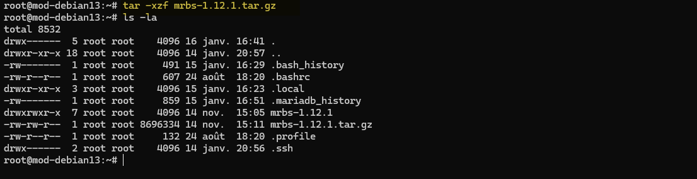

TAR est un outil en ligne de commande utilisé pour créer et manipuler des archives de fichiers. Il est couramment utilisé pour regrouper plusieurs fichiers en un seul fichier archive, facilitant ainsi le stockage et le transfert.

## Installation de TAR

TAR est généralement préinstallé sur la plupart des distributions Linux. Cependant, si vous devez l'installer sur une distribution basée sur Debian, utilisez la commande suivante :

```bash
sudo apt-get update
sudo apt-get install tar
``` 

## Utilisation de base 

La syntaxe de base pour utiliser TAR est la suivante :

```bash
tar [options] [archive-file] [file or directory to be archived]
```

## Décompresser une archive TAR

Pour décompresser une archive TAR, utilisez l'option `-x` (extract) :

```bash
tar -xvf archive.tar
```
### Décompresser une archive TAR.GZ

Pour décompresser une archive TAR.GZ, utilisez l'option `-x` avec `-z` (gzip) :

```bash
tar -xzf archive.tar.gz
```



### Décompresser une archive TAR.BZ2

Pour décompresser une archive TAR.BZ2, utilisez l'option `-x` avec `-j` (bzip2) : 

```bash
tar -xjvf archive.tar.bz2
```

## Créer une archive TAR

Pour créer une archive TAR, utilisez l'option `-c` (create) :

```bash
tar -cvf archive.tar /chemin/du/dossier_ou_fichier
``` 

### Créer une archive TAR.GZ

Pour créer une archive TAR.GZ, utilisez l'option `-c` avec `-z` (gzip) :  

```bash
tar -czvf archive.tar.gz /chemin/du/dossier_ou_fichier
``` 

### Créer une archive TAR.BZ2

Pour créer une archive TAR.BZ2, utilisez l'option `-c` avec `-j` (bzip2) :  

```bash
tar -cjvf archive.tar.bz2 /chemin/du/dossier_ou_fichier
```

## Afficher le contenu d'une archive TAR

Pour afficher le contenu d'une archive TAR sans l'extraire, utilisez l'option `-t` (list) : 

```bash
tar -tvf archive.tar
```

### Afficher le contenu d'une archive TAR.GZ

Pour afficher le contenu d'une archive TAR.GZ, utilisez l'option `-t` avec `-z` (gzip) :  

```bash
tar -tzvf archive.tar.gz
``` 

### Afficher le contenu d'une archive TAR.BZ2

Pour afficher le contenu d'une archive TAR.BZ2, utilisez l'option `-t   ` avec `-j` (bzip2) :  

```bash
tar -tjvf archive.tar.bz2
```

## Conclusion
TAR est un outil puissant et polyvalent pour la gestion des archives de fichiers sous Linux. Il offre de nombreuses options pour créer, extraire et afficher le contenu des archives, facilitant ainsi la gestion des fichiers.