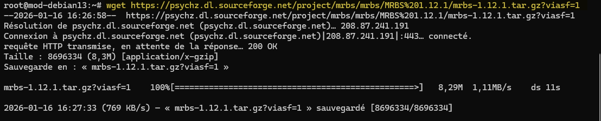

WGET est un outil en ligne de commande puissant et polyvalent utilisé pour télécharger des fichiers depuis le web. Il prend en charge les protocoles HTTP, HTTPS et FTP, et offre de nombreuses options pour personnaliser les téléchargements.

## Installation de WGET

Pour installer WGET sur une distribution basée sur Debian, utilisez la commande suivante :

```bash
sudo apt-get update
sudo apt-get install wget
```

## Utilisation de base

La syntaxe de base pour utiliser WGET est la suivante :

```bash
wget [options] [URL]
```



Exemple :

Pour télécharger un fichier, utilisez la commande suivante :  

```bash
wget http://example.com/file.zip
```

### Télécharger un fichier et le renommer

Pour télécharger un fichier et le renommer, utilisez l'option `-O` :  

```bash
wget -O nouveau_nom.zip http://example.com/file.zip
```

### Télécharger en arrière-plan

Pour télécharger un fichier en arrière-plan, utilisez l'option `-b` : 

```bash
wget -b http://example.com/file.zip
```

## Télécharger un site web entier

WGET peut également être utilisé pour télécharger un site web entier en utilisant l'option `--mirror` :
```bash
wget --mirror http://example.com
```
### Reprendre un téléchargement interrompu

Si un téléchargement est interrompu, vous pouvez le reprendre en utilisant l'option `-c` :  

```bash
wget -c http://example.com/file.zip
```