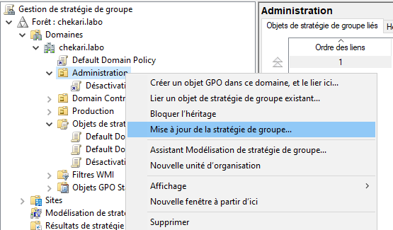
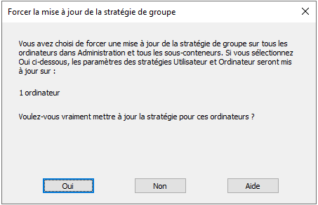
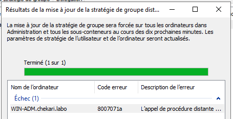
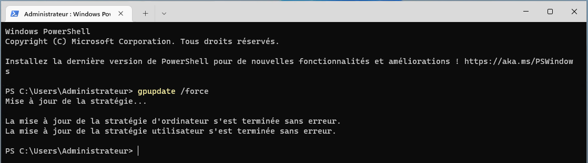

Pour appliquer une stratégie de groupe sur un poste client, il faut que le poste client soit dans le domaine et que l’utilisateur connecté soit dans le domaine.

Dans l'editeur de gestion des stratégies de groupe, vous pouvez lier la stratégie de groupe à une unité d'organisation (UO) qui contient les postes clients et les utilisateurs ciblés par la stratégie.

Effectuez un clic droit, puis `Lier un objet de stratégie existant…` afin d’appliquer cette stratégie à tous les ordinateurs du domaine.

Choisissez la bonne stratégie et validez, un raccourci vers la règle sera rajouté dans l’UO.


## Application une stratégie

Lorsqu’une GPO vient d’être créée ou modifiée, elle ne s’applique pas directement sur les postes.

Les ordinateurs clients effectuent des requêtes plusieurs fois par jour afin de récupérer les paramètres de GPO qui leur sont destinés pour les traiter et les appliquer.

Pour les ordinateurs clients, les GPO sont téléchargées et appliquées en arrière-plan sur la base d’un intervalle de 90 minutes démarrant après l’ouverture de session.

Dans notre cas, deux solutions pour appliquer la stratégie rapidement sur les postes clients :

### A partir du serveur

Clic droit sur l’UO Administration > Mise à jour de la stratégie de groupe > Oui







Dans notre cas, cela n’a pas fonctionné car le pare-feu du client a bloqué la mise à jour …

### A partir du client

Depuis une fenêtre de commande exécuté en tant qu’administrateur, exécutez la commande :

```powershell
gpupdate /force
```



Vérification sur le poste client :

Le pare-feu est bien désactivé et il n’est pas possible de le réactiver car vous avez le message « Ce paramètre est géré par votre administrateur ».