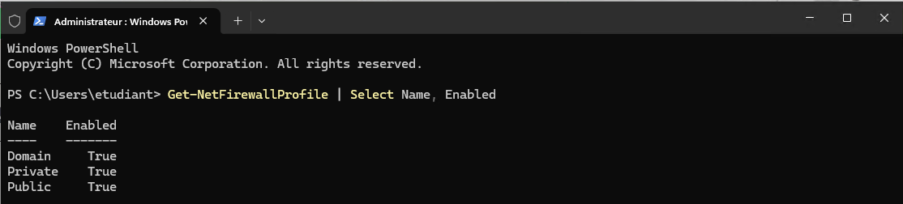
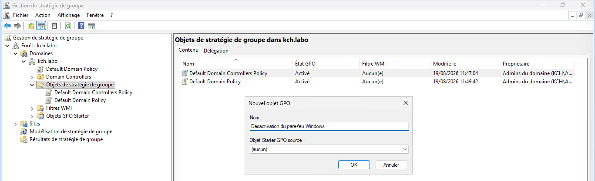
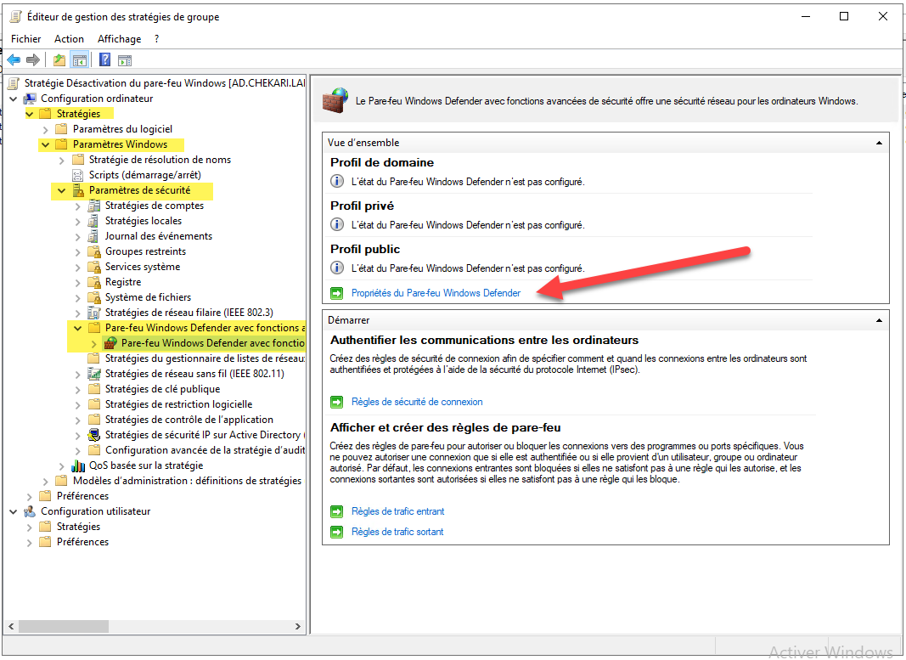
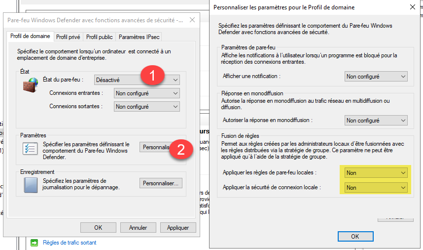
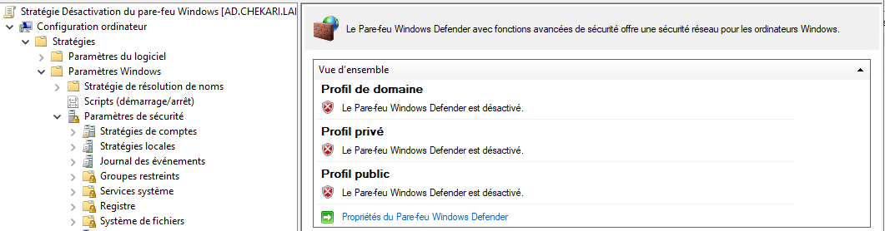
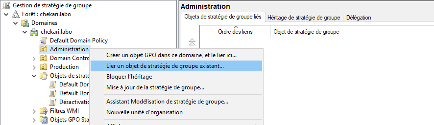
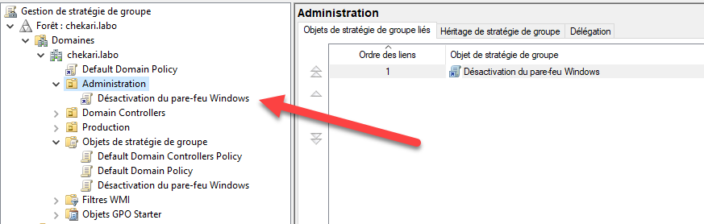
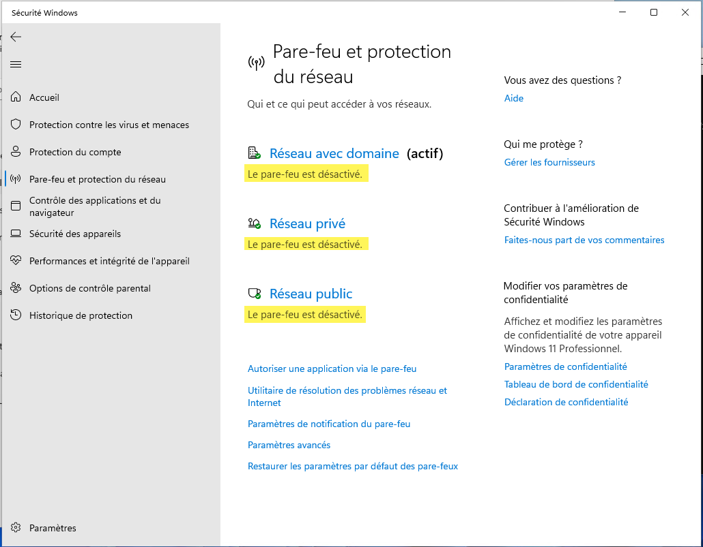
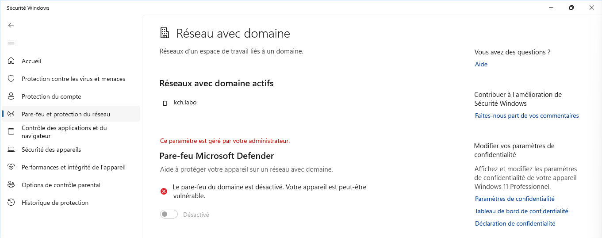

Le pare-feu Windows est désactivé dans la plupart des entreprises. Les raisons qui poussent les administrateurs à le désactiver complètement sont par exemple les interférences qu’il crée entre certaines applications client/serveur et l’empêchement de réaliser des pings. De plus, les réseaux sont protégés des attaques par un ou plusieurs Firewalls (type boîtiers) diminuant les risques que crée la désactivation du pare-feu Windows sur les postes de travail.

Prérequis :

- Vous êtes connecté avec user.admin sur le poste client.
- L’UO Administration contient l’ordinateur client et l’utilisateur connecté.
- Les postes communiquent
- Avant la mise en place de cette stratégie, vérifiez l'état des pare-feux sur les postes clients avec la commande suivante dans un terminal PowerShell :

```powershell
Get-NetFirewallProfile | Select Name, Enabled
```



## Création de la stratégie

Dans la console de gestion des stratégies de groupe, créez une nouvelle stratégie appelée `Désactivation du pare-feu Windows` (clic droit puis Nouveau sous le conteneur `Objets de stratégie de groupe`).



Editez la stratégie (clic droit puis Modifiez…), l’éditeur de gestion des stratégies (ci-dessous) s’ouvre, placez-vous dans le conteneur `Configuration ordinateur > Stratégies > Paramètres Windows > Paramètres de sécurité > Pare-feu Windows avec fonctions avancées de sécurité`.



Sélectionnez les options suivantes :

- État du pare-feu : Désactivé
- Cliquez ensuite sur le bouton Personnaliser dans la zone Paramètres.
- Choisissez Non à l’option Appliquer les règles de pare-feu locales et sécurité de connexion locale.



Ceci permet de ne pas générer de conflits entre la configuration du pare-feu sur le poste et la configuration du pare-feu par une stratégie de groupe. C’est le paramétrage de la stratégie qui l’emporte dans ce cas.

Répétez ces choix de configuration pour les autres profils du pare-feu (Profil privé et Profil public).

Cliquez sur OK pour toutes les fenêtres suivantes.

Dans l’Éditeur de gestion des stratégies de groupe, vous pouvez constater l’état du pare-feu pour les trois profils. Fermez l’éditeur.



Une fois la configuration du pare-feu terminée, il est nécessaire de lier la stratégie de groupe à l’UO Administration (qui contient les ordinateurs et utilisateurs ciblés) requis afin de la mettre en activité sur les postes de travail du domaine.

Effectuez un clic droit sur l’UO Administration, puis « Lier un objet de stratégie existant… » afin d’appliquer cette stratégie à tous les ordinateurs du domaine.



Choisissez la bonne stratégie et validez, un raccourci vers la règle sera rajouté dans l’UO.



Il ne vous reste plus qu'à l'appliquer.

Le pare-feu est bien désactivé et il n’est pas possible de le réactiver car vous avez le message `Ce paramètre est géré par votre administrateur`.



