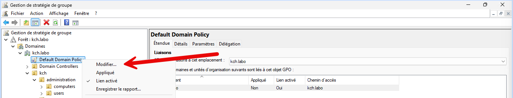
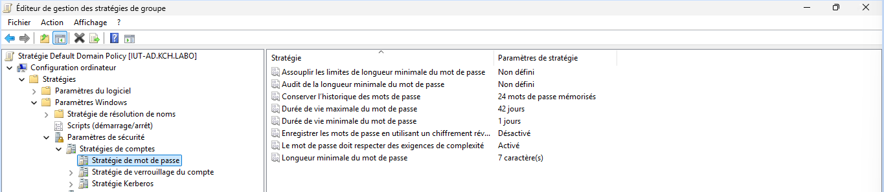

La stratégie de mot de passe permet de définir les règles de sécurité pour les mots de passe des utilisateurs du domaine.
Il ne faut pas créer une stratégie de mot de passe sur une UO, car elle ne sera pas appliquée. La stratégie de mot de passe doit être créée sur le domaine. Il est conseillé de modifier la `Default Domain Policy` pour définir les règles de sécurité des mots de passe.

Aller dans `Configuration ordinateur > Stratégies > Paramètres Windows > Paramètres de sécurité > Stratégies de compte > Stratégie de mot de passe`.

