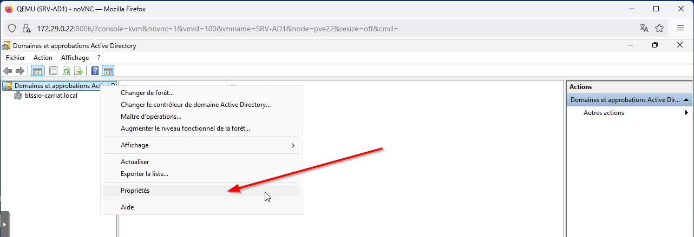
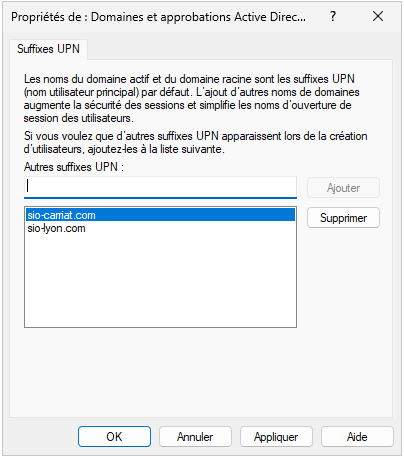
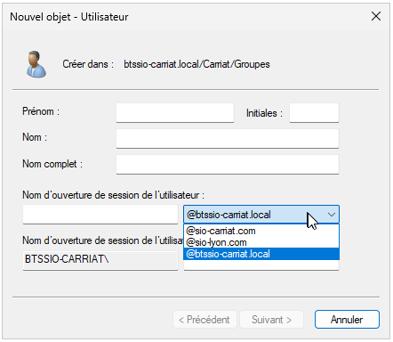

Pour ajouter un domaine à votre foret, il faut utiliser le composant **"Domaines et approbations Active directory"**

Ouvrir les propriétés des domaines

Ajouter ensuite vos domaines

Les utilisateurs ont maintenant un nom de session correspondant au domaine Microsoft 365.

