Dans le gestionnaire de serveur, cliquer sur Ajouter des rôles et fonctionnalités.

Avant d’installer le rôle AD-DS, **il faut bien s’assurer d’avoir mis la bonne configuration IP et le bon nom du serveur. Ils ne pourront plus être modifié après.**

## Ajout du rôle

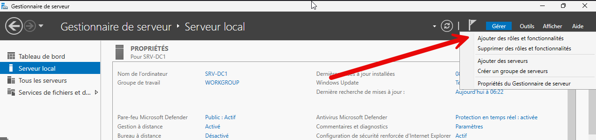

On valide l’étape, Suivant.

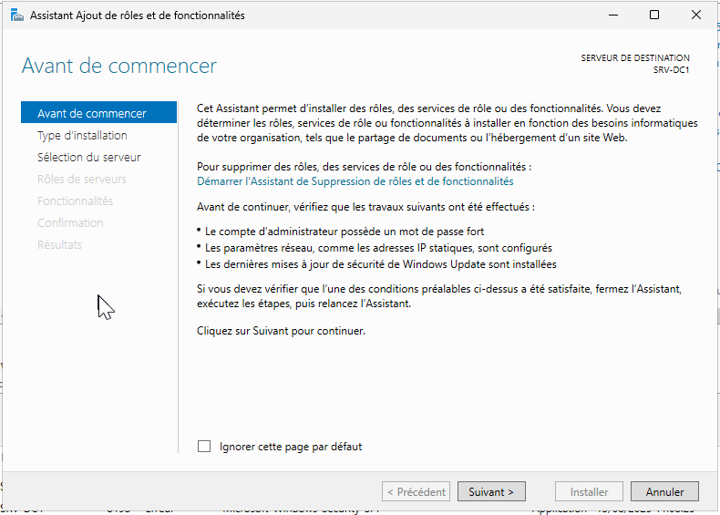

On laisse ensuite l’option par défaut.

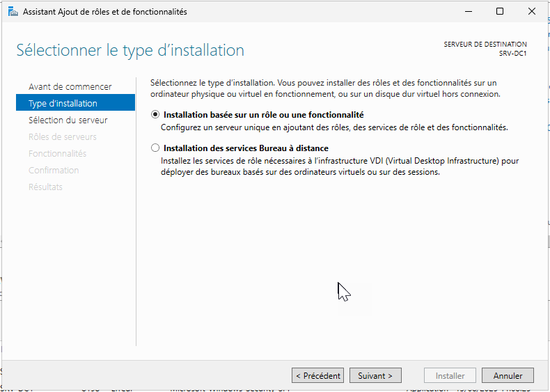

On vérifie ensuite que notre serveur est bien dans la liste.

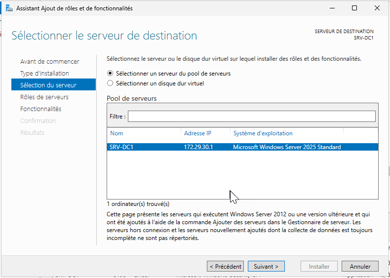

On va ensuite cocher Services de domaine Active Directory.

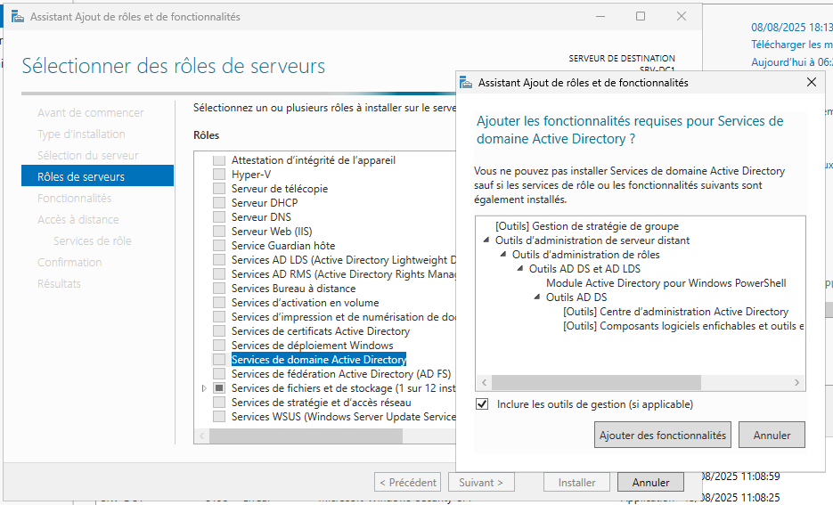

Pas de fonctionnalités supplémentaires.

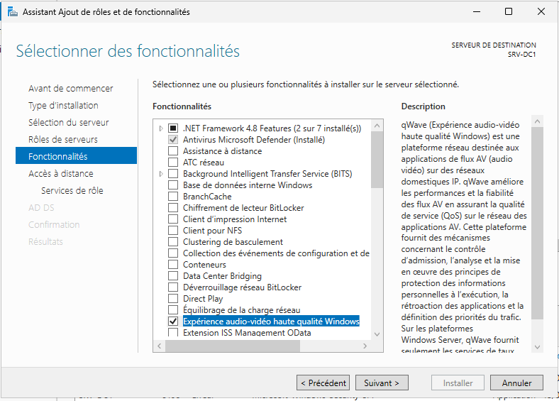

On termine par valider les écrans suivants

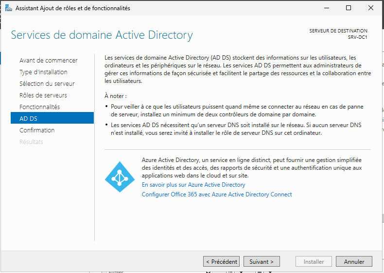

Installer

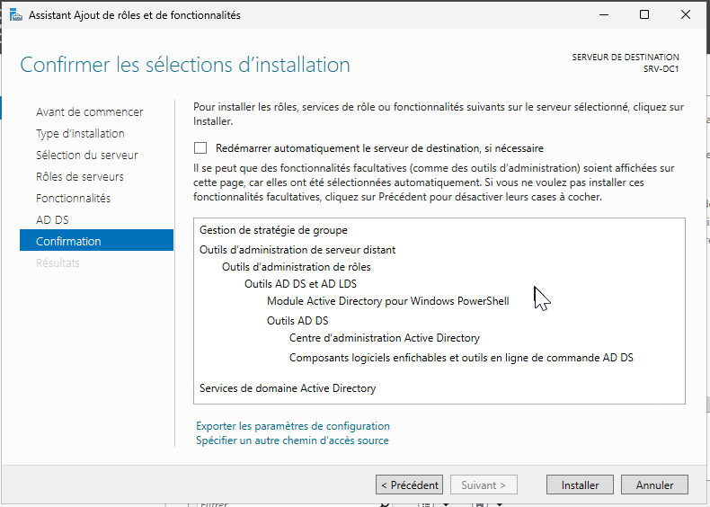

## Configuration Post-installation

Dans le gestionnaire de serveur, il faut maintenant promouvoir le serveur en tant que contrôleur de domaine.

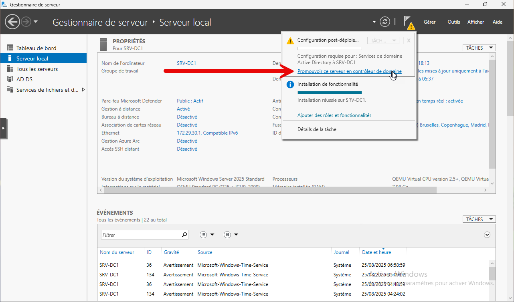

Dans le premier écran, nous allons choisir de créer une nouvelle forêt.

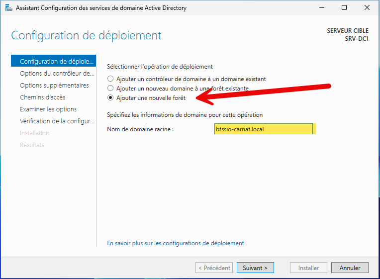

Pour plus de sécurité, nous allons choisir le niveau fonctionnel Windows Server 2025.

Il faut également saisir le mot de passe de restauration des services d’annuaire (à conserver impérativement).

On valide ensuite les écrans suivants :

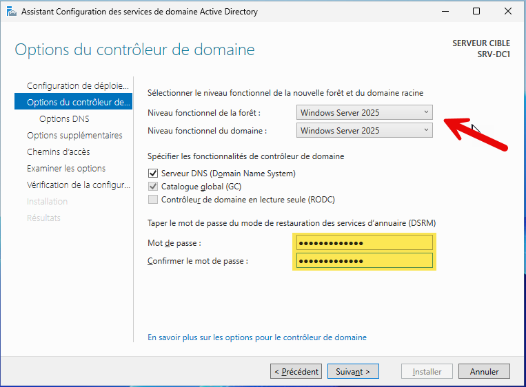

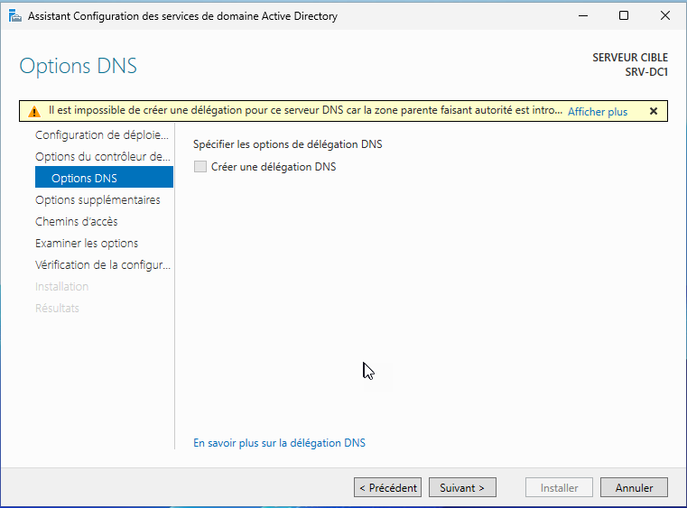

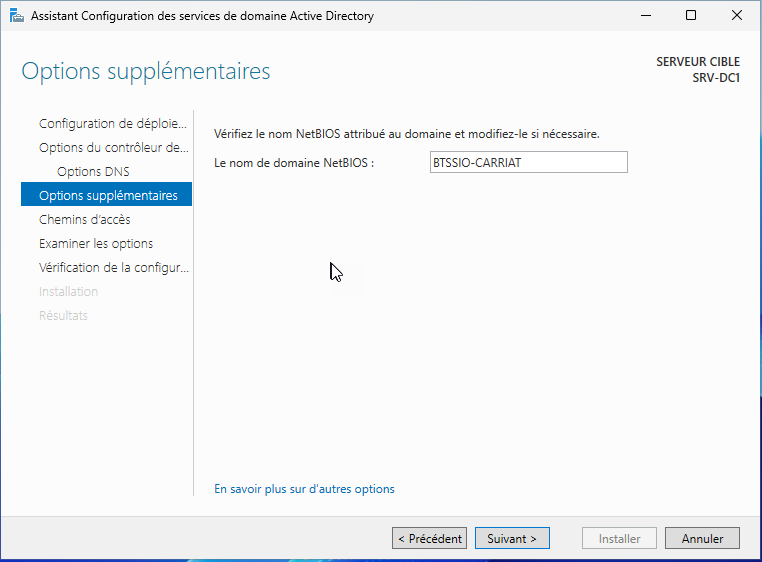

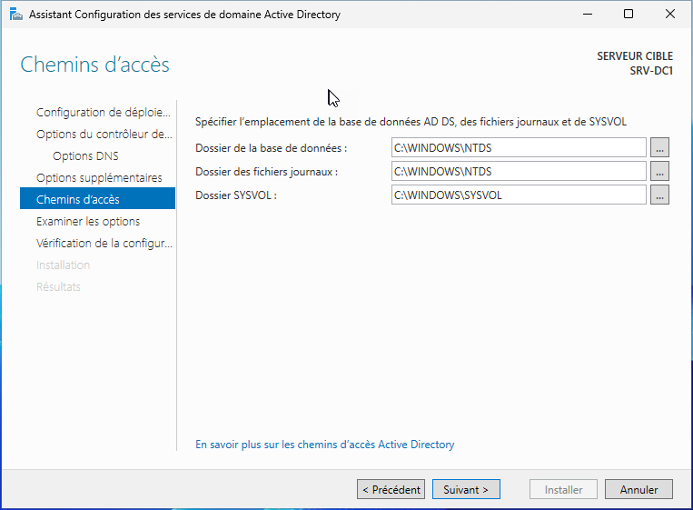

La vérification de la configuration permet de s’assurer que le serveur a bien les prérequis pour être un contrôleur de domaine.

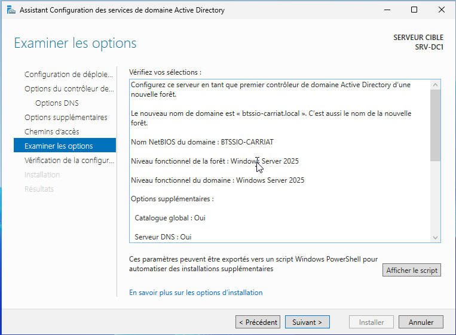

La vérification faite, nous pouvons lancer l’installation.

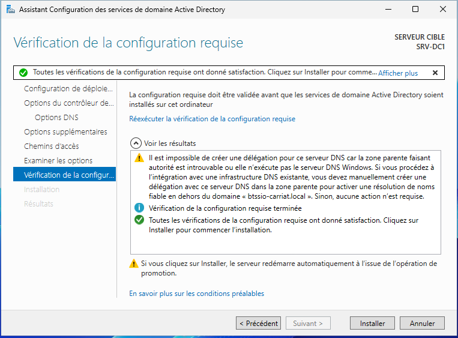

Une fois installé, le serveur va redémarrer et l’administrateur local deviendra administrateur du domaine.

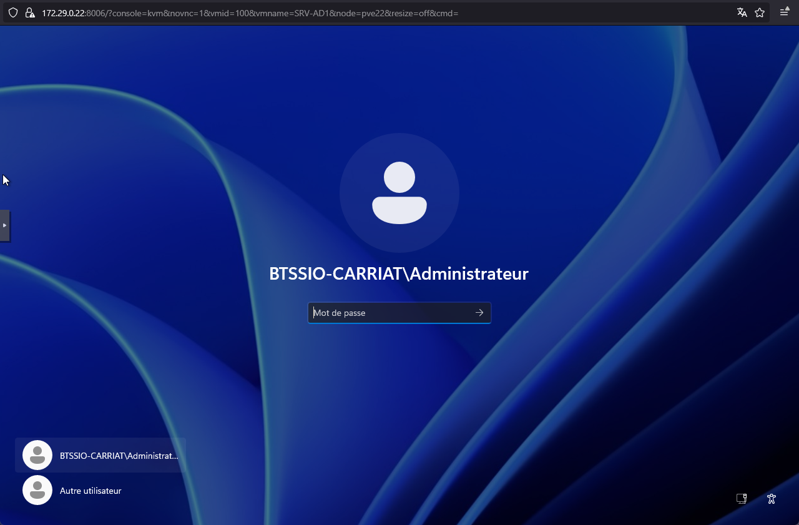
