Depuis Windows Server 2025, il est nécessaire d’activer le rôle Services de certificats Active Directory afin de permettre une authentification Active Directory ou LDAP.

Aller dans le Gestionnaire de serveur et Ajouter des rôles et fonctionnalités.

Dans la fenêtre, cocher Services de certificats Active Directory
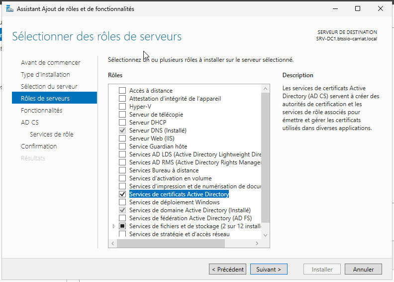
Laisser cocher Autorité de certification
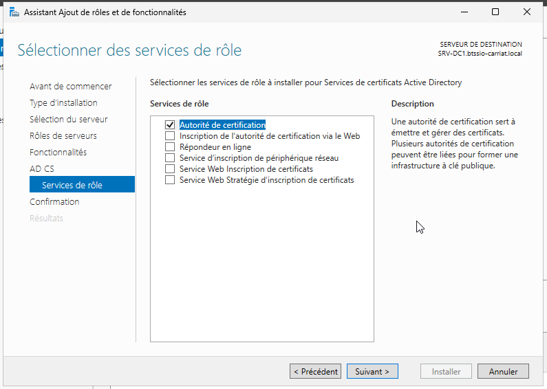
Une fois installé, il faut terminer la configuration.

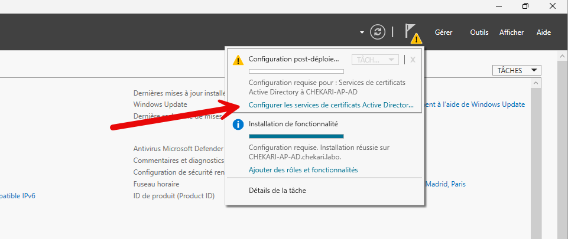

Valider les informations d’identification.

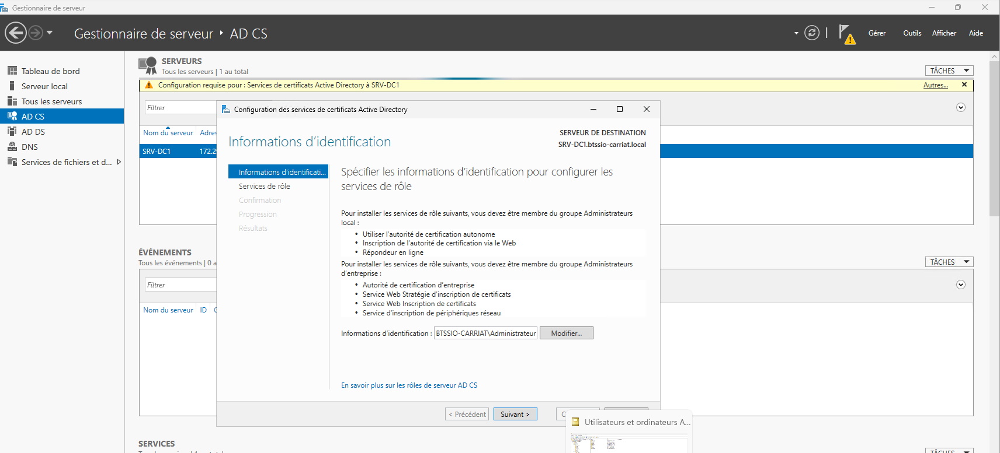

Dans l’écran suivant, cocher Autorité de certification.

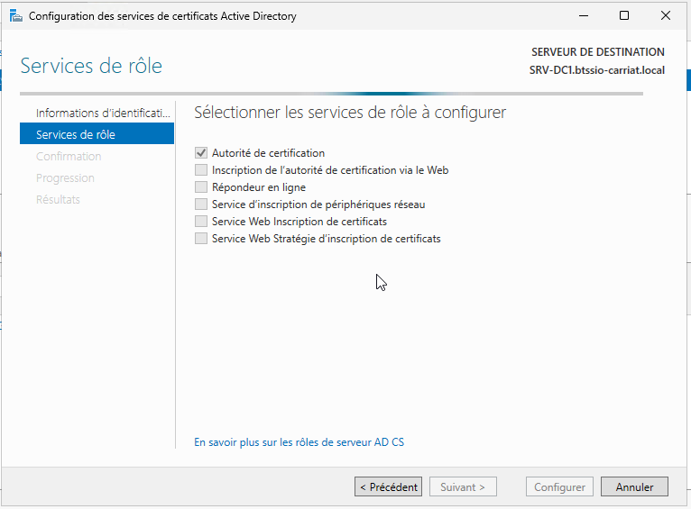

Valider ensuite les écrans suivants.

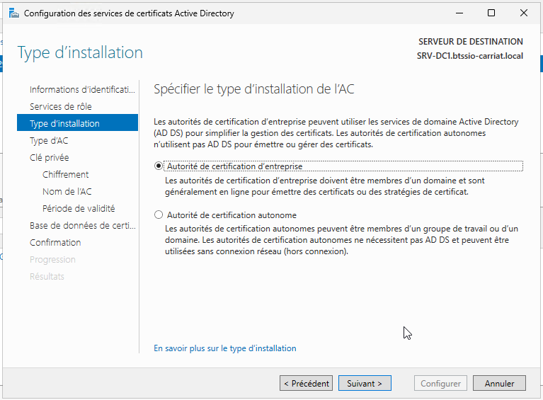
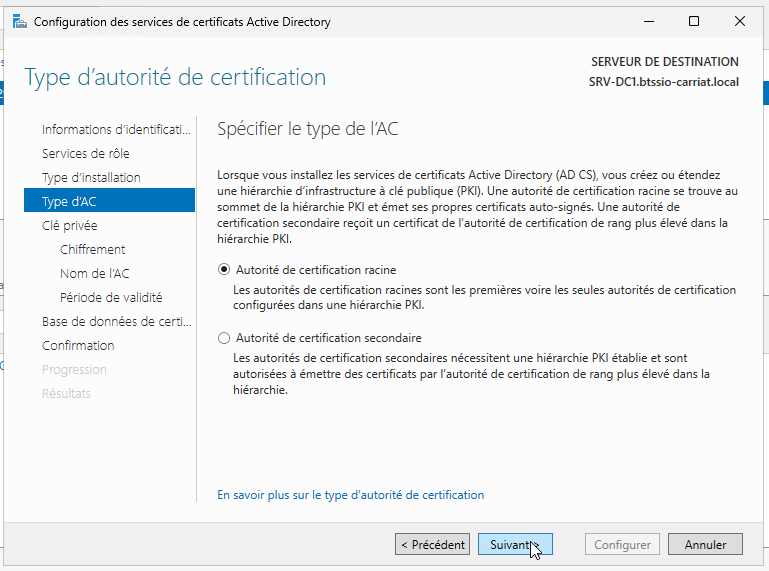
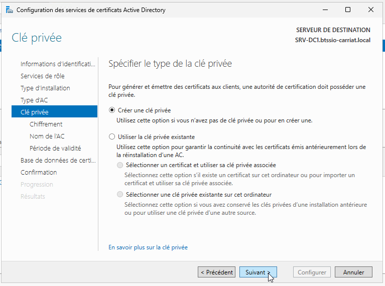
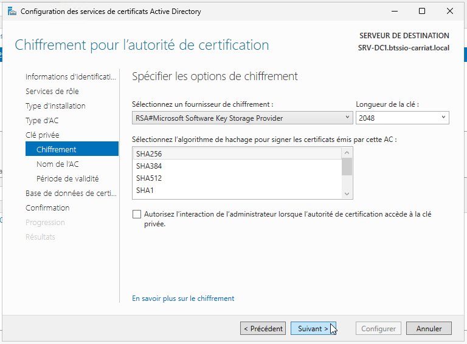
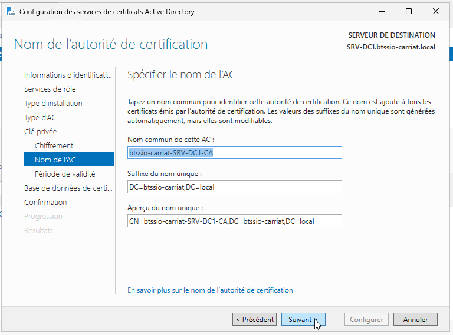
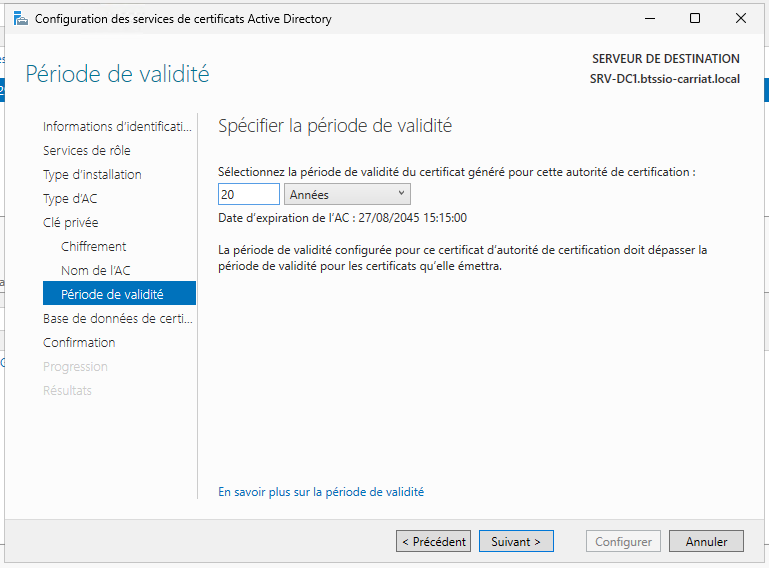
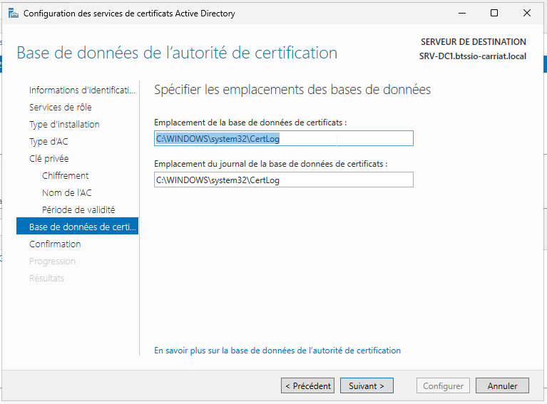
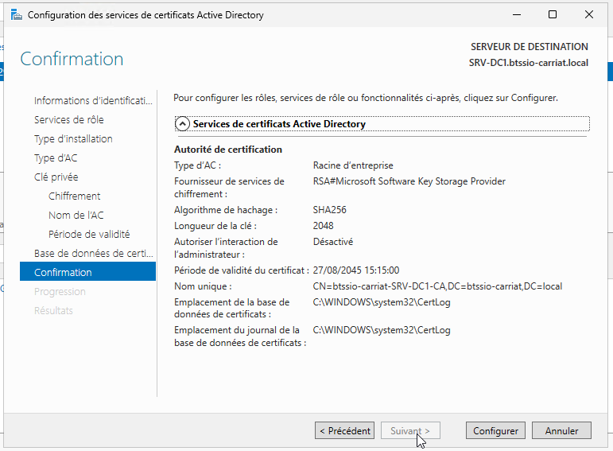
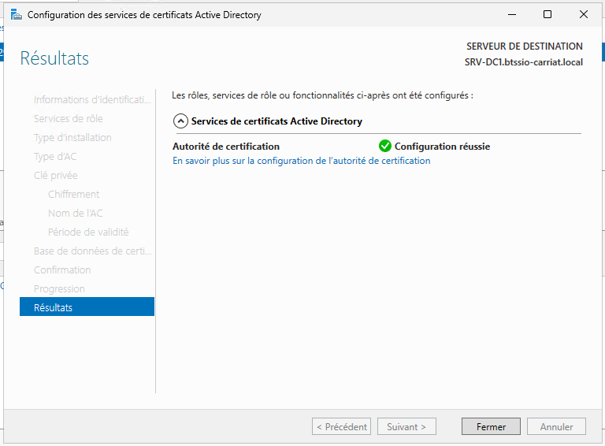
Votre autorité est prête !

### Exporter le certificat de l'Autorité de certificat (CA)

#### Depuis l'interface Graphique

Ouvrir le composant, autorité de certification.

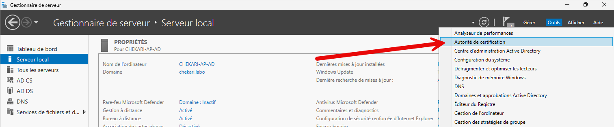

Ouvrir les propriétés de l'autorité.

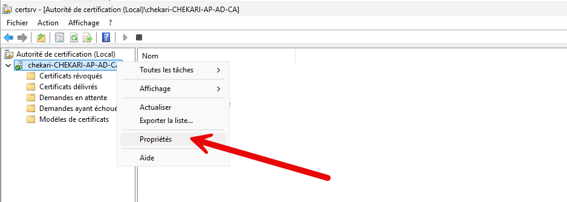

Dans l'onglet `Général > Afficher le certificat`

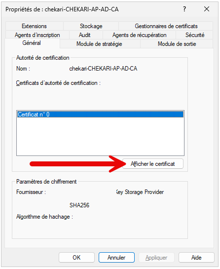

Dans l'onglet Détails, choisir de copier le certificat dans un fichier.

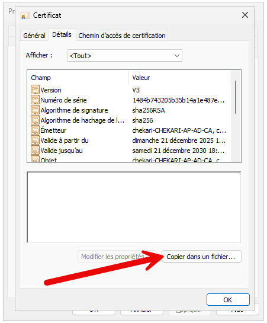

Choisir le format X.509 encodé en base 64.

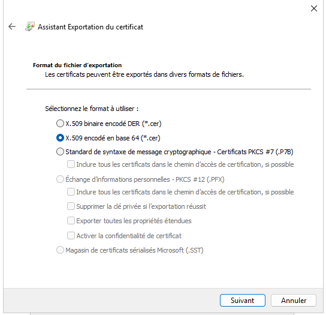

Donner ensuite l'emplacement où sera enregistré le fichier.

Vous pouvez ouvrir le fichier avec le notepad pour avoir accès au certificat.

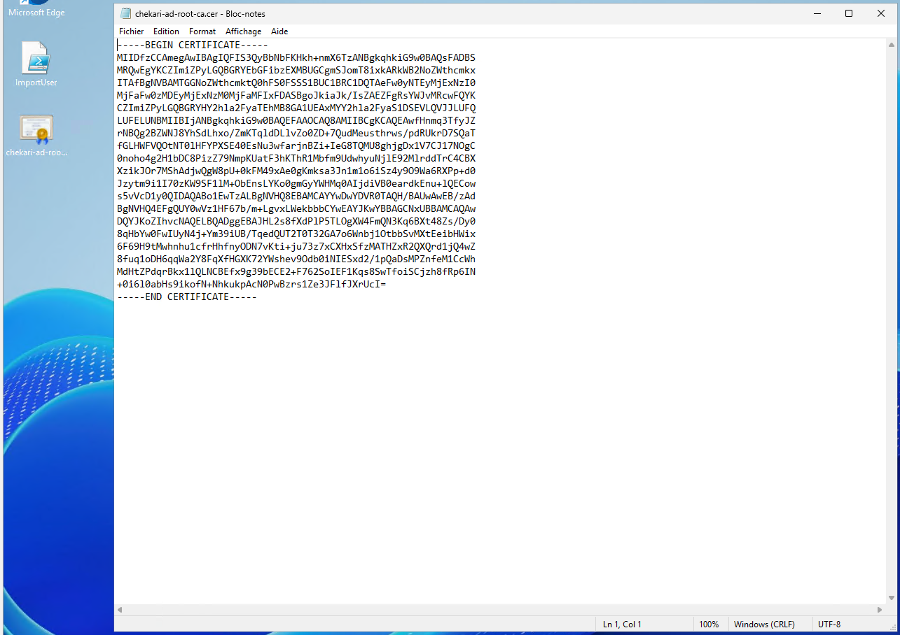

#### Depuis PowerShell

Sur l’AD, afficher les certificats racine et leur empreinte :

```bash
Get-ChildItem -Path Cert:\LocalMachine\Root
```

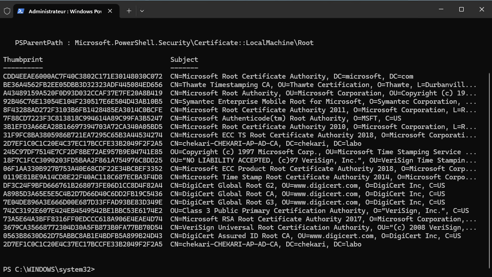

 On va ensuite exporter le certificat de l’AD en utilisant ton Thumbprint :

```bash
$cert = Get-ChildItem -Path Cert:\LocalMachine\Root\2D7EF1C0C1C20E4C37EC17BCCFE33B2049F2F2A5
Export-Certificate -Cert $cert -FilePath c:\ssl\root-ca-cert.cer -Type CERT
certutil -encode c:\ssl\root-ca-cert.cer c:\ssl\root-ca-cert.pem
```

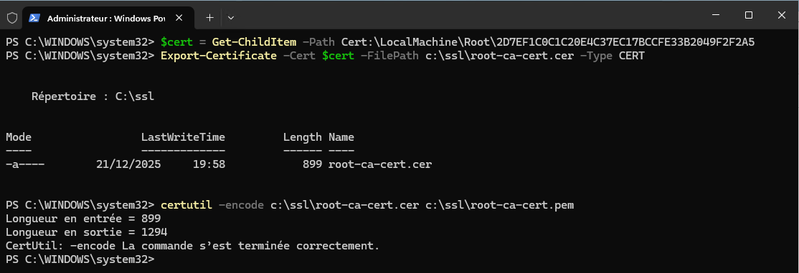

Les fichiers sont bien créés.

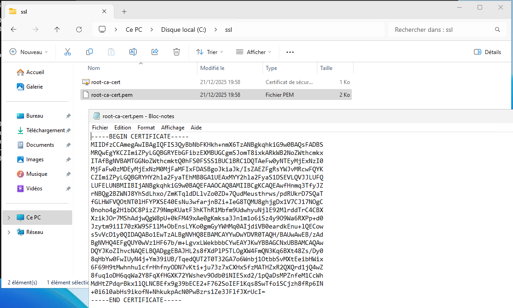