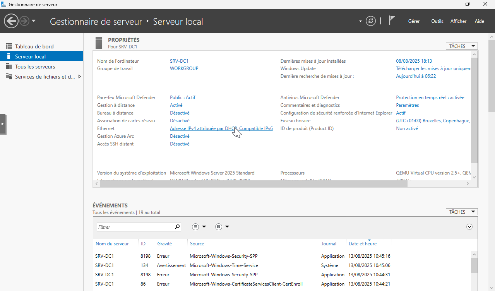
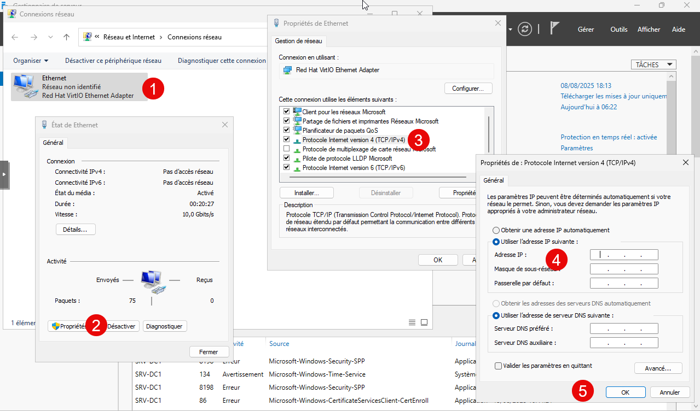

Pour renommer un serveur, il existe plusieurs chemins d’accès.

Personnellement, je lance le Gestionnaire de serveur :

Dans Ethernet, on clique sur Adresse IPv4.

On sélectionne ensuite la carte réseau > Propriétés >Protocole Internet version 4 puis on réalise le paramétrage.

