Le service DHCP (Dynamic Host Configuration Protocol) est un rôle essentiel dans les réseaux informatiques, permettant l'attribution automatique d'adresses IP et d'autres paramètres de configuration réseau aux clients. Dans Windows Server 2025, le rôle DHCP a été amélioré pour offrir une meilleure performance, une sécurité renforcée et une gestion plus facile.

## Installation du rôle DHCP
Pour installer le rôle DHCP sur Windows Server 2025, suivez ces étapes :
1. Ouvrez le Gestionnaire de serveur.
2. Cliquez sur "Ajouter des rôles et des fonctionnalités".

3. Sélectionnez "Rôle basé ou installation de fonctionnalités" et cliquez sur "Suivant".
4. Choisissez le serveur sur lequel vous souhaitez installer le rôle DHCP et cliquez sur "Suivant".
5. Cochez la case "Serveur DHCP" et cliquez sur "Suivant

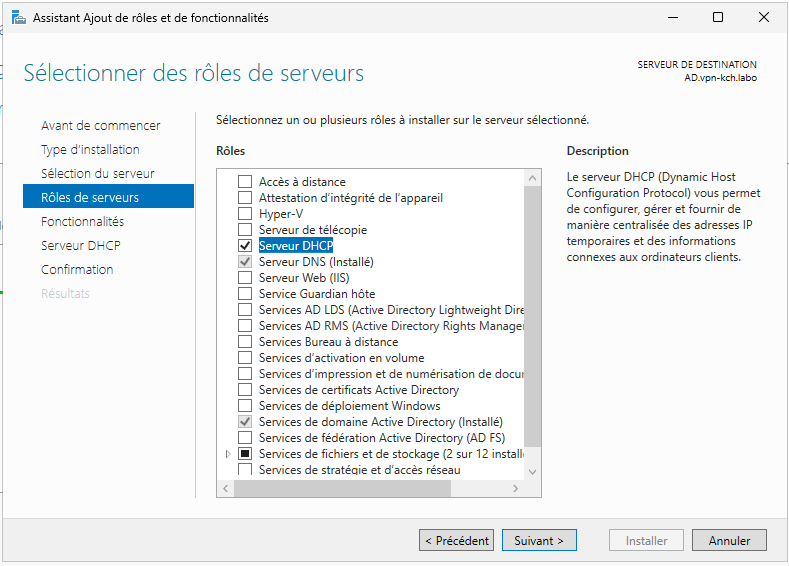

6. Suivez les instructions à l'écran pour terminer l'installation du rôle DHCP.

## Configuration du rôle DHCP

Après l'installation du rôle DHCP, vous devez configurer le serveur DHCP pour qu'il puisse attribuer des adresses IP aux clients. Voici les étapes pour configurer le serveur DHCP :

- Dans le gestionnaire de serveur, terminer la configuration du rôle DHCP en cliquant sur "Terminer la configuration DHCP" dans le volet de notifications.

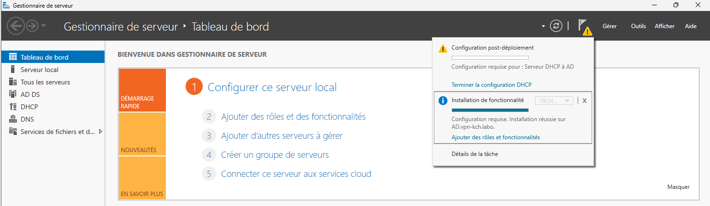

Dans le cas d'un domaine Active Directory, il faut autoriser le serveur DHCP dans Active Directory pour qu'il puisse fonctionner correctement.

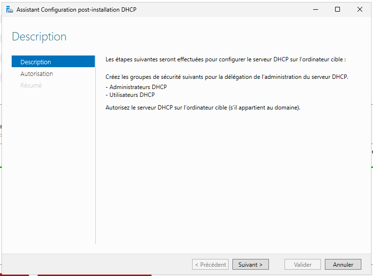

- Cliquez sur **Valider** pour autoriser le serveur DHCP dans Active Directory.

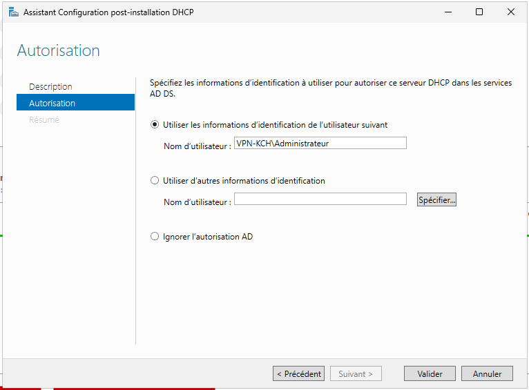

- La configuration est terminée.

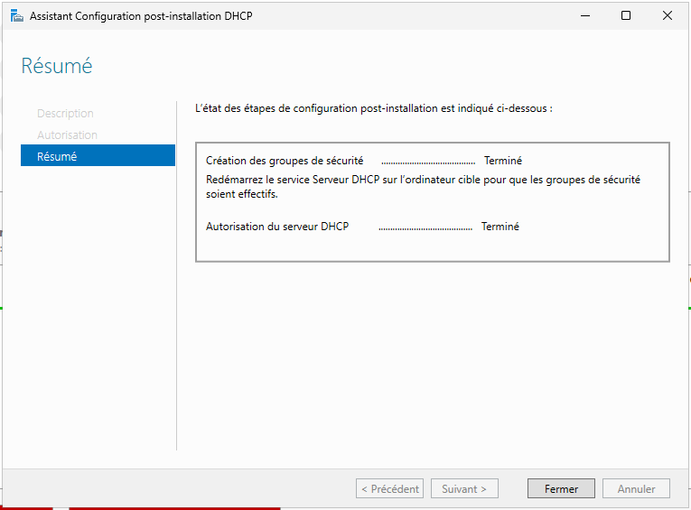

- Ouvrez le Gestionnaire de serveur et cliquez sur "Outils", puis sélectionnez "DHCP".
- Dans la console DHCP, développez le nom de votre serveur DHCP, puis cliquez avec le bouton droit sur "IPv4" et sélectionnez "Nouvelle Etendue".

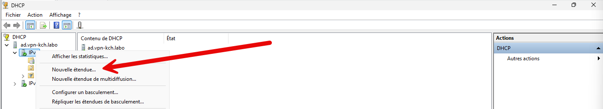

- Nommer l'étendue et fournir une description (facultatif), puis cliquez sur "Suivant".

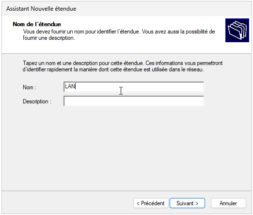

- Spécifiez la plage d'adresses IP que le serveur DHCP peut attribuer aux clients, puis cliquez sur "Suivant".

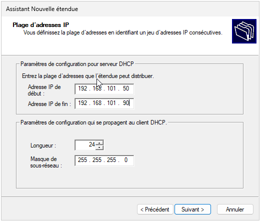

- Configurez les options DHCP selon vos besoins :
  - Ajouter une exclusion d'adresses IP si nécessaire.

  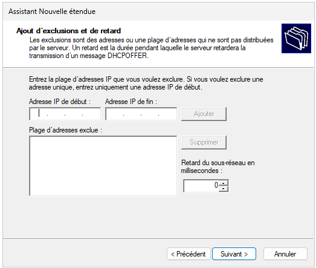

  - Configurer la durée du bail DHCP.

  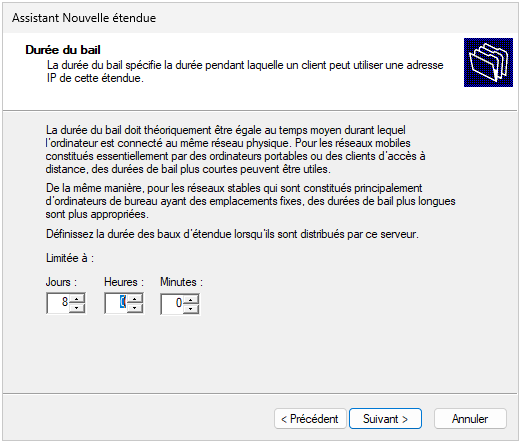

  - Ajouter des options DHCP telles que la passerelle par défaut, les serveurs DNS, etc.

  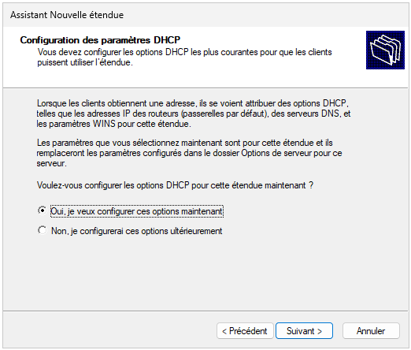

  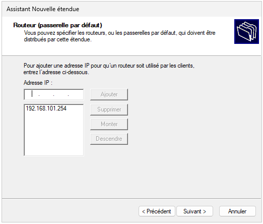

- Activer l'étendue pour permettre au serveur DHCP de commencer à attribuer des adresses IP aux clients.

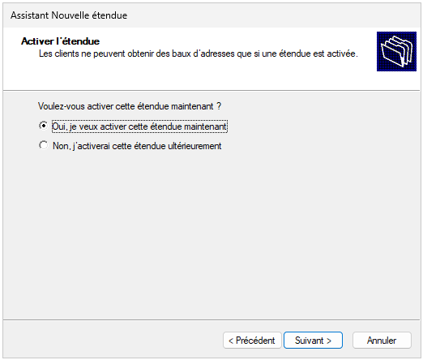