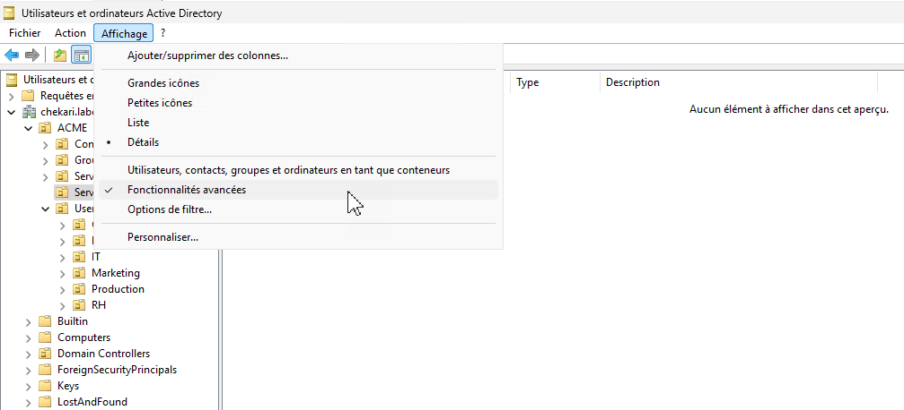
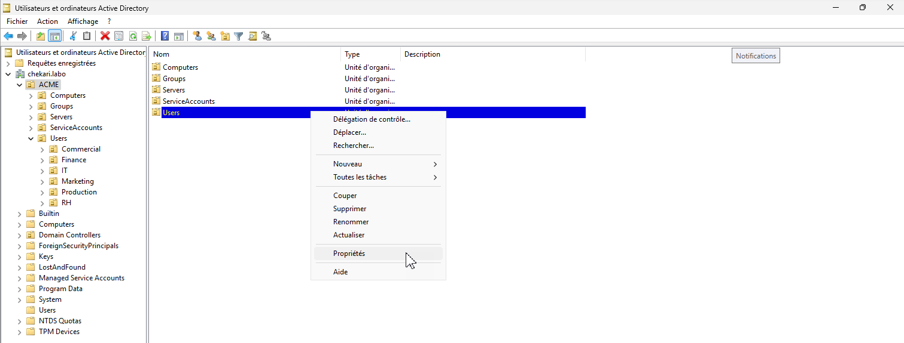
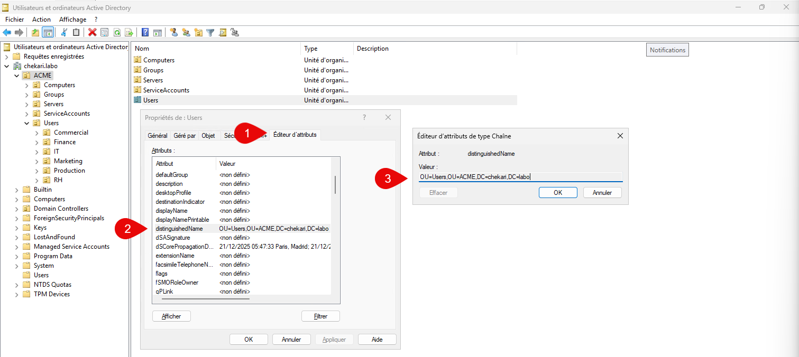

Le Distinguished Name (DN) est un identifiant unique et complet permettant de localiser précisément un objet (utilisateur, groupe, ordinateur, OU) dans un Active Directory. Il décrit le chemin exact de l’objet dans l’arborescence de l’annuaire, par exemple :

`CN=jdupont,OU=IT,OU=Users,DC=entreprise,DC=local`

Dans Active Directory, le DN est indispensable pour identifier sans ambiguïté un objet, notamment lors des opérations d’administration, de scripts ou d’automatisation.

Dans un contexte LDAP avec des serveurs Linux, le DN joue un rôle central lors de l’authentification et des requêtes d’annuaire. 

Il est utilisé comme point d’entrée (Bind DN) pour permettre à un service Linux (serveur web, serveur de fichiers, application métier, etc.) de se connecter à l’annuaire Active Directory et d’interroger les informations des utilisateurs ou des groupes.

Grâce au DN, les serveurs Linux peuvent s’intégrer à l’Active Directory pour la gestion centralisée des comptes, l’authentification unique et le contrôle des accès, garantissant ainsi une interopérabilité efficace entre environnements Windows et Linux.

Pour trouver le DN d'un objet, il faut activer les fonctionnalités avancées de l'élément "Utilisateurs et ordinateurs Active Directory".

Aller ensuite dans les propriétés de l'éléments.

Puis dans les éditeurs d'attributs.

