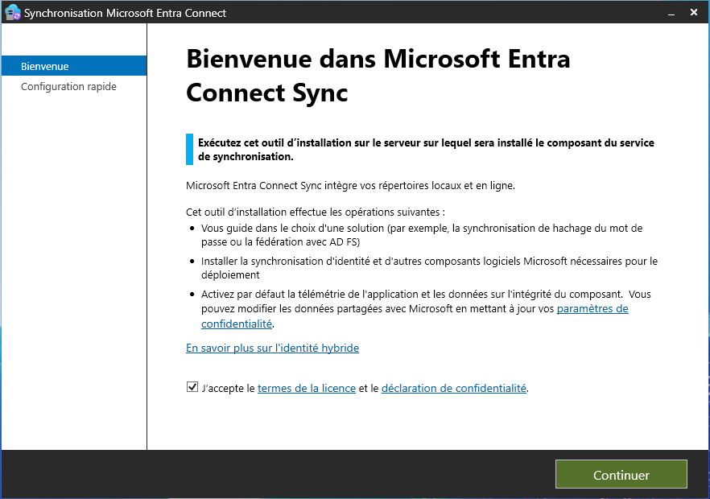
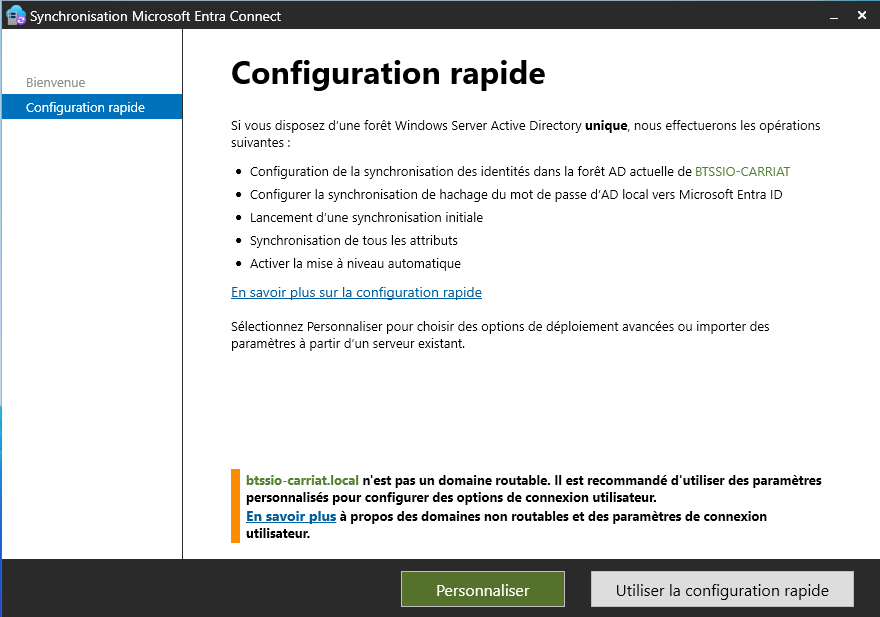
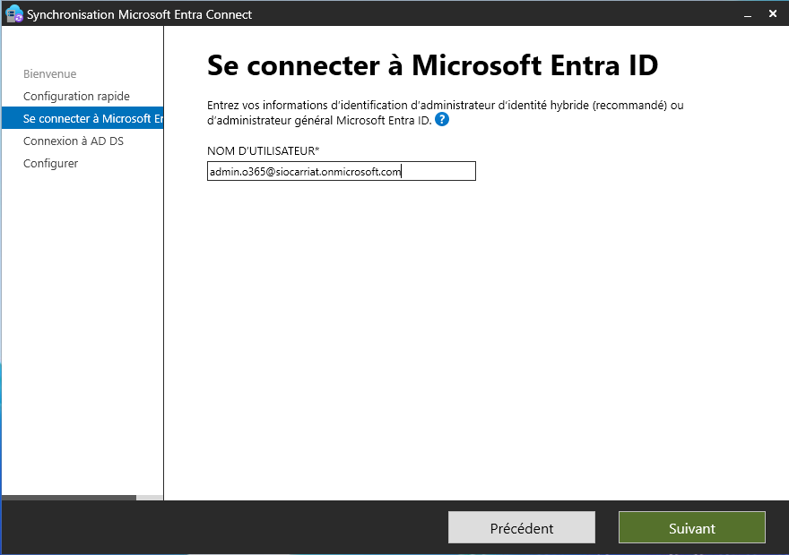
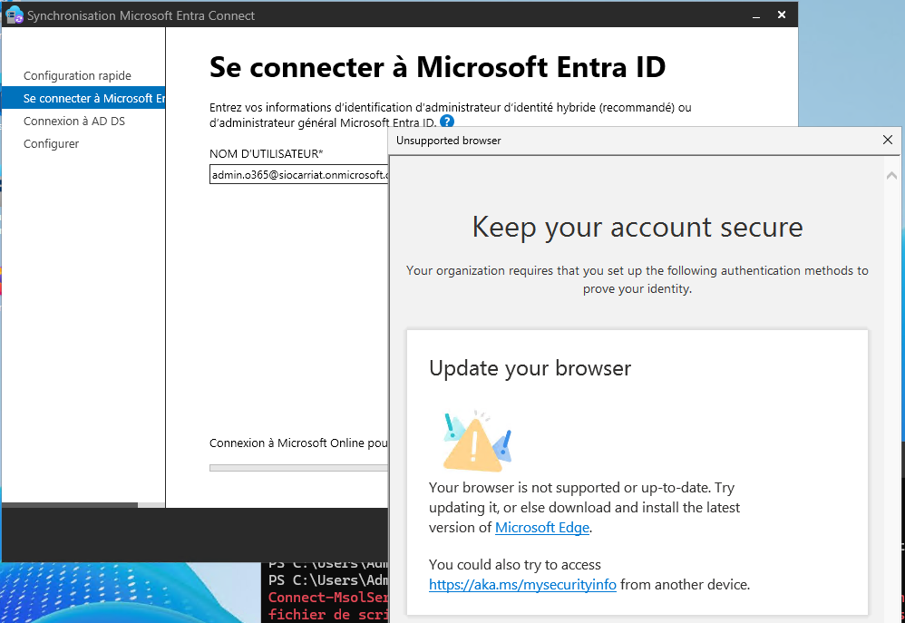
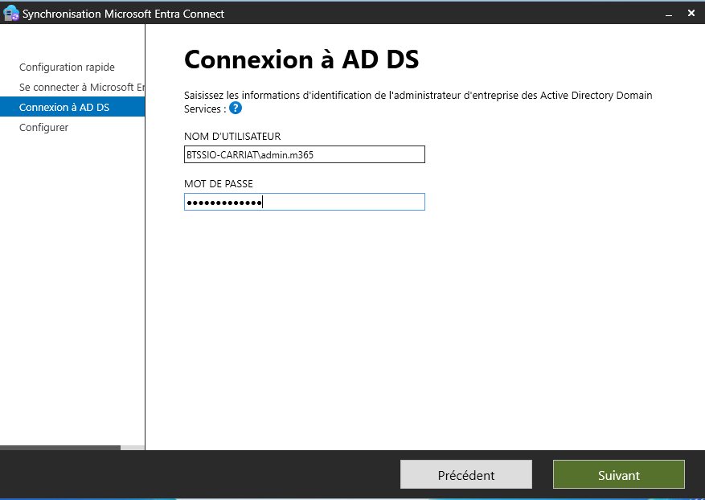
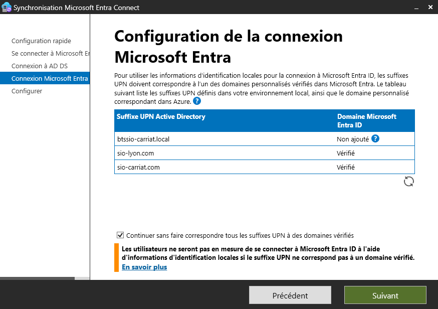
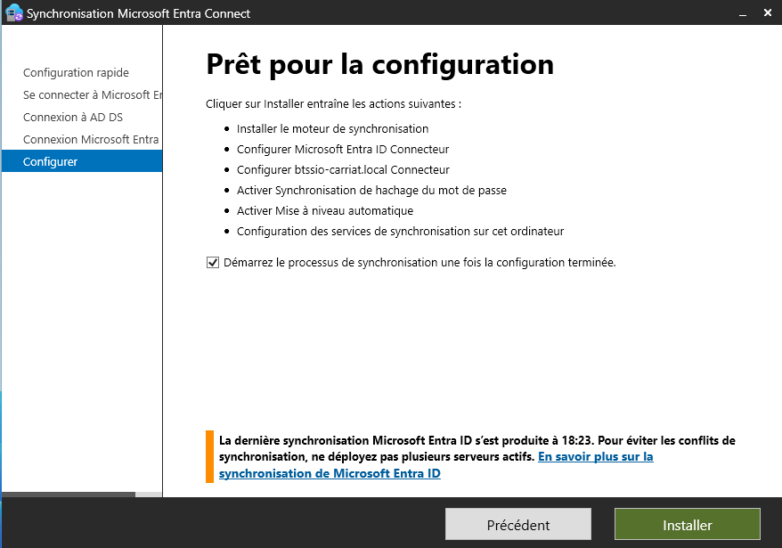

Aller sur le site Microsoft Entra pour télécharger le dernier client de synchronisation AzureADConnect.msi.

On commence par accepter les termes de la licence



On va ensuite choisir la configuration rapide.



On va nommer un utilisateur Administrateur



Si vous avez l’erreur suivante :



Il faut que l’authentification multifacteur soit activé sur le compte (rien à voir avec la version du navigateur) merci Microsoft 🙃

On va ensuite renseigner l’administrateur local



On va continuer sans faire correspondre les suffixes UPN.



Et on termine par lancer le processus de synchronisation.



Voici les commandes PowerShell utile :

```bash
Lancer une synchro en delta :
Start-ADSyncSyncCycle -PolicyType Delta
 
Lancer une synchro complète :
Start-ADSyncSyncCycle -PolicyType Initial
 
Vérifier la dernière synchro :
Get-ADSyncScheduler
```

Une fois la configuration terminée, vous obtiendrez cette fenêtre
