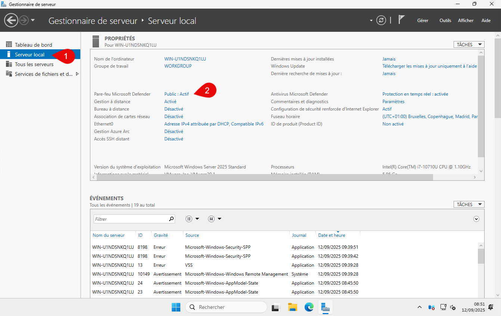
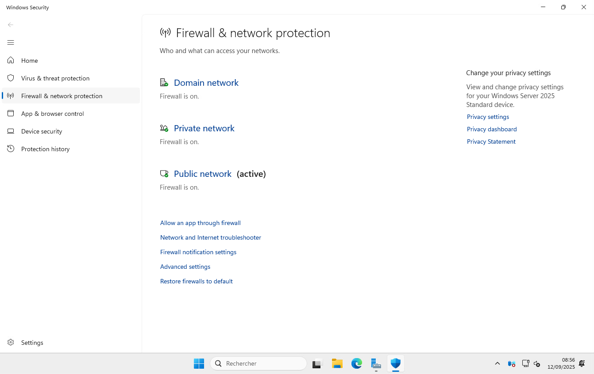
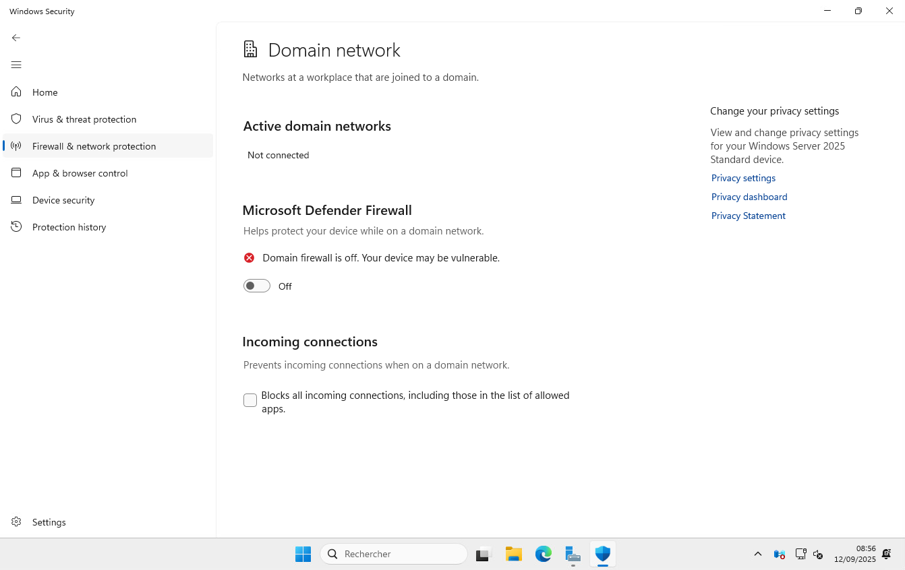
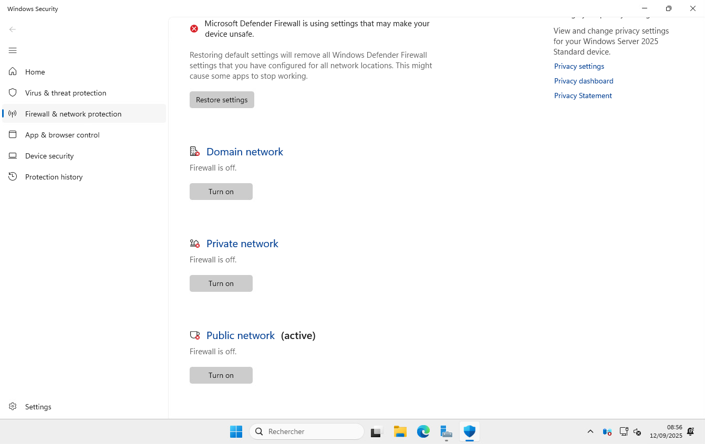

Dans le gestionnaire du serveur, sélectionner le serveur local puis cliquer sur Pare-feu Microsoft Defender.

Dans la fenêtre qui s’ouvre, désactivé le Firewall pour tous les domaines.

Cliquer sur le domaine et passer le pare-feu en off.

Tous les domaines sont désactivés.
