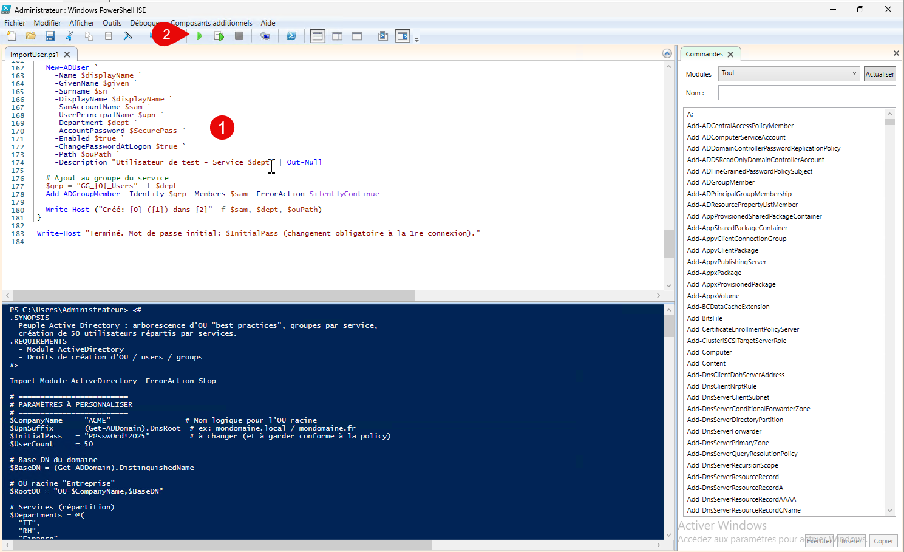
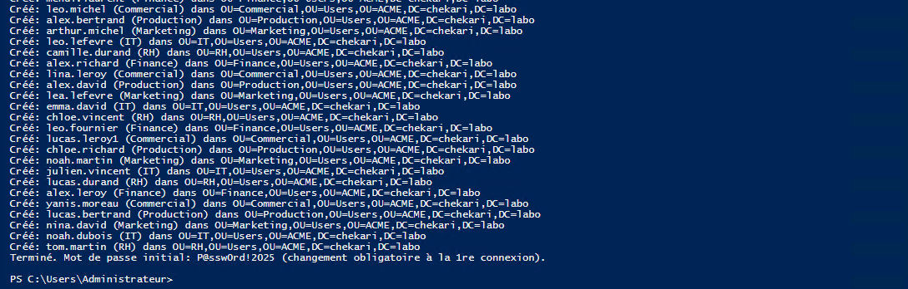
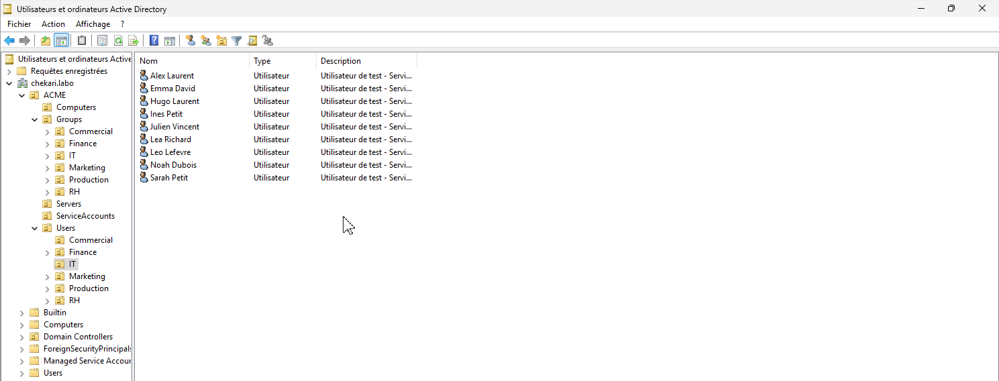

L’objectif de cette fiche de Knowledge Base (KB) est de vous apprendre à peupler automatiquement un annuaire Active Directory à l’aide d’un script PowerShell, comme cela se fait en situation professionnelle. 

Plutôt que de créer manuellement des dizaines de comptes utilisateurs (méthode longue et source d’erreurs), vous allez utiliser un script prêt à l’emploi pour créer une arborescence d’OU conforme aux bonnes pratiques, générer 50 comptes utilisateurs répartis par service (informatique, RH, finance, etc.) et les associer aux groupes de sécurité correspondants.

Cette manipulation vous permettra de mieux comprendre l’organisation logique d’un domaine Active Directory, la notion de services, de groupes et l’intérêt de l’automatisation dans l’administration système.

Le fichier PowerShell vous est fourni en téléchargement avec cette fiche KB. 

Pour l’utiliser, connectez-vous sur un contrôleur de domaine ou une machine disposant des outils RSAT Active Directory, puis ouvrez PowerShell ISE en tant qu’administrateur.

Copiez-collez l’intégralité du script dans une nouvelle fenêtre de script, vérifiez si nécessaire les paramètres (nom de l’entreprise, mot de passe initial, suffixe du domaine), puis exécutez le script. 

Celui-ci créera automatiquement les OU, les groupes de sécurité et les comptes utilisateurs dans l’annuaire. 

- Ouvrir PowerShell ISE en tant qu'administrateur.
- Executer le script.



Vous devez avoir un résultat positif dans la fenêtre d'éxécution.



Constater dans le composant Utilisateurs et ordinateurs Active Directory que les utilisateurs sont importés.



```powershell
Import-Module ActiveDirectory -ErrorAction Stop

# =========================
# PARAMÈTRES À PERSONNALISER
# =========================
$CompanyName   = "ACME"                 # Nom logique pour l'OU racine
$UpnSuffix     = (Get-ADDomain).DnsRoot  # ex: mondomaine.local / mondomaine.fr
$InitialPass   = "Etudiant_1234"         # à changer (et à garder conforme à la policy)
$UserCount     = 50

# Base DN du domaine
$BaseDN = (Get-ADDomain).DistinguishedName

# OU racine "Entreprise"
$RootOU = "OU=$CompanyName,$BaseDN"

# Services (répartition)
$Departments = @(
  "IT",
  "RH",
  "Finance",
  "Commercial",
  "Production",
  "Marketing"
)

# =========================
# FONCTIONS UTILITAIRES
# =========================
function Ensure-OU {
  param(
    [Parameter(Mandatory)] [string] $Name,
    [Parameter(Mandatory)] [string] $Path
  )
  $dn = "OU=$Name,$Path"
  if (-not (Get-ADOrganizationalUnit -LDAPFilter "(distinguishedName=$dn)" -ErrorAction SilentlyContinue)) {
    New-ADOrganizationalUnit -Name $Name -Path $Path -ProtectedFromAccidentalDeletion $true | Out-Null
    Write-Host "OU créée : $dn"
  } else {
    Write-Host "OU existe : $dn"
  }
  return $dn
}

function Ensure-Group {
  param(
    [Parameter(Mandatory)] [string] $Name,
    [Parameter(Mandatory)] [string] $Path,
    [ValidateSet("Global","DomainLocal","Universal")] [string] $Scope = "Global",
    [ValidateSet("Security","Distribution")] [string] $Category = "Security"
  )

  $existing = Get-ADGroup -Filter "SamAccountName -eq '$Name'" -ErrorAction SilentlyContinue
  if (-not $existing) {
    New-ADGroup -Name $Name -SamAccountName $Name -GroupScope $Scope -GroupCategory $Category -Path $Path | Out-Null
    Write-Host "Groupe créé : $Name"
  } else {
    Write-Host "Groupe existe : $Name"
  }
}

function New-UniqueSam {
  param(
    [Parameter(Mandatory)] [string] $GivenName,
    [Parameter(Mandatory)] [string] $Surname
  )
  # samAccountName: prenom.nom (sans accents) tronqué à 20 chars
  $raw = ("{0}.{1}" -f $GivenName, $Surname).ToLower()

  # Retire accents et caractères non autorisés
  $norm = $raw.Normalize([Text.NormalizationForm]::FormD)
  $clean = -join ($norm.ToCharArray() | Where-Object { [Globalization.CharUnicodeInfo]::GetUnicodeCategory($_) -ne "NonSpacingMark" })
  $clean = ($clean -replace "[^a-z0-9\.]", "")

  $base = $clean.Substring(0, [Math]::Min(20, $clean.Length))
  $sam = $base
  $i = 1

  while (Get-ADUser -Filter "SamAccountName -eq '$sam'" -ErrorAction SilentlyContinue) {
    $suffix = "$i"
    $maxLen = 20 - $suffix.Length
    $sam = ($base.Substring(0, [Math]::Min($maxLen, $base.Length))) + $suffix
    $i++
  }
  return $sam
}

# =========================
# 1) CRÉATION ARBORESCENCE OU
# =========================
# OU racine
if (-not (Get-ADOrganizationalUnit -LDAPFilter "(distinguishedName=$RootOU)" -ErrorAction SilentlyContinue)) {
  New-ADOrganizationalUnit -Name $CompanyName -Path $BaseDN -ProtectedFromAccidentalDeletion $true | Out-Null
  Write-Host "OU racine créée : $RootOU"
} else {
  Write-Host "OU racine existe : $RootOU"
}

# Niveaux "best practices"
$OuUsers           = Ensure-OU -Name "Users"           -Path $RootOU
$OuComputers       = Ensure-OU -Name "Computers"       -Path $RootOU
$OuGroups          = Ensure-OU -Name "Groups"          -Path $RootOU
$OuServers         = Ensure-OU -Name "Servers"         -Path $RootOU
$OuServiceAccounts = Ensure-OU -Name "ServiceAccounts" -Path $RootOU

# Sous-OU de Users par département
$DeptOUs = @{}
foreach ($dept in $Departments) {
  $DeptOUs[$dept] = Ensure-OU -Name $dept -Path $OuUsers
}

# Sous-OU de Groups par département
$GroupDeptOUs = @{}
foreach ($dept in $Departments) {
  $GroupDeptOUs[$dept] = Ensure-OU -Name $dept -Path $OuGroups
}

# =========================
# 2) GROUPES PAR SERVICE
# =========================
# Convention simple : GG_<DEPT>_Users (Global Group)
foreach ($dept in $Departments) {
  Ensure-Group -Name ("GG_{0}_Users" -f $dept) -Path $GroupDeptOUs[$dept] -Scope Global -Category Security
}

# =========================
# 3) CRÉATION 50 UTILISATEURS
# =========================
# Petites listes de prénoms/nom pour générer des comptes "réalistes"
$FirstNames = @("Alex","Camille","Julien","Sofia","Nina","Lucas","Emma","Hugo","Lina","Noah","Ines","Leo","Sarah","Yanis","Manon","Arthur","Lea","Tom","Chloe","Mehdi")
$LastNames  = @("Martin","Bernard","Dubois","Thomas","Robert","Richard","Petit","Durand","Leroy","Moreau","Simon","Laurent","Lefevre","Michel","Garcia","David","Bertrand","Roux","Vincent","Fournier")

# Répartition: round-robin sur les services
$SecurePass = ConvertTo-SecureString $InitialPass -AsPlainText -Force

for ($n = 1; $n -le $UserCount; $n++) {
  $given = Get-Random -InputObject $FirstNames
  $sn    = Get-Random -InputObject $LastNames
  $dept  = $Departments[($n - 1) % $Departments.Count]

  $sam = New-UniqueSam -GivenName $given -Surname $sn
  $upn = "$sam@$UpnSuffix"
  $displayName = "$given $sn"
  $ouPath = $DeptOUs[$dept]

  # Évite doublon UPN (rare) en s'appuyant sur SAM unique
  $existing = Get-ADUser -Filter "SamAccountName -eq '$sam'" -ErrorAction SilentlyContinue
  if ($existing) {
    Write-Warning "Utilisateur existe déjà : $sam (skip)"
    continue
  }

  New-ADUser `
    -Name $displayName `
    -GivenName $given `
    -Surname $sn `
    -DisplayName $displayName `
    -SamAccountName $sam `
    -UserPrincipalName $upn `
    -Department $dept `
    -AccountPassword $SecurePass `
    -Enabled $true `
    -ChangePasswordAtLogon $false `
    -Path $ouPath `
    -Description "Utilisateur de test - Service $dept" | Out-Null

  # Ajout au groupe du service
  $grp = "GG_{0}_Users" -f $dept
  Add-ADGroupMember -Identity $grp -Members $sam -ErrorAction SilentlyContinue

  Write-Host ("Créé: {0} ({1}) dans {2}" -f $sam, $dept, $ouPath)
}

Write-Host "Terminé. Mot de passe initial: $InitialPass (changement obligatoire à la 1re connexion)."
```