Démarrer sur le fichier iso et appuyer sur une touche pour lancer l’installation.

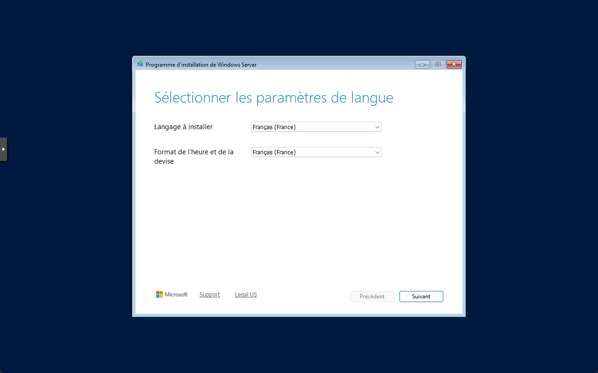

Choisir la langue Français et le format de l’heure Français, suivant.

Choisir ensuite le clavier Français pour un clavier AZERTY, suivant.

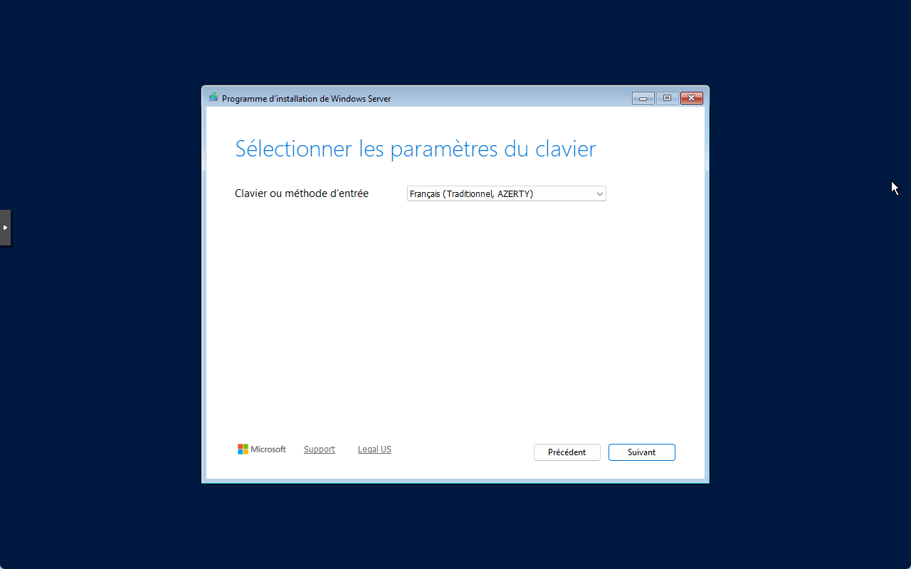

Cocher que vous accepter de tout supprimer.

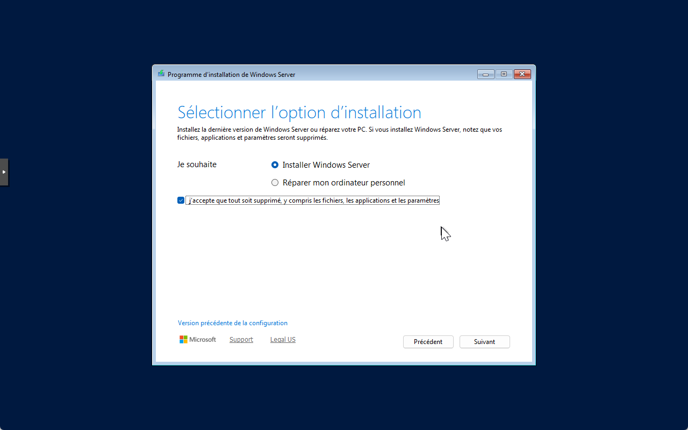

Vous pouvez ensuite choisir de ne pas préciser de clé de produit.

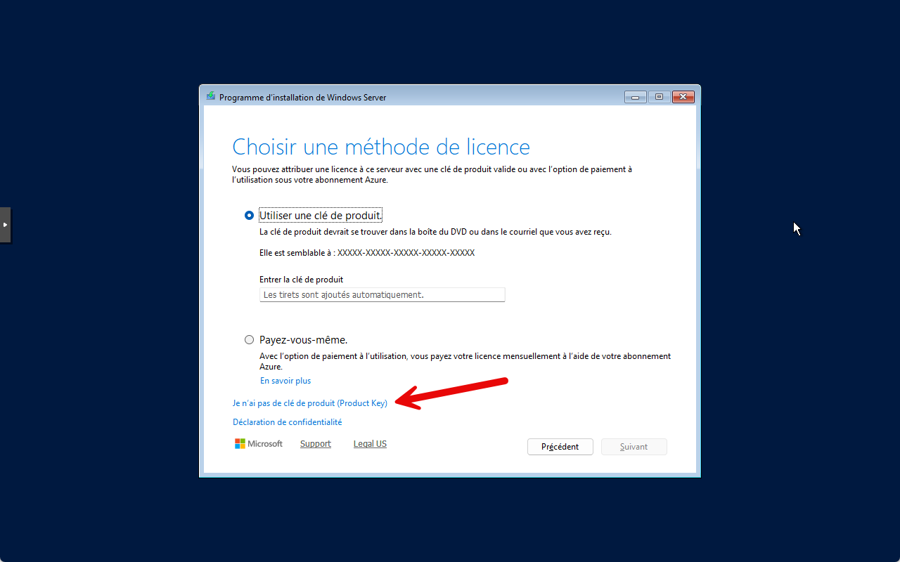

Pour avoir un bureau, il faut choisir une version avec expérience utilisateur.

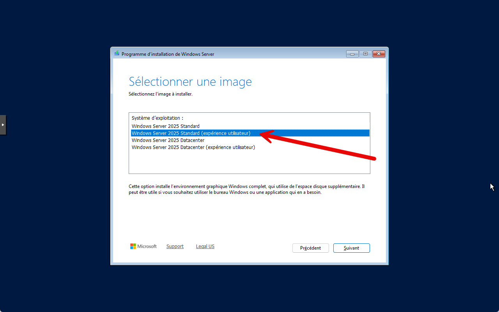

Il faut accepter le contrat de licence.

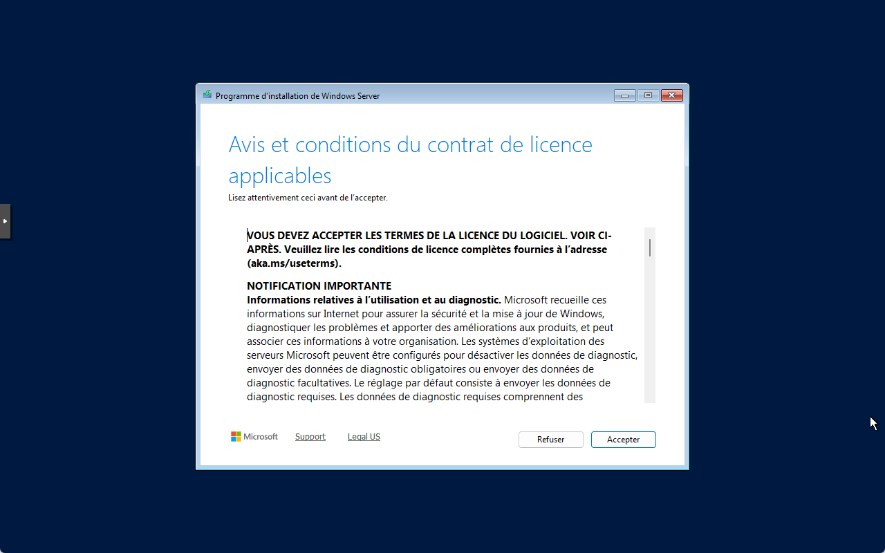

Choisir le disque où sera installé Windows Server 2025. suivant.

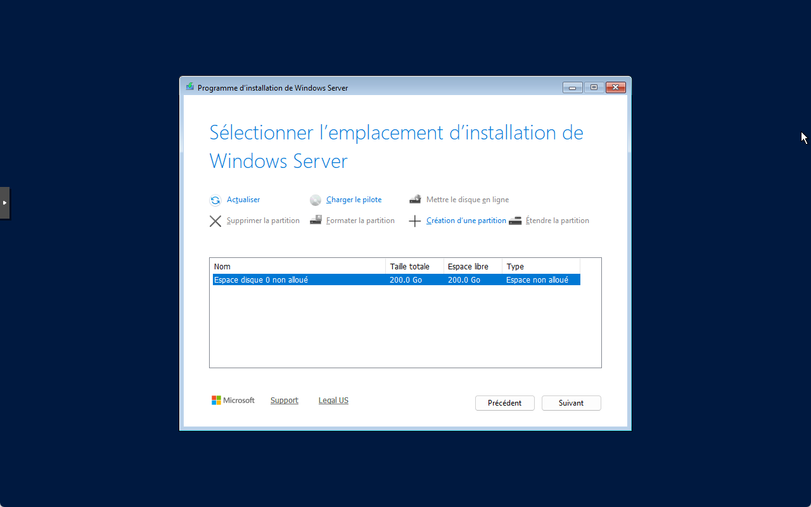

Puis, il reste à lancer l’installation, Installer.

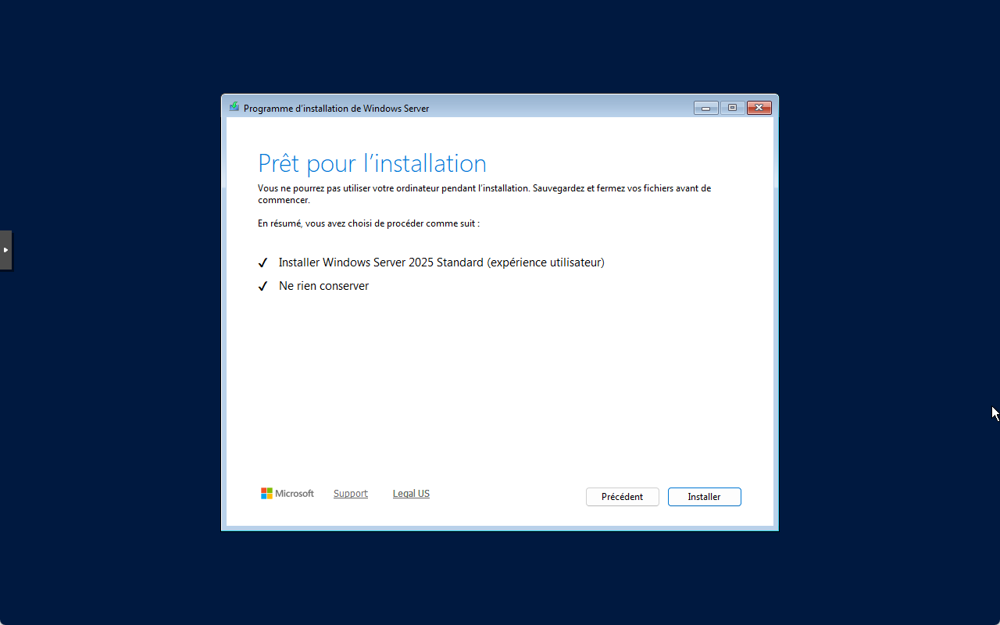

L’installation se lance.

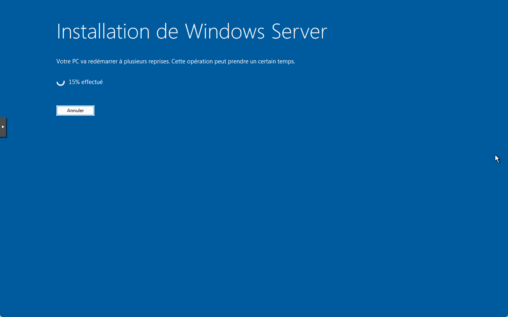

Après un redémarrage, l’installation se poursuit.

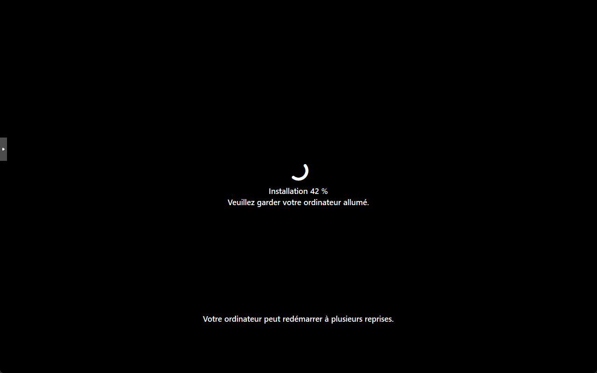

On passe à nouveau la saisie de la clé de produit.

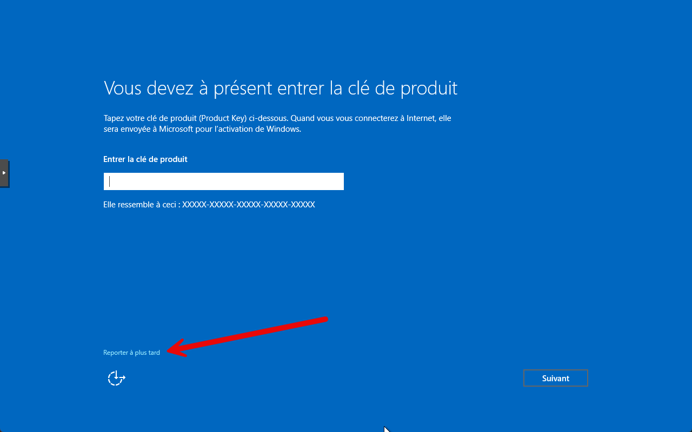

On saisit ensuite le mot de passe du compte administrateur local.

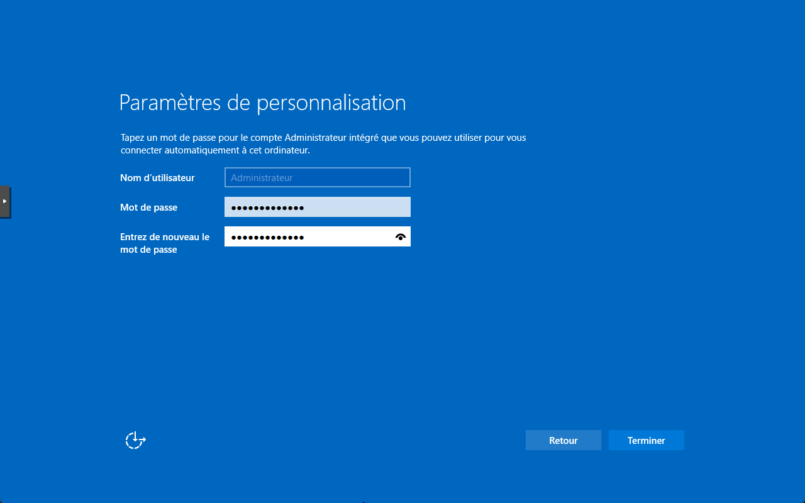

L’installation est terminée, nous pouvons ouvrir une session.

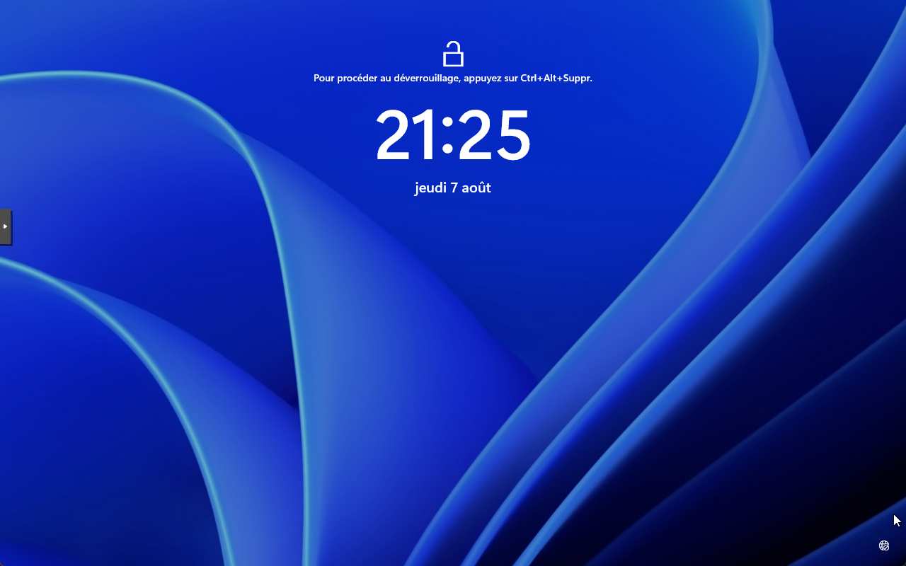

Il ne reste plus qu’à configurer les données utilisateur.

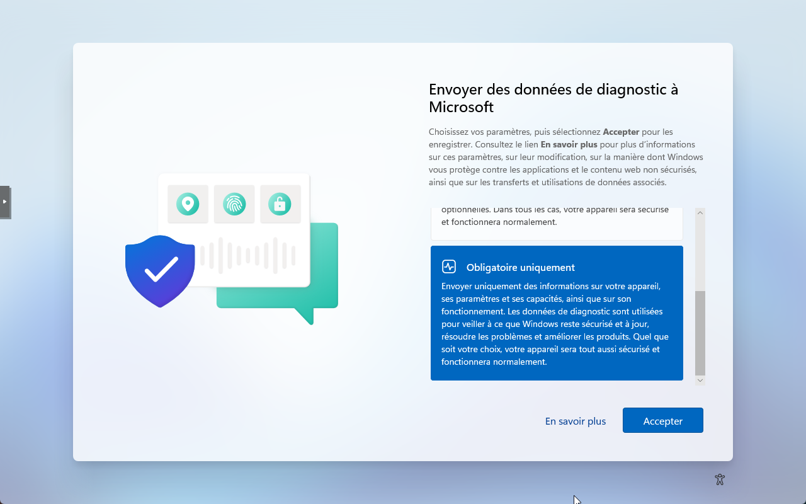

Choisir les possibilités les plus restrictives.

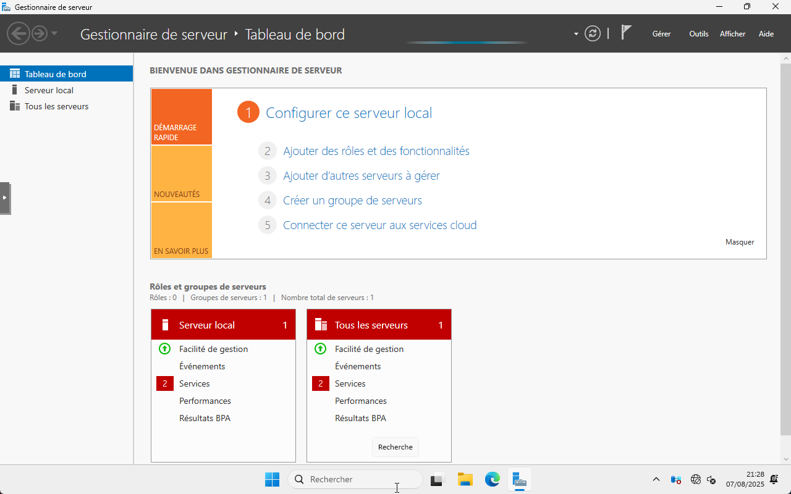

Bonne utilisation !