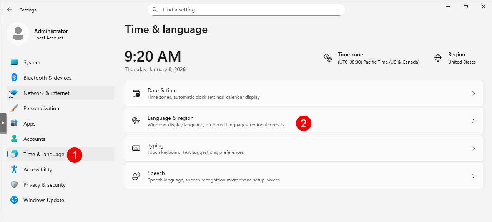
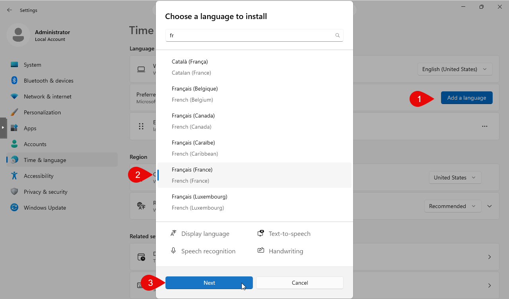
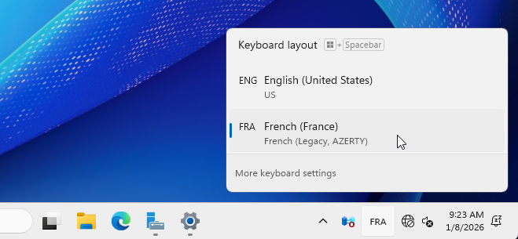
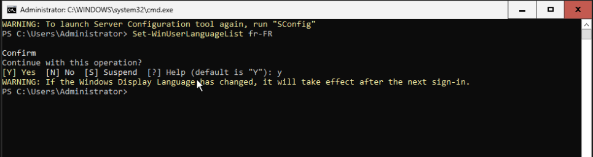

## Par interface graphique

Pour passer le clavier en français sur Windows Server 2025, suivez les étapes ci-dessous :

1. Ouvrez les **Settings**.
2. Cliquez sur **Time & Language**.
3. Sélectionnez **Language & region**.



4. Ajouter le **Français**.



5. Nous pouvons maintenant basculer sur le clavier français en cliquant sur l'icône de langue dans la barre des tâches.



## Par PowerShell

Vous pouvez également utiliser PowerShell pour ajouter la disposition de clavier française. Voici les commandes à exécuter :

```powershell
Set-WinUserLanguageList -LanguageList fr-FR
```



Cette commande configure la langue de l'utilisateur en français (France) et ajoute la disposition de clavier française.
Il faut ensuite sortir de PowerShell pour bénéficier du clavier français.