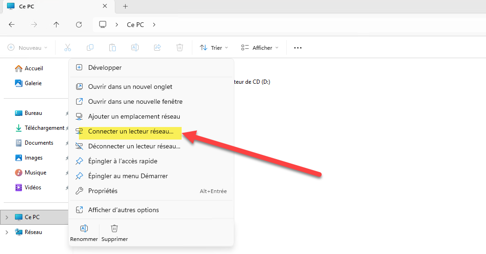
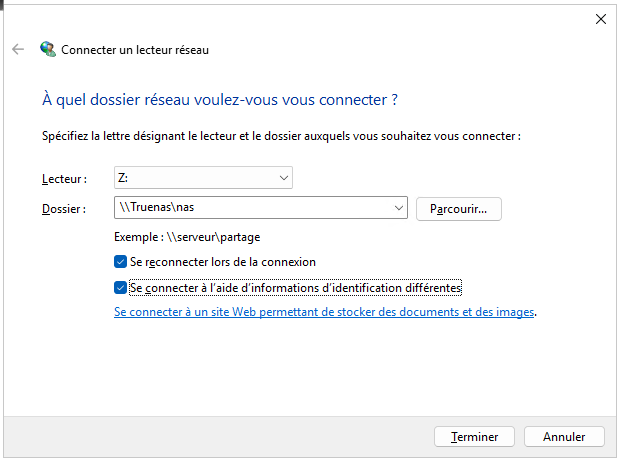
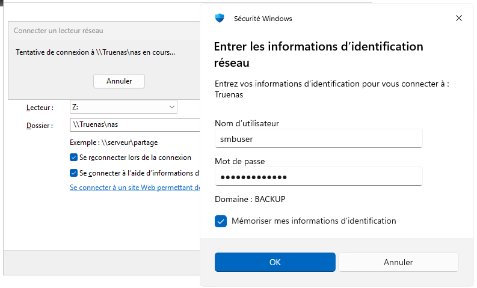
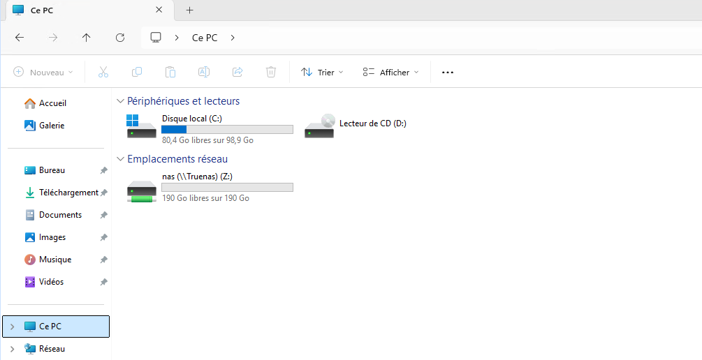

Sous Windows, pour ajouter un lecteur réseau, il faut d'abord s'assurer que le partage réseau est bien configuré sur le serveur (par exemple un serveur TrueNAS ou un serveur Windows).

Aller dans l'explorateur de fichiers, puis cliquer droit sur "Ce PC". Ensuite, cliquer sur "Connecter un lecteur réseau" dans le menu.

Il est possible de choisir une lettre pour le lecteur réseau et de saisir le chemin du partage réseau (par exemple `\\serveur\partage`). Il est également possible de cocher l'option "Se reconnecter à l'ouverture de session" pour que le lecteur réseau soit automatiquement reconnecté à chaque démarrage de Windows.

Si vos identifiants sont différents de ceux de votre session Windows, il est possible de cocher l'option "Se connecter avec des informations d'identification différentes" et de saisir le nom d'utilisateur et le mot de passe du partage réseau.

Le partage est maintenant accessible depuis l'explorateur de fichiers sous la lettre choisie. Il est possible d'accéder aux fichiers et dossiers du partage réseau comme s'ils étaient sur le disque local.

