Voilà ma problématique, j'ai reçu des nouvelles imprimantes pour mes salles de classe. Je souhaite les installer et les partager sur le réseau pour que les enseignants et les étudiants puissent les utiliser facilement. Comment puis-je configurer un serveur d'impression sur Windows Server 2025 pour gérer ces imprimantes et les partager avec les utilisateurs de mon domaine Active Directory ?

Pour configurer un serveur d'impression sur Windows Server 2025 et partager les imprimantes avec les utilisateurs de votre domaine Active Directory, suivez ces étapes :

## Configuration du rôle de serveur d'impression

Depuis le gestionnaire de serveur, cliquez sur "Ajouter des rôles et fonctionnalités". 

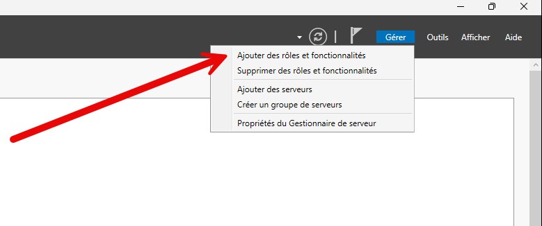

Sélectionnez "Rôle basé ou installation de fonctionnalités" et choisissez votre serveur. Ensuite, cochez la case "Serveur d'impression et de numérisation de document" 

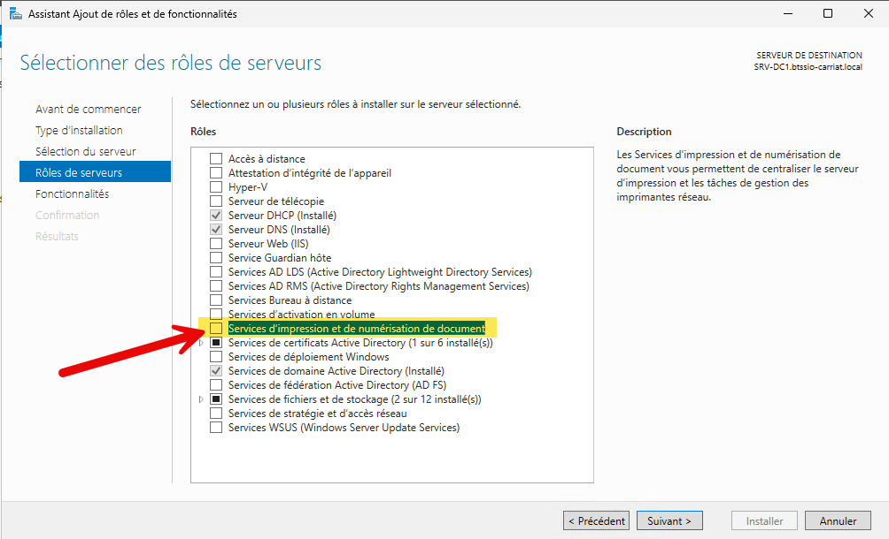

Suivez les instructions pour installer le rôle et cocher uniquement `Serveur d'impression`

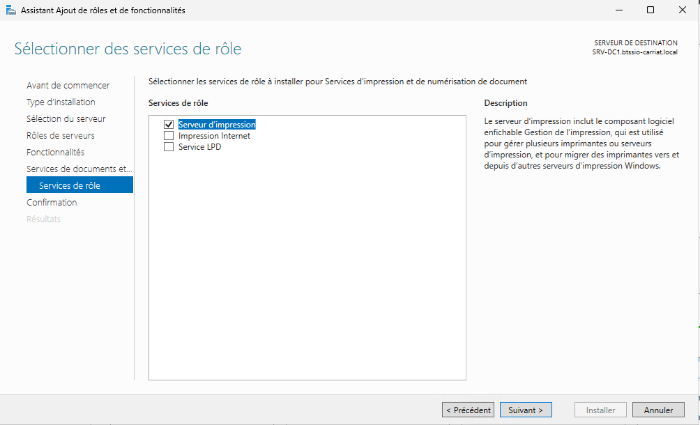

Terminez par `Ìnstaller`.

Lorsque l'installation est terminée, cliquez sur "Fermer".

Depuis les outils d'administration, ouvrez "Gestion de l'impression".

## Ajout d'une imprimante

Dans la console de gestion de l'impression, nous allons configurer une première imprimante pour la rendre disponible sur le réseau.

Dans un premier temps,, nous allons ajouter l'imprimante à notre serveur d'impression. Cliquez sur "Ajouter une imprimante" dans le serveur d'impression.

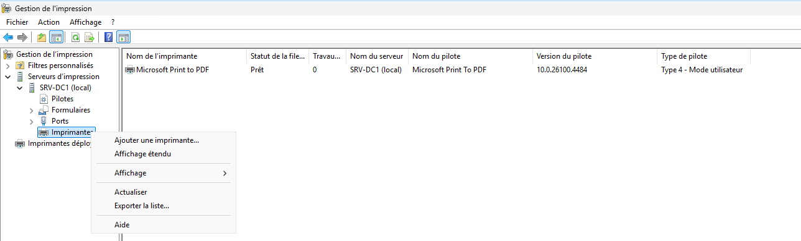

On va ensuite ajouter l'mprimante via son adresse IP.

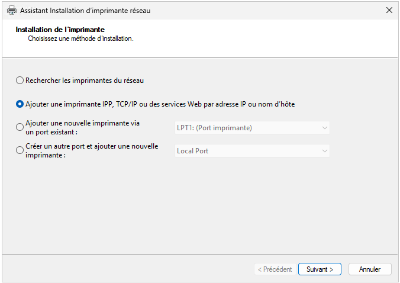

Il faut donc saisir l'adresse IP de l'imprimante, puis cliquer sur "Suivant".

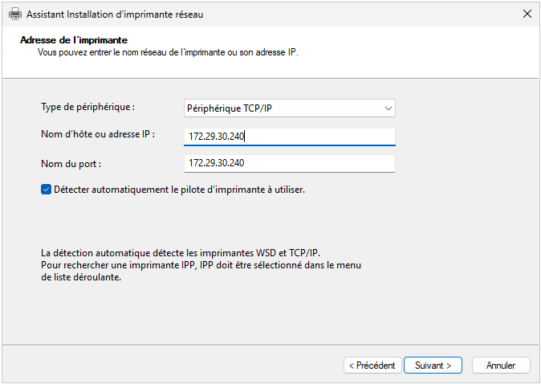

Nous allons ensuite choisir d'installer le pilote de l'imprimante. Si le pilote est disponible dans la liste, sélectionnez-le. Sinon, vous pouvez cliquer sur "Disque fourni" pour installer le pilote à partir d'un fichier.

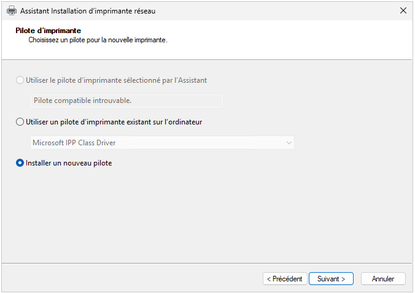

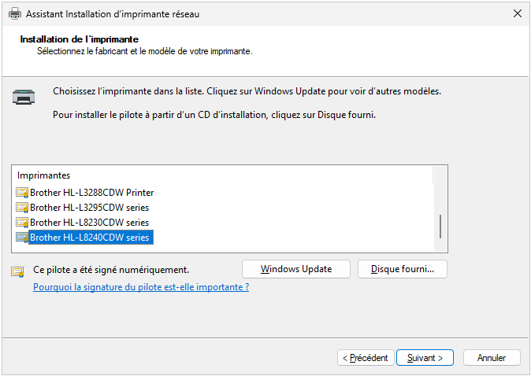

Nommer ensuite l'imprimante et cliquer sur "Suivant".

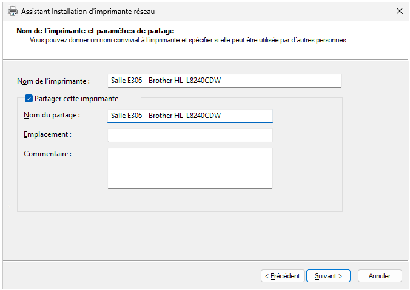

L'installation se lance puis vous pouvez imprimer une page de test pour vérifier que l'imprimante fonctionne correctement.

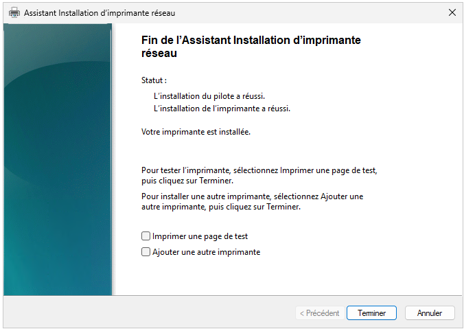

L'imprimante est maintenant ajoutée à votre serveur d'impression et prête à être partagée avec les utilisateurs de votre domaine Active Directory.

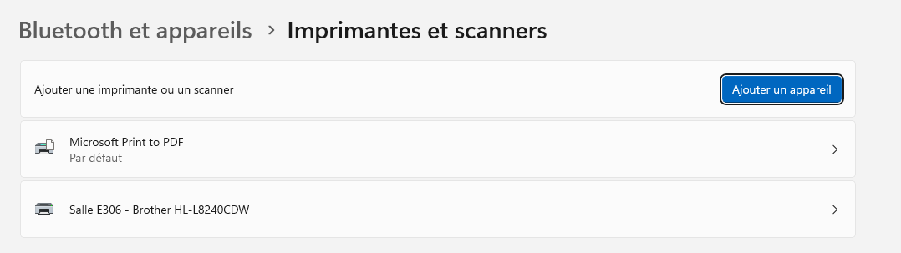

