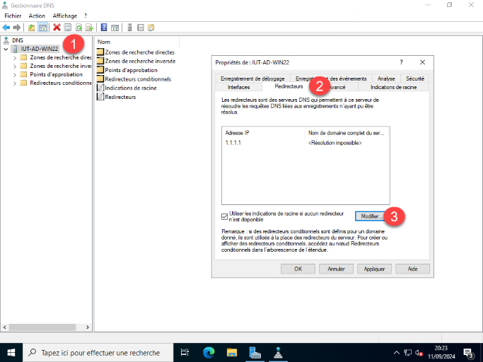

Dans un environnement Active Directory, les redirecteurs DNS permettent à ton serveur DNS interne de déléguer la résolution des noms qu’il ne connaît pas (par exemple les sites Internet) à un serveur DNS externe fiable (comme celui de ton fournisseur d’accès ou de ton pare-feu). Cela évite que le serveur doive interroger directement l’ensemble de la hiérarchie DNS publique, ce qui accélère les résolutions, réduit le trafic réseau et améliore la sécurité en contrôlant vers quels serveurs externes les requêtes sont envoyées.

Lancer l’outil DNS, sur le serveur, clic droit > Propriétés > Redirecteurs > Modifier.

