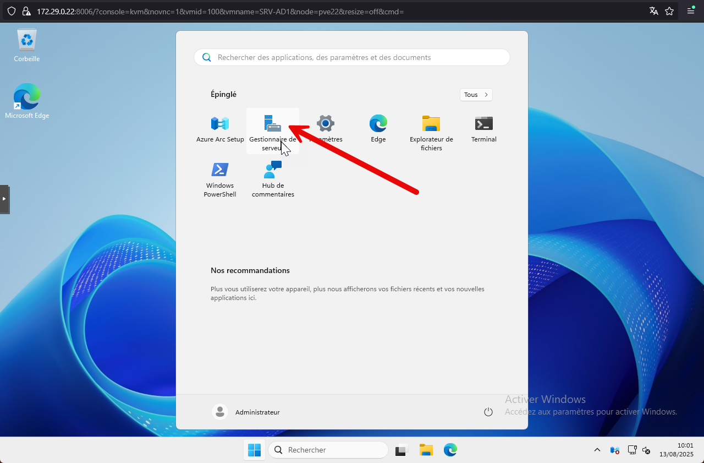
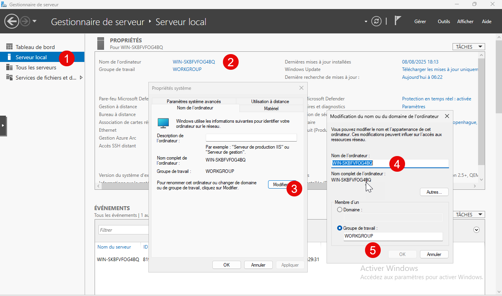
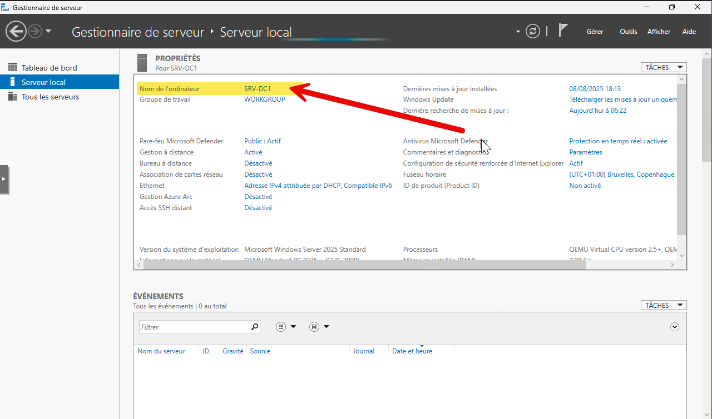

Pour renommer un serveur, il existe plusieurs chemins d’accès.

Personnellement, je lance le Gestionnaire de serveur :

Puis dans Serveur local > Nom de l’ordinateur.

Dans le pop-up, on va modifier le nom et ensuite redémarrer.

Après redémarrage, le nom est bien modifié.

