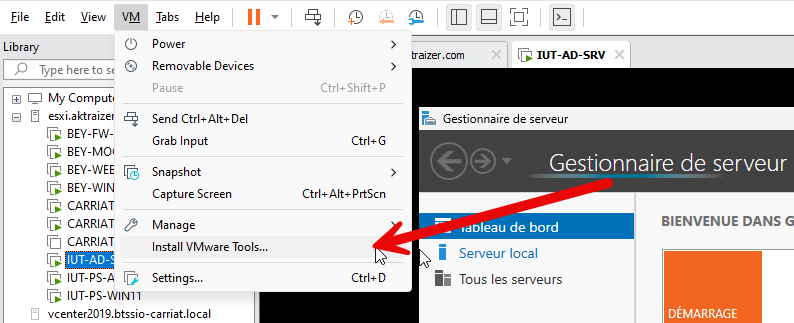
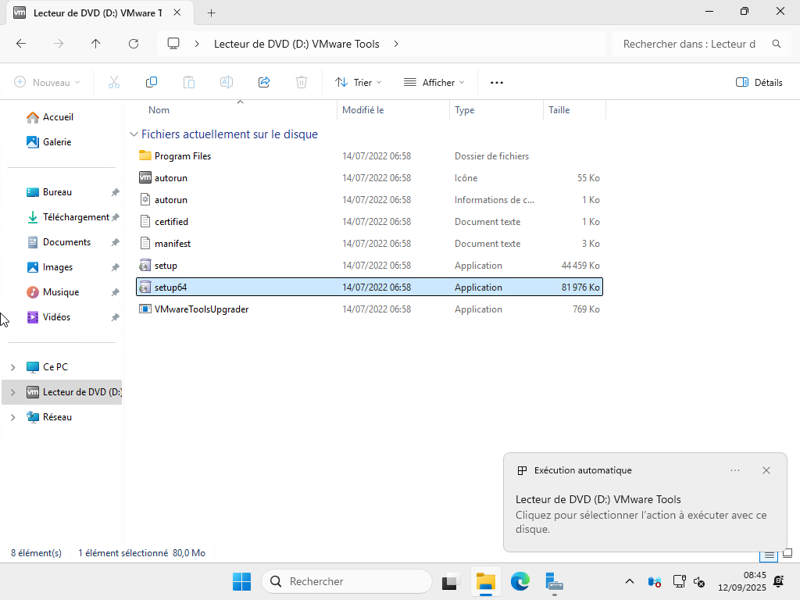
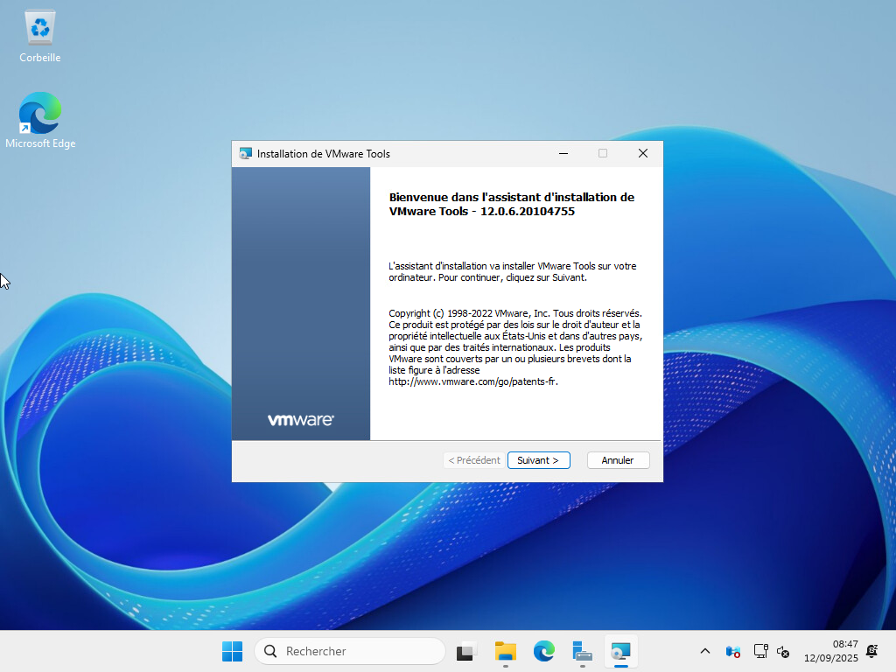

Insérer les VM Tools dans la machine depuis le menu de VMWare Workstation, VM > Install VMWare Tools…

Une fois le disque inséré, vous pouvez lancer le fichier setup64 présent dans le lecteur.

Réaliser une installation standard.
