Le rôle de Routage et accès distant dans Windows Server 2025 permet aux administrateurs de configurer des services de réseau tels que le VPN (Virtual Private Network) et le routage. Ce rôle est essentiel pour les entreprises qui souhaitent offrir un accès sécurisé à leurs ressources réseau à distance.

[https://learn.microsoft.com/fr-fr/windows-server/remote/remote-access/get-started-install-ras-as-vpn?tabs=servermgr](https://learn.microsoft.com/fr-fr/windows-server/remote/remote-access/get-started-install-ras-as-vpn?tabs=servermgr)

## Installation du rôle Routage et accès distant

Pour installer le rôle de Routage et accès distant sur Windows Server 2025, suivez ces étapes :

1. Ouvrez le Gestionnaire de serveur.
2. Cliquez sur "Ajouter des rôles et des fonctionnalités".

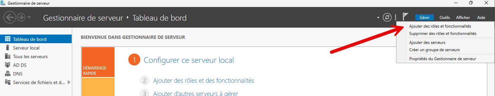

3. Sélectionnez "Rôle basé ou installation de fonctionnalités" et cliquez sur "Suivant".
4. Choisissez le serveur sur lequel vous souhaitez installer le rôle de Routage et accès distant et cliquez sur "Suivant".
5. Cochez la case "Routage et accès distant" et cliquez sur "Suivant".

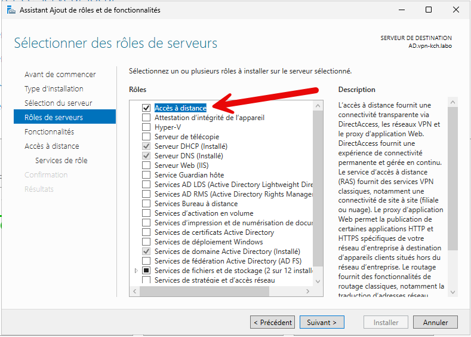

6. Valider les étapes suivantes jusqu’à la sélection du service puis choisir le « DirectAccess et VPN ».

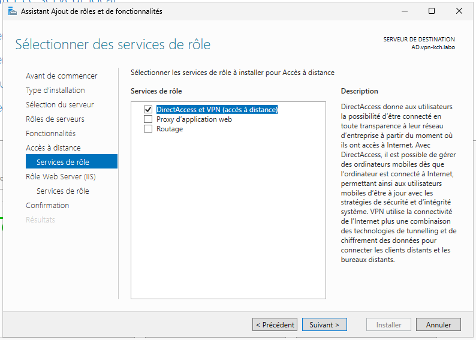

7. Laisser le reste coché et lancer l’installation.
8. Une fois terminé, lancer l’assistant de mise en route.

Dans l’assistant, ne choisir de déployer qu’un VPN, DirectAccess n’étant pas une technologie très répandue et uniquement Windows. Pour plus d’informations :

[DirectAccess vs VPN](https://docs.microsoft.com/en-us/windows-server/remote/remote-access/directaccess/directaccess-vs-vpn)

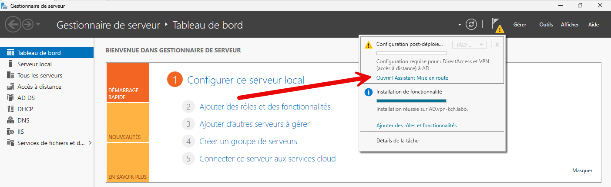

Choisir **Déployer VPN uniquement** et cliquer sur **Suivant**.

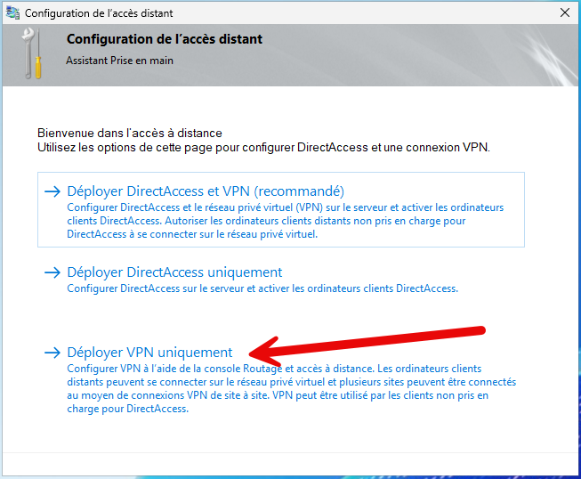

Ce choix ouvre une MMC avec le composant « Routage et accès distant ».

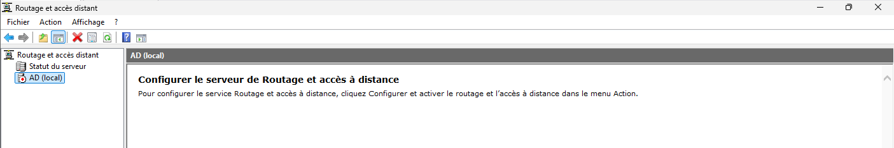

Il faut ensuite lancer la configuration en faisant un clic droit sur le serveur et en sélectionnant « Configurer et activer le routage et l’accès distant ».

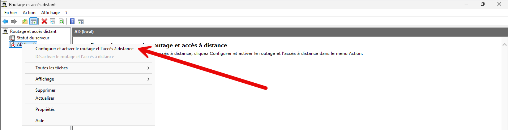

Choisir la configuration personnalisée.

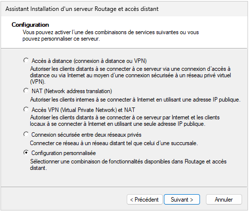

On sélectionne la création d’un **Accès VPN**.

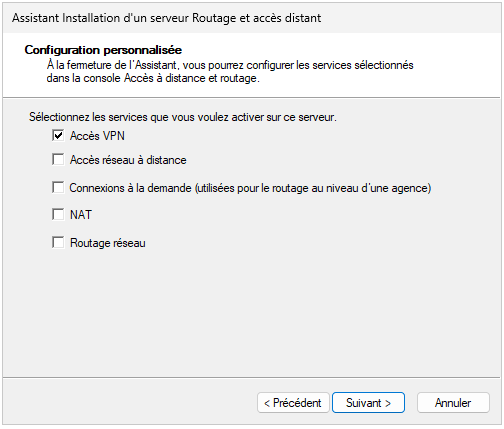

Puis, démarre le service.

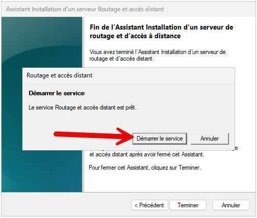

Le service est maintenant démarré.

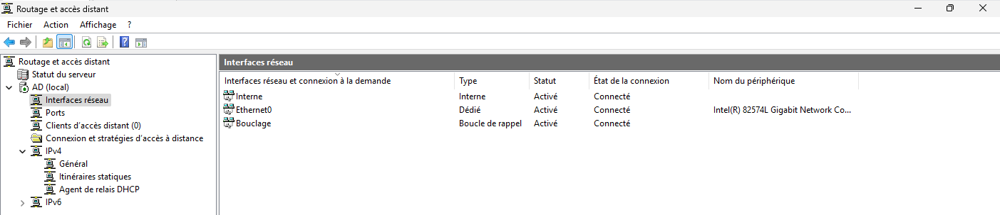

## Autoriser les utilisateurs à se connecter au VPN

Le serveur étant configuré, il faut autoriser un utilisateur à se connecter en VPN. Aller dans les propriétés de l’utilisateur, onglet Appel entrant et autoriser l’accès.

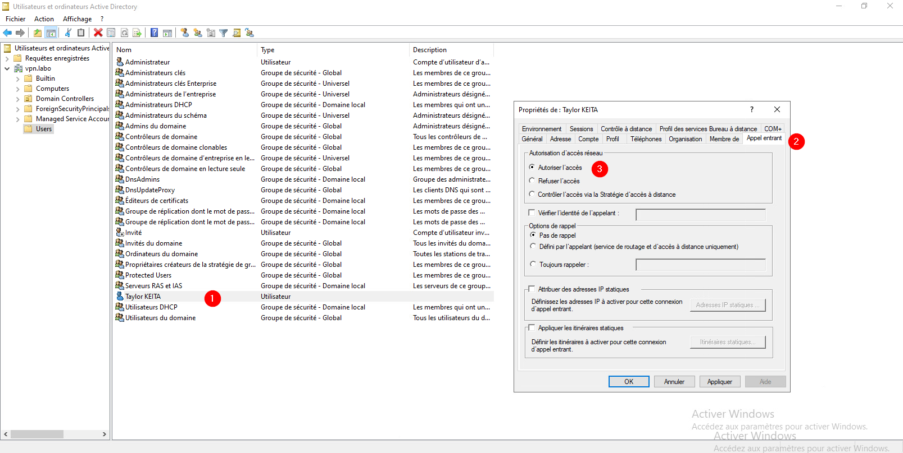