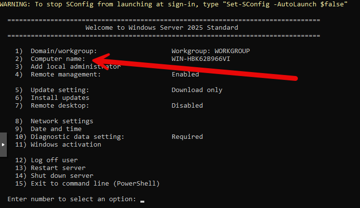
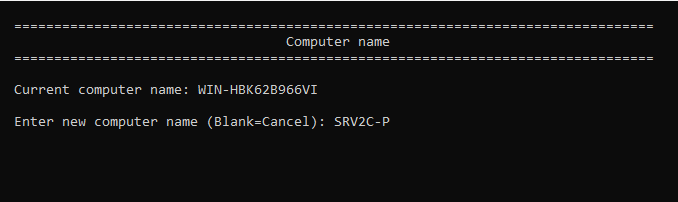

Pour renommer un serveur Windows Core, depuis l'interface SConfig, sélectionnez l'option **2) Computer Name**.



Puis, nommer le serveur.



Il faudra ensuite redémarrer le serveur pour que le changement de nom prenne effet.

Sinon, vous pouvez utiliser la commande PowerShell suivante :

```powershell
Rename-Computer -NewName "NOUVEAU_NOM_DU_SERVEUR" -Restart
```

Remplacez `"NOUVEAU_NOM_DU_SERVEUR"` par le nom souhaité pour votre serveur. L'option `-Restart` redémarrera automatiquement le serveur après le changement de nom pour que la modification prenne effet.
Après le redémarrage, vous pouvez vérifier que le nom du serveur a bien été modifié en utilisant la commande suivante :

```powershell
$env:COMPUTERNAME
```

Cela affichera le nom actuel du serveur.