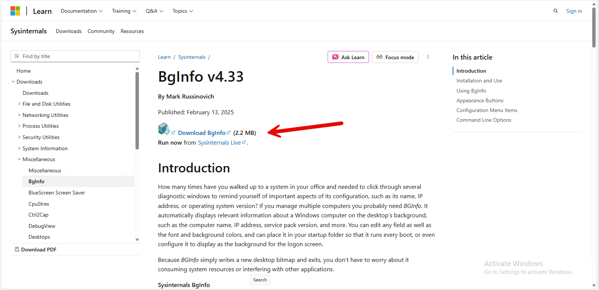
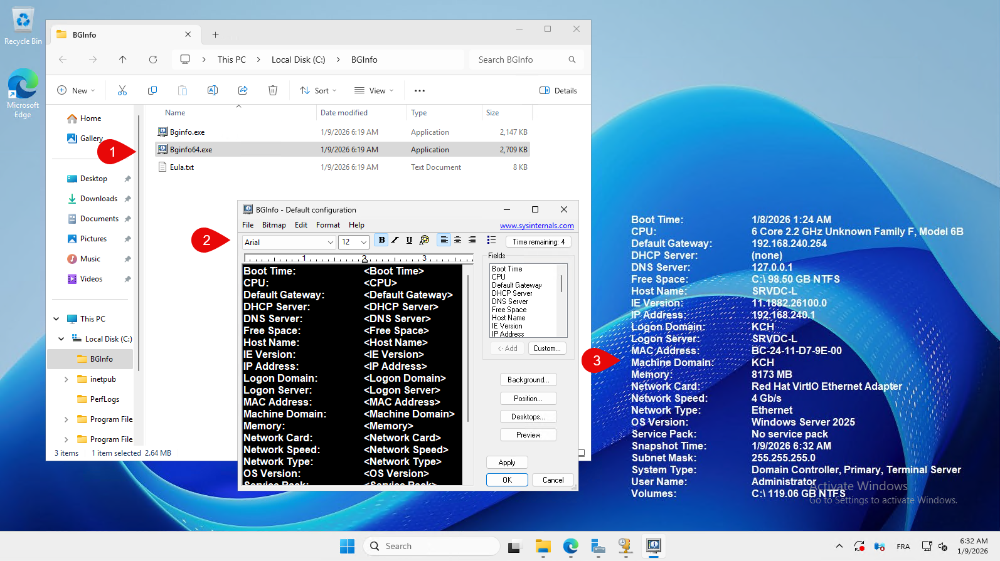
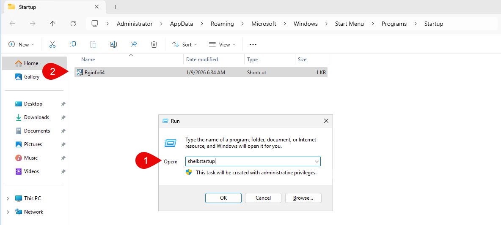

:::note
Installation sous Windows Server 2025 Standard Edition.
:::

BGinfo est un utilitaire de Sysinternals qui permet d'afficher des informations système sur le bureau de Windows. Voici comment l'installer et le configurer sur Windows Server 2025.

[https://learn.microsoft.com/en-us/sysinternals/downloads/bginfo](https://learn.microsoft.com/en-us/sysinternals/downloads/bginfo)

Téléchargez l'outil BGinfo depuis le site officiel de Sysinternals.

Décompresser l'archive téléchargée dans un répertoire de votre choix, par exemple `C:\BGinfo`.

Pour le lancer au démarrage, créer un raccourci dans le dossier de démarrage.

1. Appuyez sur `Win + R`, tapez `shell:startup` et appuyez sur Entrée pour ouvrir le dossier de démarrage.

