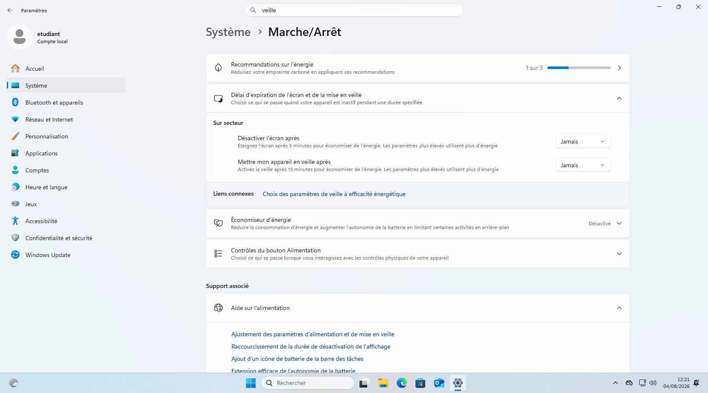

Votre machine virtuelle est configurée, mais vous souhaitez désactiver la mise en veille automatique de Windows 11 25H2 afin de ne pas être interrompu pendant vos travaux et de pouvoir laisser tourner vos programmes sans interruption.

Dans les paramètres de Windows 11 25H2, aller dans Système > Marche/Arret.

Séléctionner `Jamais`pour les deux options :
- Désactiver l'écran après
- Mettre mon appareil en veille après

