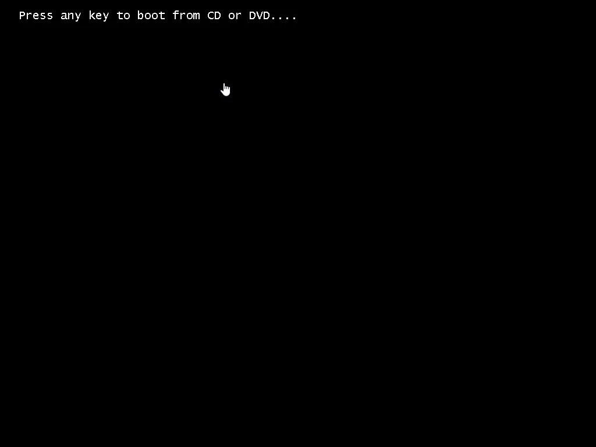
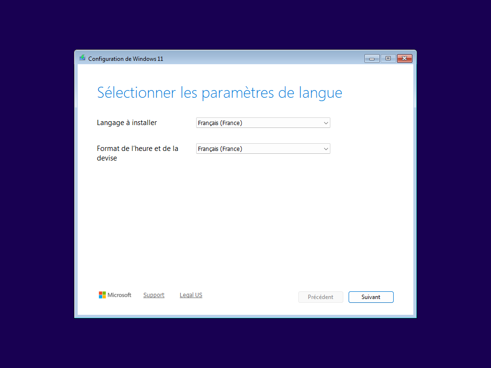
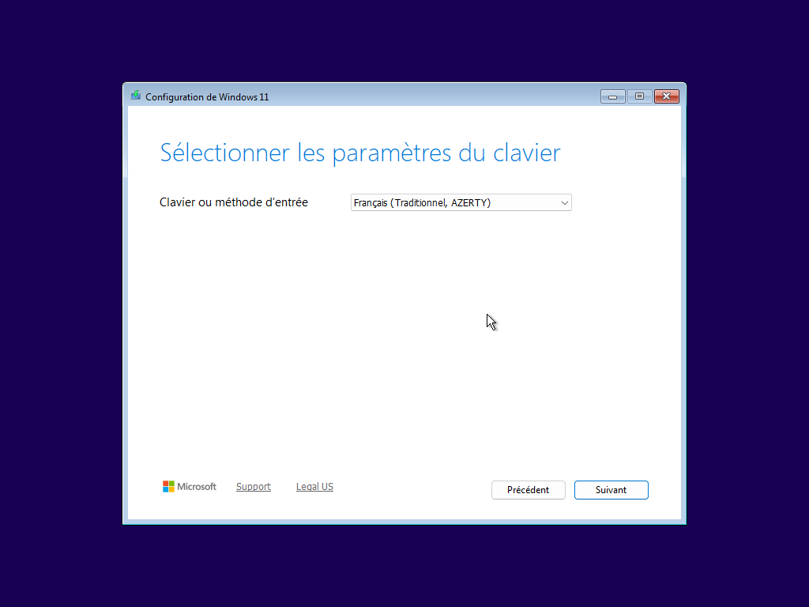
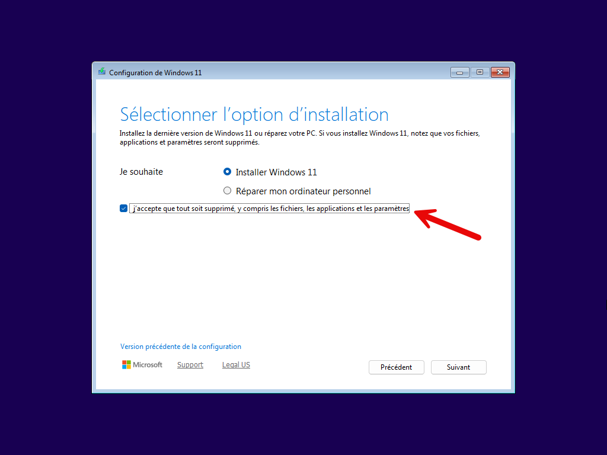
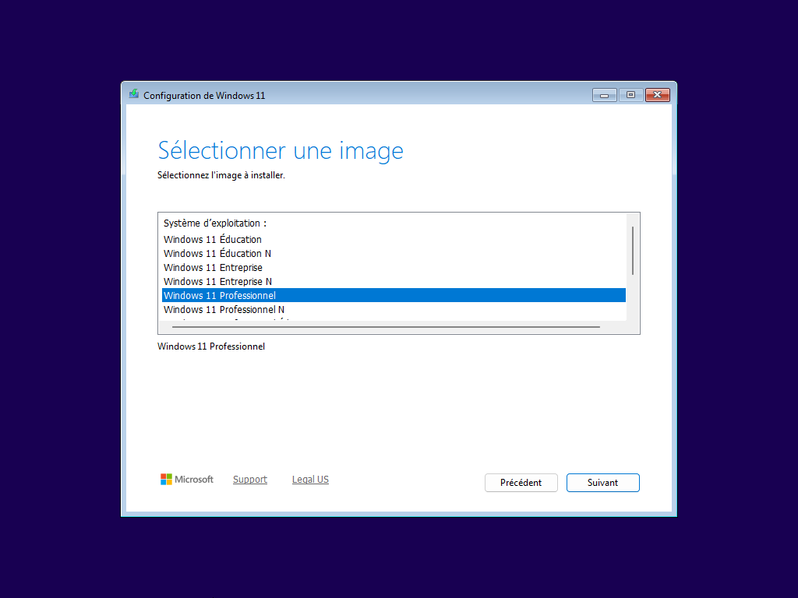
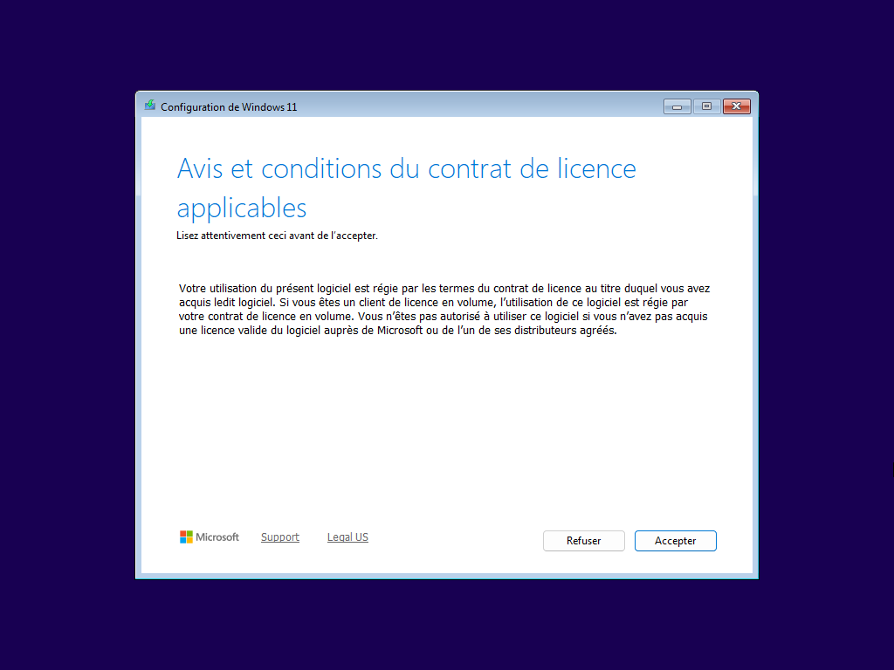
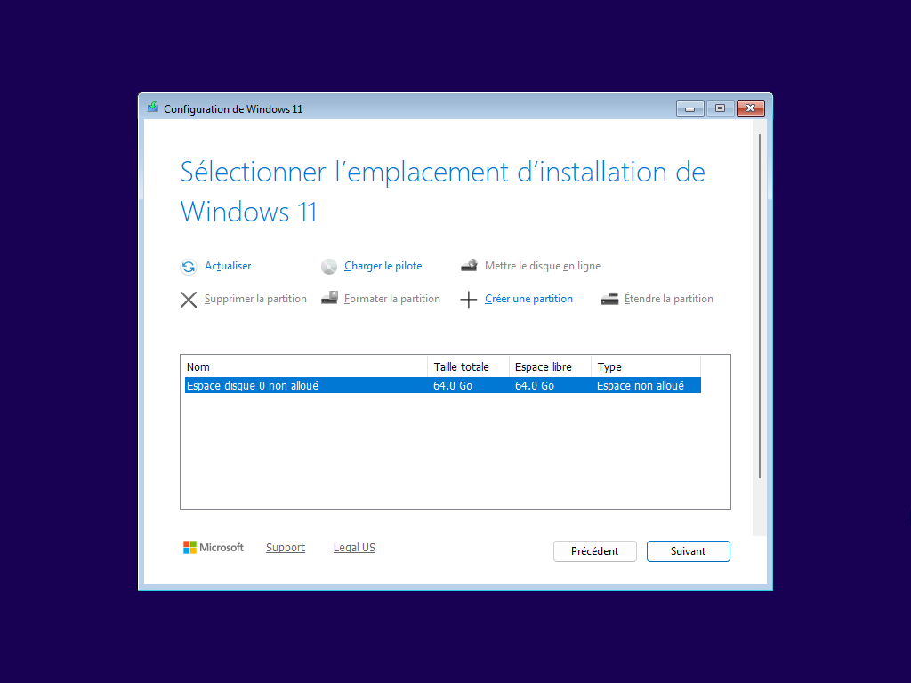
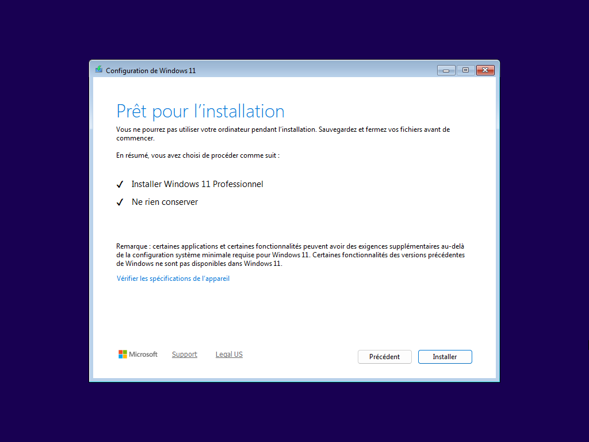
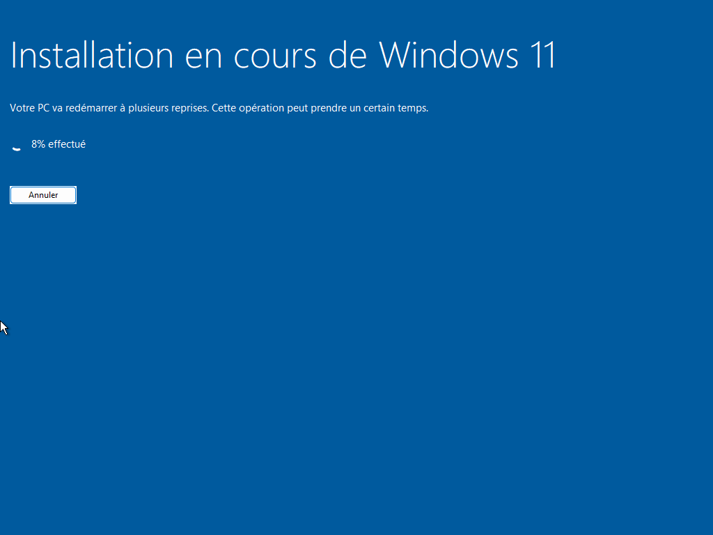

Après la création de la VM, Il faut la démarrer, n’ayant pas d’OS sur le disque, le démarrage est amorcé sur le lecteur CD/DVD.

Si le démarrage ne se fait pas automatiquement, il faut appuyer sur une touche du clavier (quand on est dans la VM).

Astuce : Dans VMWare Workstation, pour sortir de la VM, vous pouvez appuyer sur CTRL + ALT sur le clavier.

Choisir la langue d’installation, Suivant

Choisir le layout du clavier (Français)

Choisir de réaliser une installation de Windows 11 et accepter de tout supprimer sur le disque dur.

Vous arrivez sur le choix du système à installer, nous allons choisir Windows 11 Professionnel.

Accepter le contrat de licence.

L’espace de stockage non formaté est sélectionné, Suivant.

On lance ensuite l’installation

L’installation se lance.

## Configuration post-installation

Après les redémarrages, il faut fournir les informations de personnalisation du système d’exploitation.

Les écrans varient en fonction des versions majeures de Windows 11.

Choisir la région et la disposition du clavier.

Je vous conseille de tous créer un compte identique :
Login : `etudiant`
Mot de passe : `Etudiant_1234`

Il faut ensuite répondre aux questions de sécurité pour pouvoir récupérer le mot de passe si vous l’oubliez. (mettre toto à chaques réponses).

