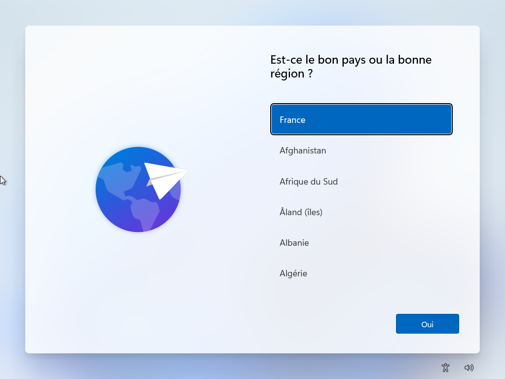
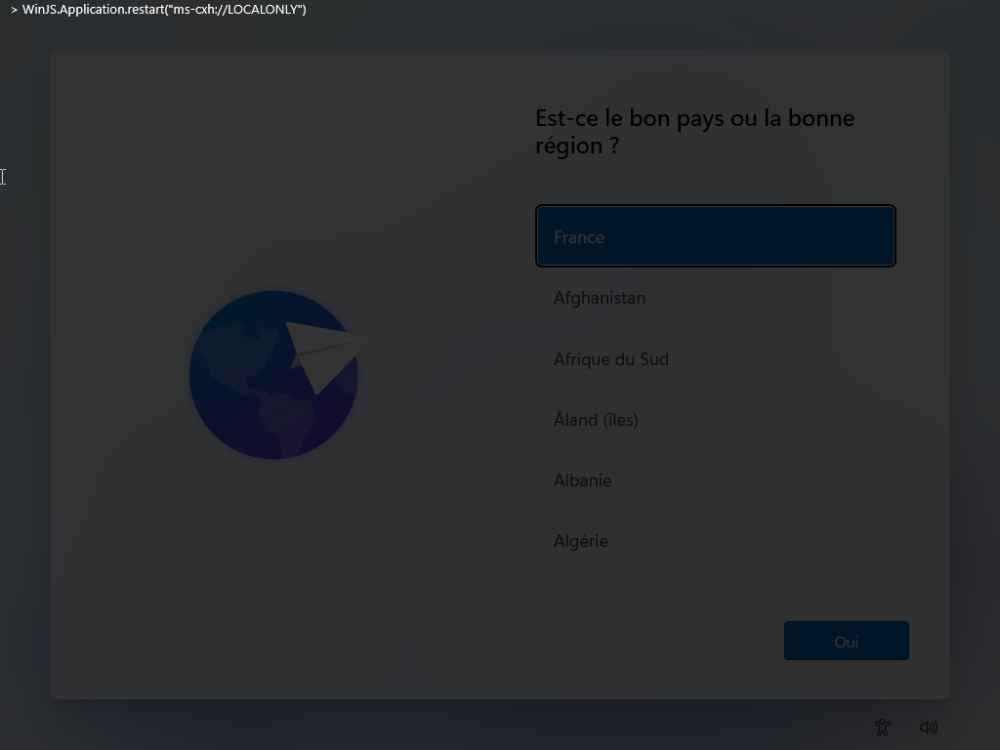
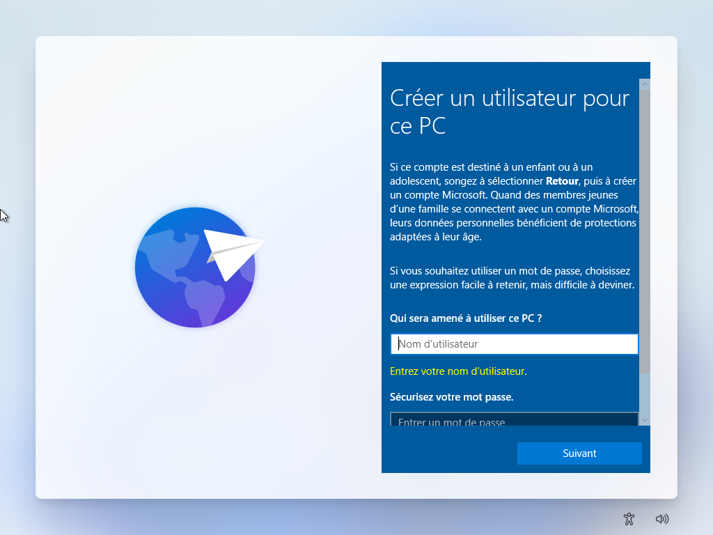
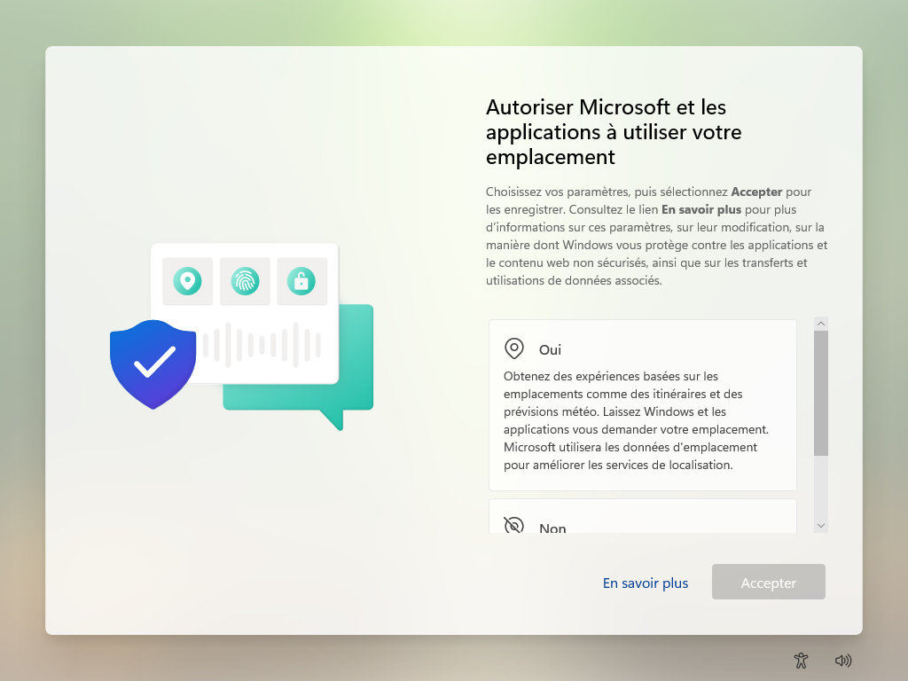

Lors de l’installation de Windows 11 25H2, Microsoft impose l’utilisation d’une connexion Internet et d'un compte Microsoft **Très déconseillé**.

Si ce n’est pas possible, nous allons voir comment désactiver ce contrôle.

Sur cet écran, appuyer sur CTRL+MAJ+J et taper :



```
WinJS.Application.restart("ms-cxh://LOCALONLY")
```



Puis appuyer sur `ECHAP`

Une fenêtre nous demandant de créer un compte local s’affiche.



Je vous conseille de tous créer un compte identique :
Login : `etudiant`
Mot de passe : `Etudiant_1234`

Il faut ensuite répondre aux questions de sécurité pour pouvoir récupérer le mot de passe si vous l’oubliez. (mettre toto à chaques réponses).

Vous pouvez ensuite poursuivre l'installation de Windows 11 25H2 sans compte Microsoft et sans connexion Internet.

