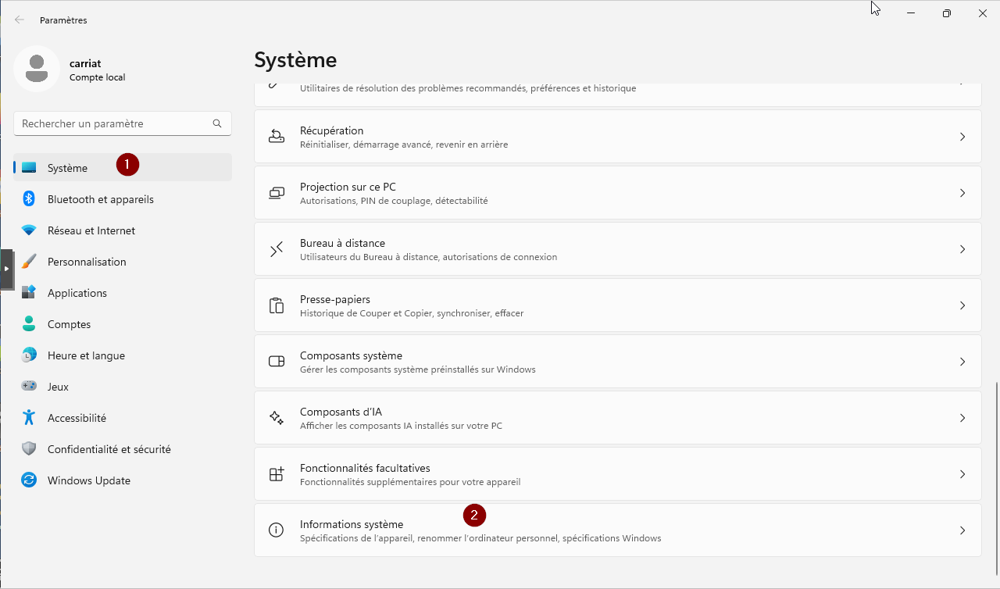
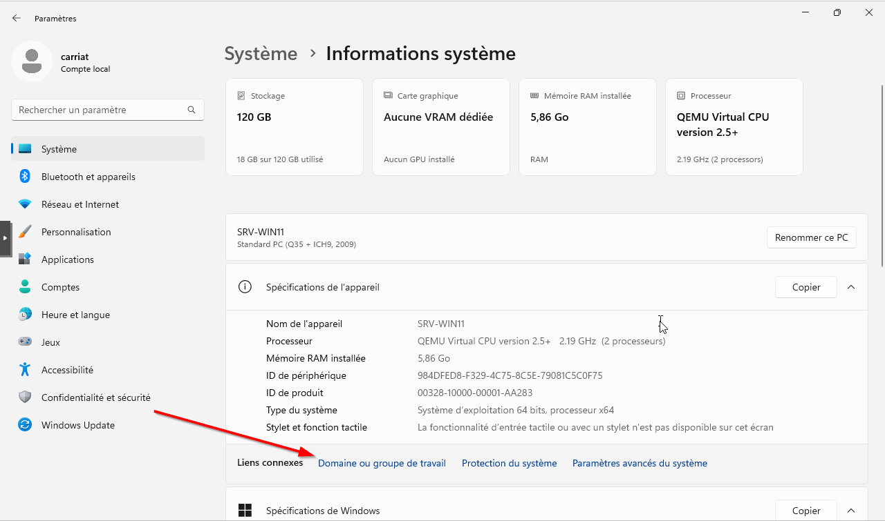
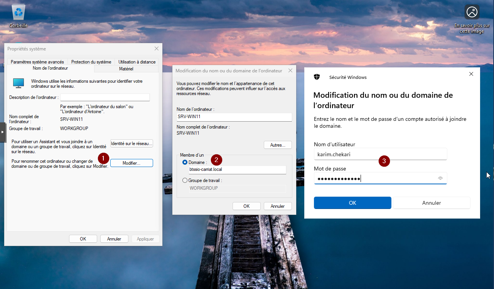
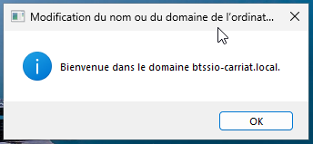
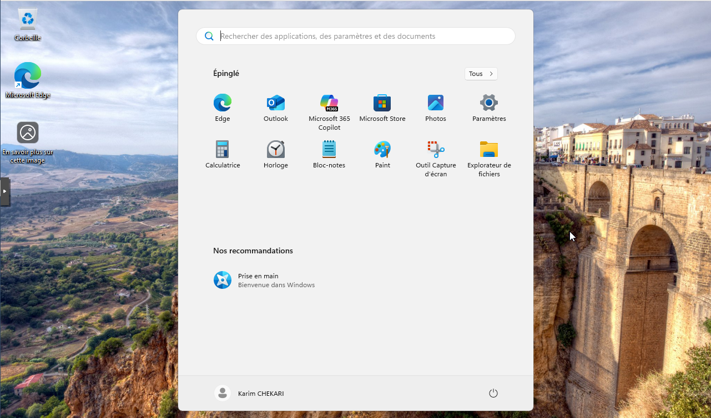

Pour ajouter un ordinateur sur le domaine, aller dans les **Paramètres > Système > Informations système**.

Aller dans Domaine ou groupe de travail.

Dans la fenêtre qui s’ouvre, cliquer sur Modifier (1) puis passer en mode domaine et saisir son nom (2) et enfin valider l’ajout avec un utilisateur autorisé (3).

Un message de bienvenue doit apparaitre.

Vous pouvez maintenant ouvrir une session avec un utilisateur du domaine.

C’est terminé !

