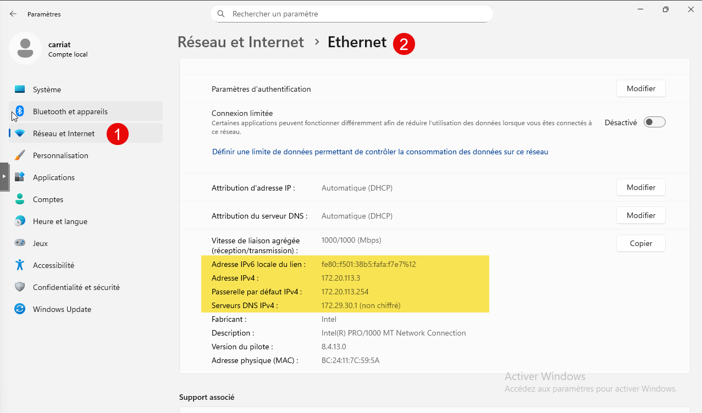
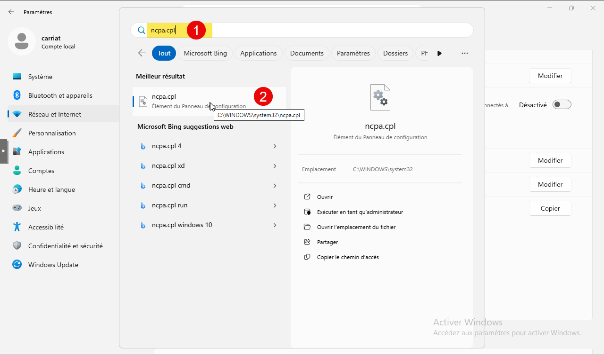
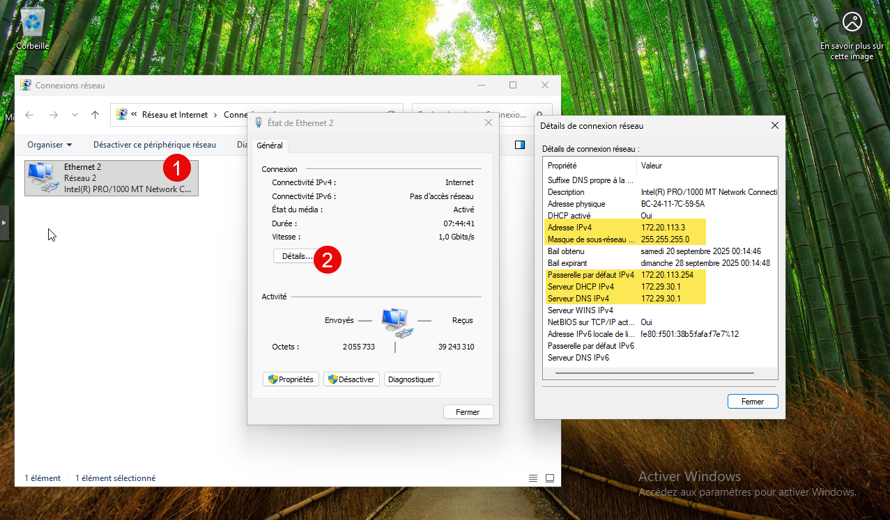
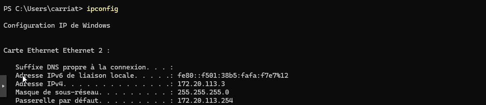
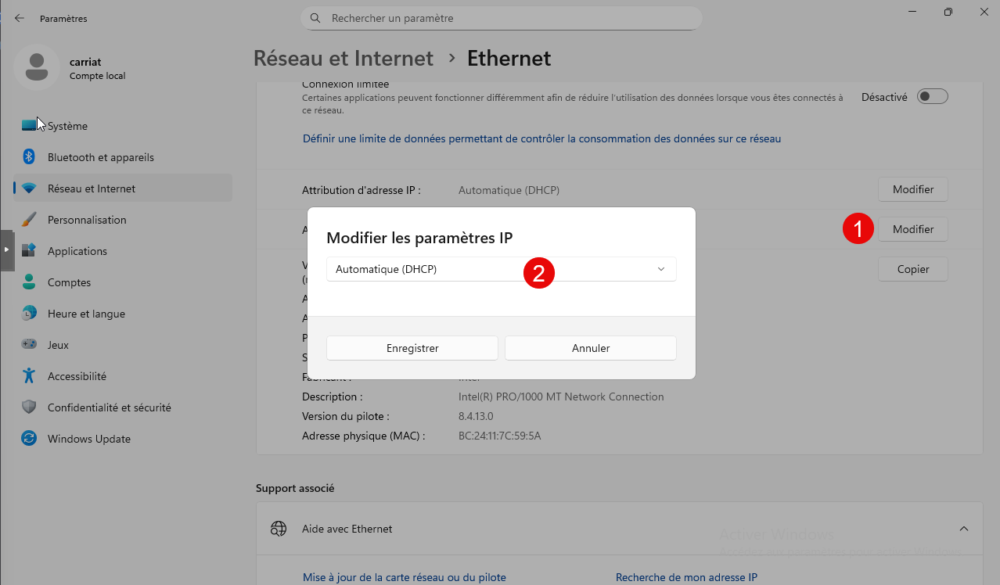
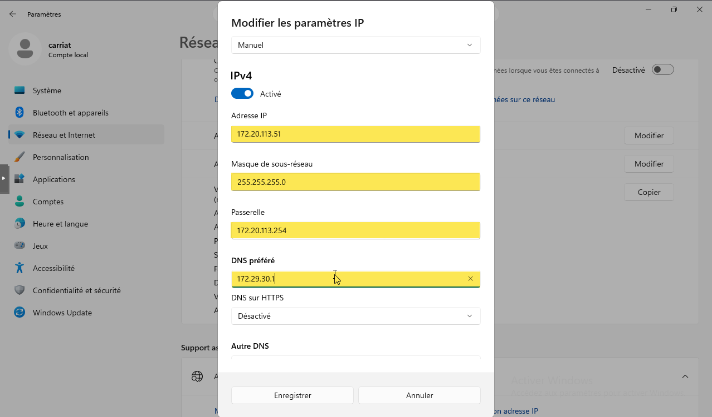
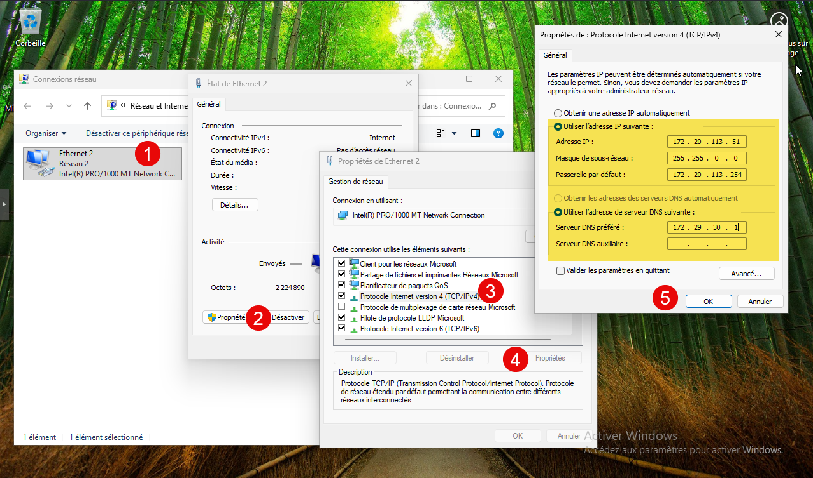

La configuration IP dans Windows permet d’attribuer à un ordinateur une adresse unique pour communiquer sur un réseau local (LAN) ou sur Internet. Cette configuration comprend généralement l’adresse IP, le masque de sous-réseau, la passerelle par défaut et les serveurs DNS. Sans ces paramètres, un poste ne pourrait pas échanger correctement avec d’autres machines ni accéder à des services en ligne.

## Connaitre son IP

### Via l’interface graphique

Aller dans **Paramètres > Réseau et Internet > Développer le bloc Ethernet**.


### Via l’ancienne interface

Nous pouvons accéder par l’ancien panneau de configuration, mais le plus rapide est de lancer le programme ncpa.cpl

Dans la fenêtre qui s’ouvre, ouvrez la carte Ethernet, puis aller dans Détails. Les informations IP sont disponibles.


### En ligne de commande

Lancer la commande ipconfig


## Modification IP

### Via interface graphique

Aller dans Paramètres > Réseau et Internet > Développer le bloc Ethernet.

Au niveau de la ligne **Attribution d’adresse IP**, actuellement en Automatique (DHCP) cliquer sur Modifier.


Passer en manuel et activer IPv4.
Saisir ensuite vos informations IP dans les champs.

Enregistrer le paramétrage, il est appliqué automatiquement.

### Via ancienne interface

Nous pouvons accéder par l’ancien panneau de configuration, mais le plus rapide est de lancer le programme ncpa.cpl

Aller dans les propriétés de la carte > Protocole Internet version 4 >Propriétés > Saisir les informations.

:::caution
Attention à bien refermer les fenêtres en les validant par ok.
:::

### En ligne de commande

Trouver l’alias de l’interface de sa carte réseau
```powershell
Get-NetAdapter
```

Modifier l’adresse IP et le serveur DNS
```powershell
New-NetIPAddress -InterfaceAlias "Ethernet" -IPAddress 172.20.xxx.xxx -PrefixLength 24 -DefaultGateway 172.29.xxx.254
Set-DnsClientServerAddress -InterfaceAlias "Ethernet" -ServerAddresses 172.29.30.1
```