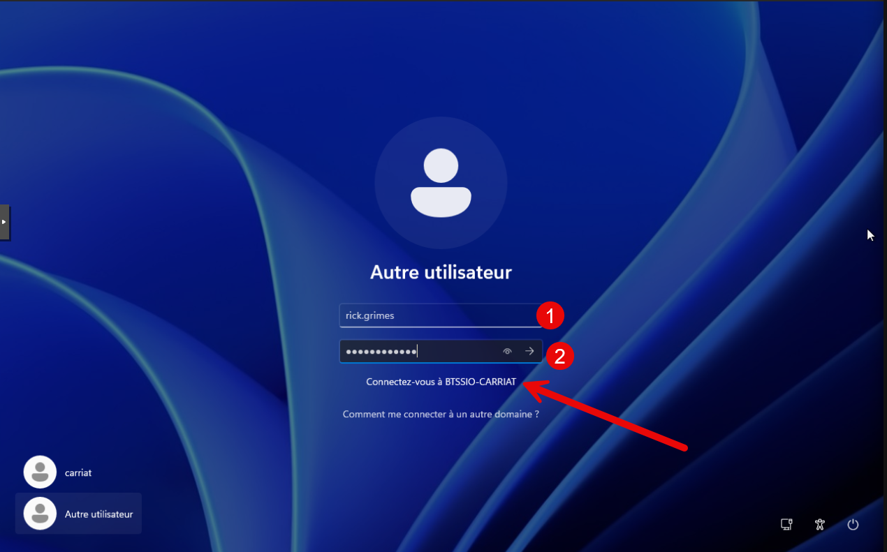
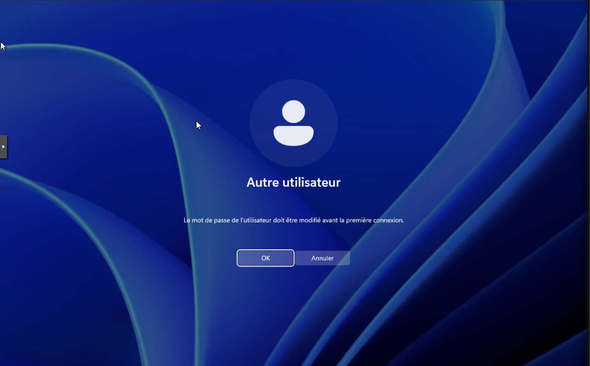
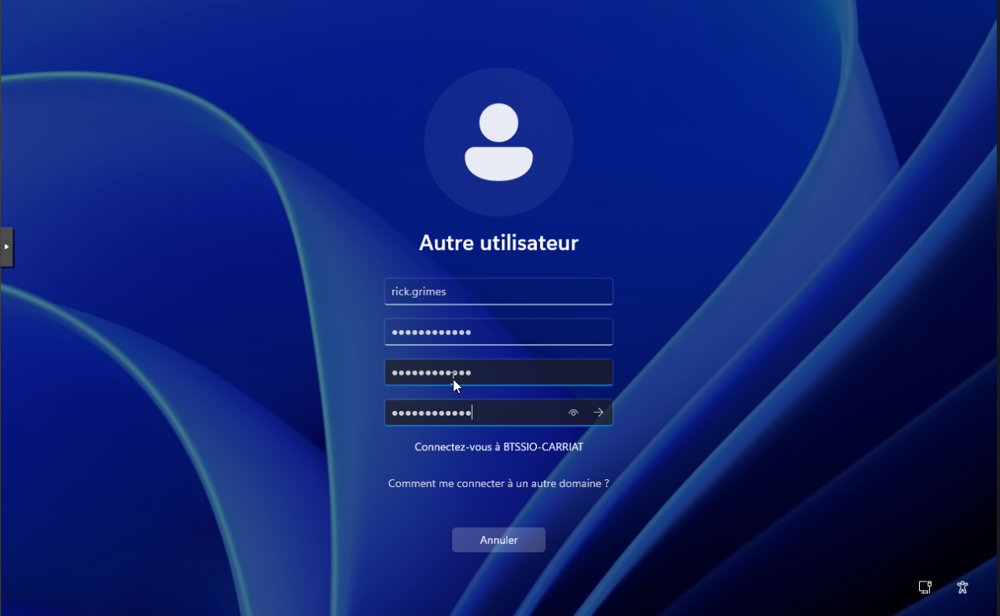
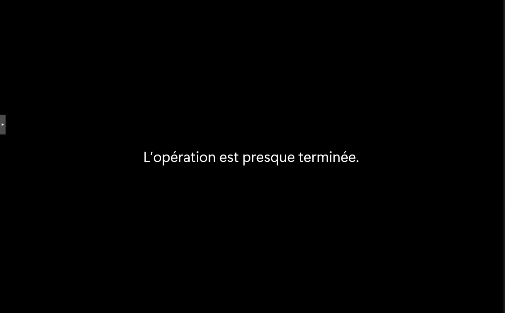
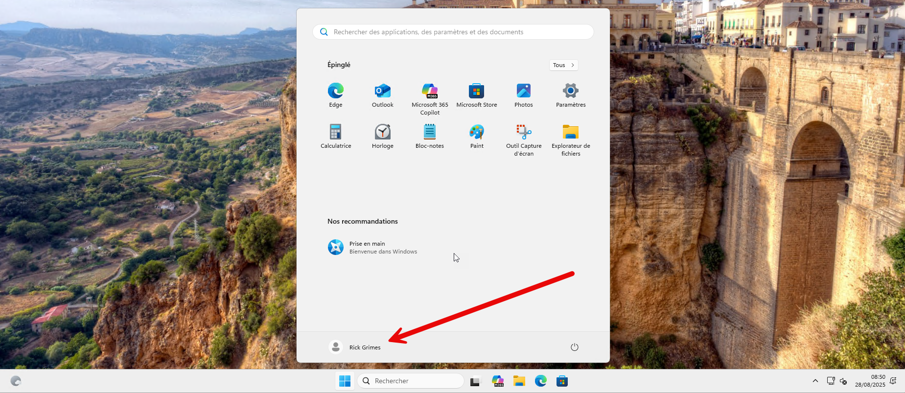

Vos enseignants vous ont fourni un accès sur le réseau du BTS. Il dispose d’une authentification centralisée qui vous permet de vous connecter sur n’importe quel poste.

Lors de la première connexion, depuis n’importe quel ordinateur, vous devrez changer de mot de passe.

Saisir votre identifiant et le mot de passe par défaut : Etudiant_1234

On invite à changer votre mot de passe

Saisir deux fois votre nouveau mot de passe et valider par Entrée

Le mot de passe a été changé !

Votre session va s’initialiser, il faut patienter.

Et vous êtes connecté. Félicitations !
