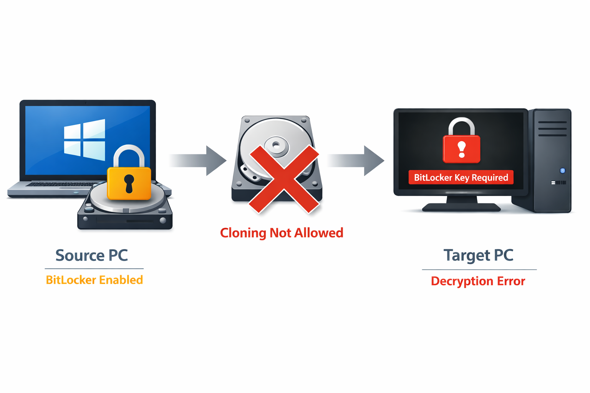
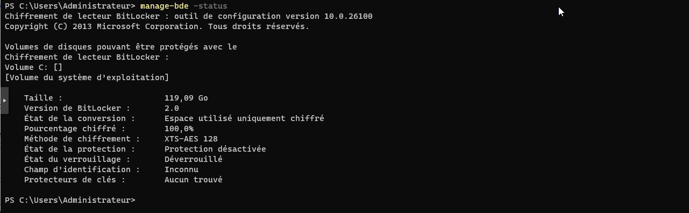
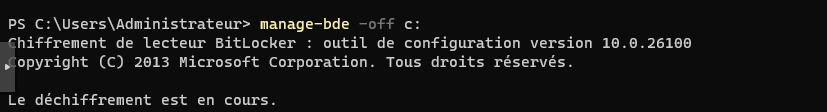
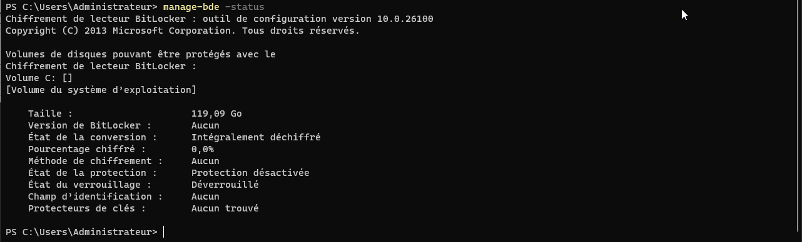

## Qu’est-ce que BitLocker ?

BitLocker est une fonctionnalité de sécurité intégrée à Windows qui permet de chiffrer entièrement un disque dur afin de protéger les données contre le vol ou l’accès non autorisé. 

Le chiffrement repose sur des clés de sécurité, généralement stockées dans le TPM (Trusted Platform Module) de la machine. 

Tant que BitLocker est actif, les données du disque ne peuvent être lues que si le système est démarré sur le matériel d’origine ou après saisie d’une clé de récupération.

## Pourquoi désactiver BitLocker avant un clonage ?



Dans un contexte de clonage ou de déploiement d’images systèmes, BitLocker doit être désactivé, le disque chiffré est lié matériellement à la machine source. 

Si une image BitLocker est clonée sur un autre poste, les clés de chiffrement ne correspondent plus et le système déployé ne peut pas démarrer correctement ou demande une clé de récupération. 

Pour garantir un déploiement fiable et fonctionnel sur plusieurs machines, il est donc indispensable de désactiver BitLocker avant la capture de l’image, puis de le réactiver si nécessaire après le déploiement.

Exécuter la commande `manage-bde -status` pour voir si le disque est chiffré



Pour déchiffrer le lecteur :

```cmd
manage-bde -off C:
```



On peut vérifier le status en relançant la commande :

```cmd
manage-bde -status
```

