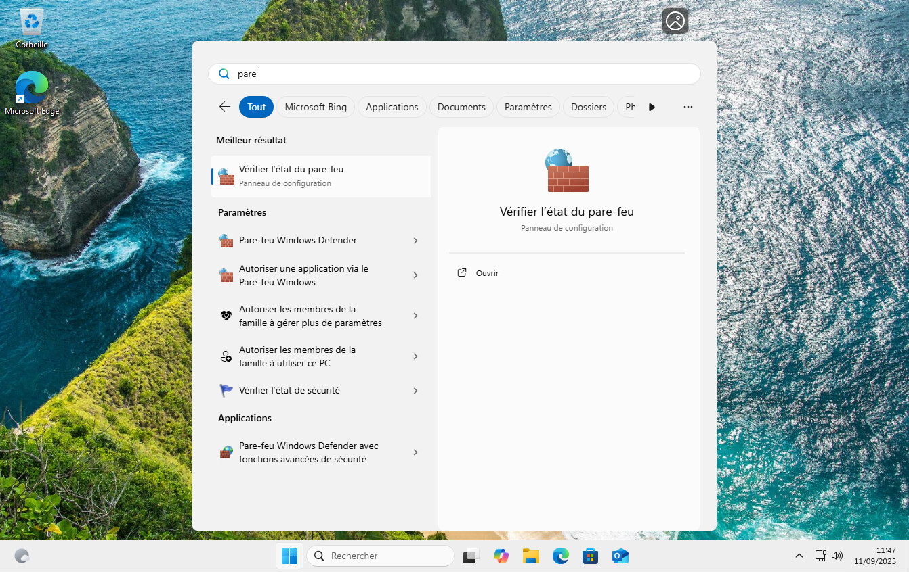
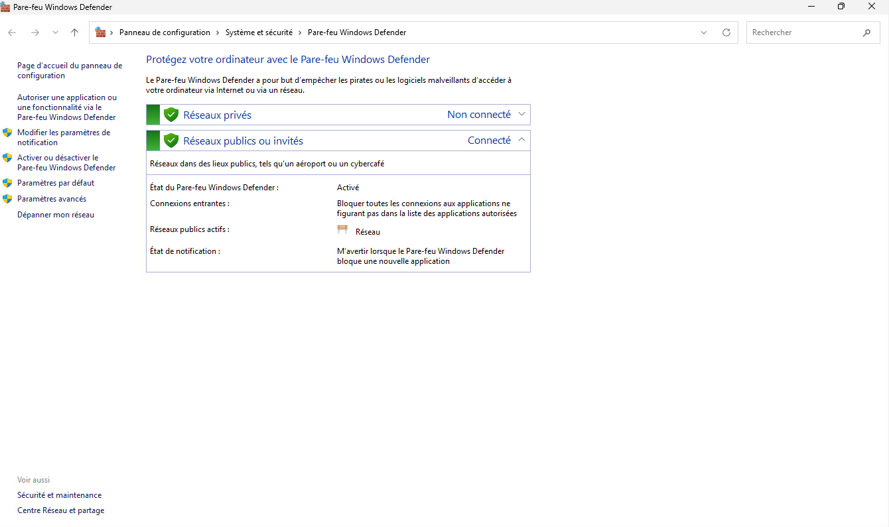
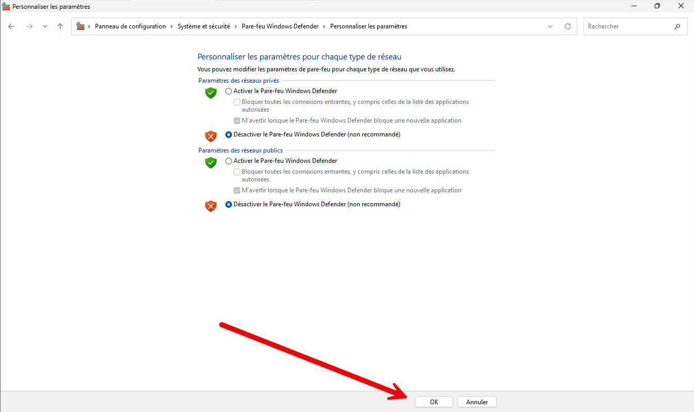
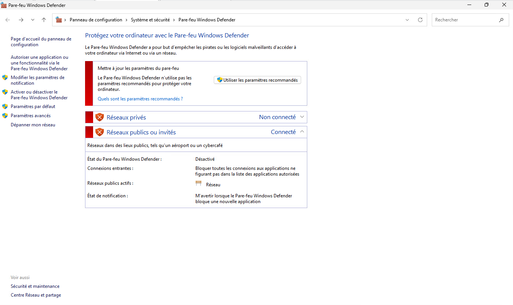

Appuyer sur la touche Windows du clavier et rechercher "Pare-feu". 

Lancer "Vérifier l’état du pare-feu".
Dans la fenêtre qui s’ouvre, cliquer sur Activer ou désactiver le Pare-feu Windows Defender.

Pour chaque réseau, désactiver le pare-feu. Valider par ok

Le pare-feu est désactivé.

