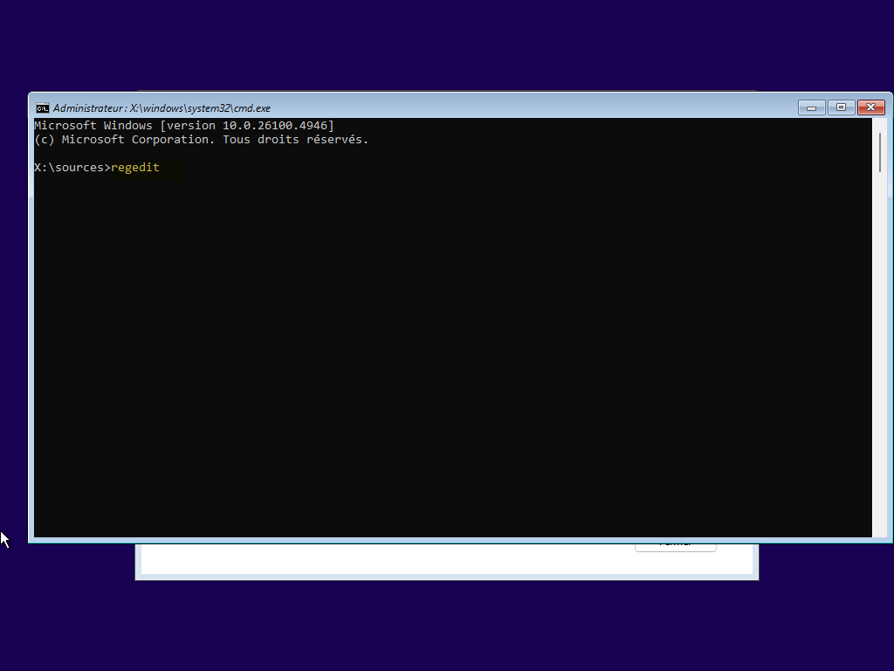
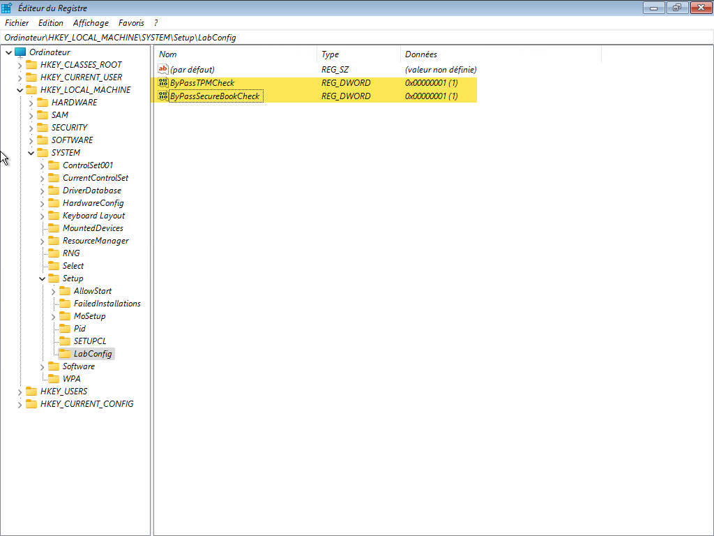

Si votre ordinateur ne répond pas aux exigences minimales de Windows 11 ou s’il n’a pas de puce TPM au moment de l’installation, vous aurez un message d’erreur.

Appuyer sur la touche `MAJ+F10` du clavier pour ouvrir une invite de commande. Puis lancer `regedit`

Aller dans HKEY_LOCAL_MACHINE\SYSTEM\Setup et créer une nouvelle clé LabConfig
- Créer une valeur DWORD(32-bit) ByPassTPMCheck avec la valeur à 1
- Créer une valeur DWORD(32-bit) ByPassSecureBootCheck avec la valeur à 1

Vous pouvez également ajouter BypassRAMCheck (pour désactiver la vérification de la quantité de RAM).

Vous devez fermer avec la croix l’assistant sinon l’ordinateur redémarre et vous aurez à nouveau le blocage.
