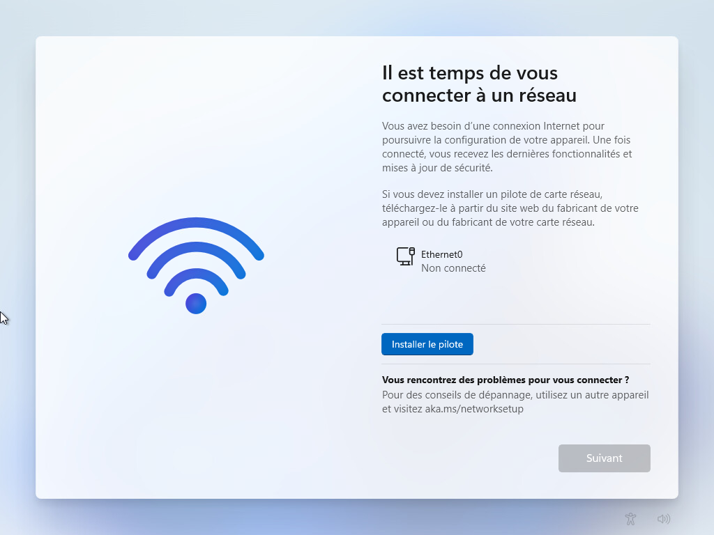
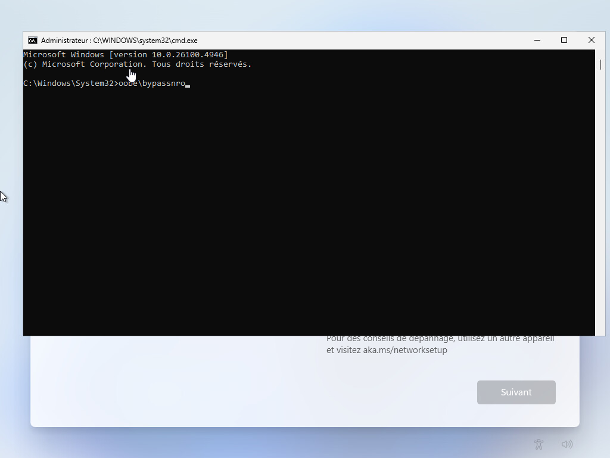
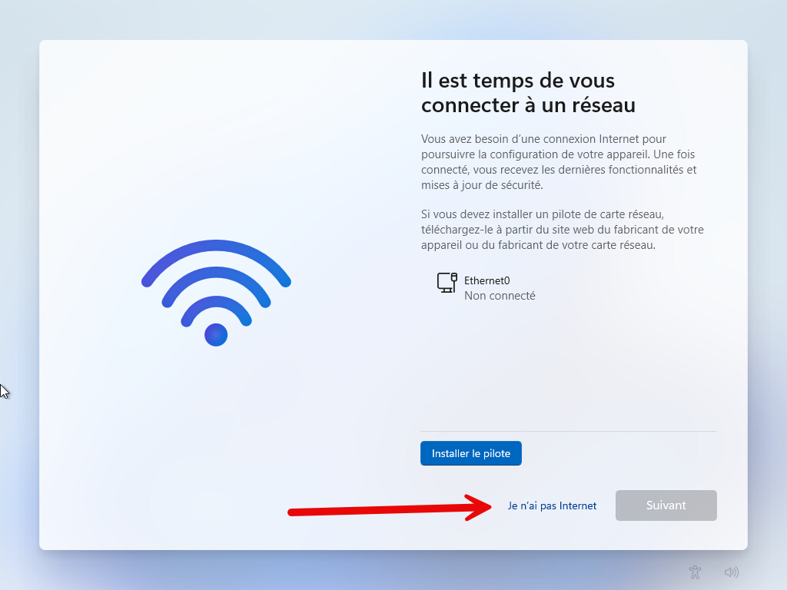

Lors de l’installation de Windows 11 24h2, Microsoft impose l’utilisation d’une connexion Internet.

Si ce n’est pas possible, nous allons voir comment désactiver ce contrôle.



Sur cet écran, appuyer sur MAJ+F10 et taper :

```bash
oobe\bypassnro
```



Le processus d’installation redémarre et vous avez maintenant un bouton supplémentaire pour continuer l’installation.

