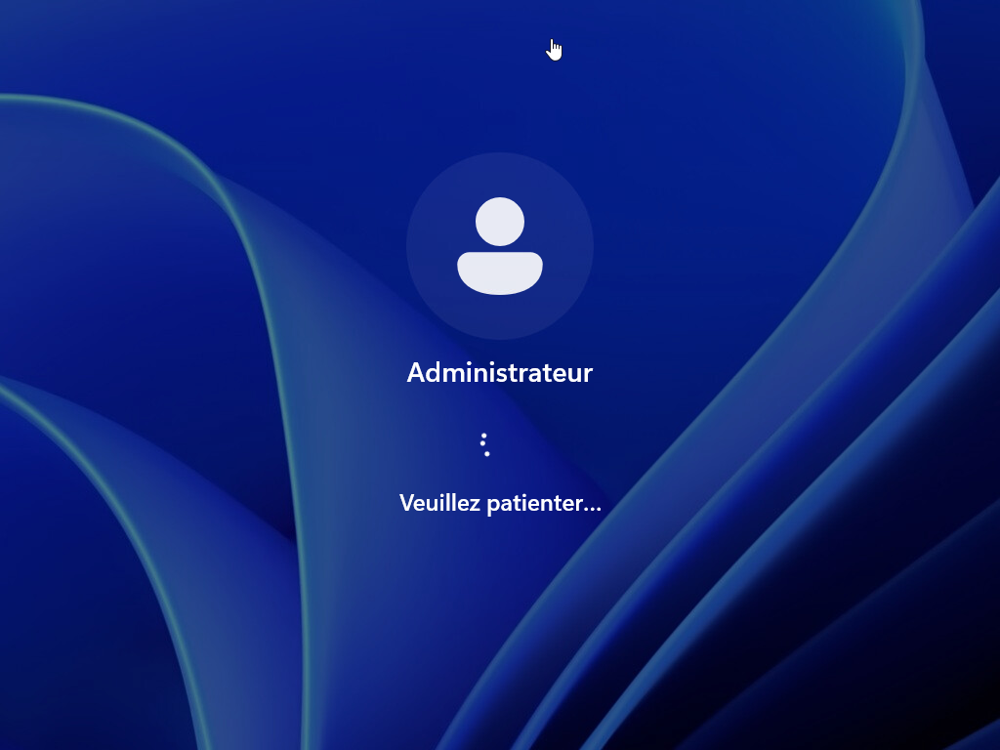

Lors de la préparation d’une image de référence pour un déploiement de Windows 11, il est recommandé de démarrer en mode Audit. Ce mode, accessible avant la création d’un compte utilisateur final, permet à l’administrateur de personnaliser le système (installation de pilotes, logiciels, mises à jour, configurations spécifiques) sans passer par l’OOBE (Out-of-Box Experience). L’avantage principal est de pouvoir préparer une machine totalement configurée et propre, puis de la généraliser avec l’outil Sysprep avant capture. Cela évite d’avoir des comptes inutiles ou des paramètres liés à un utilisateur spécifique dans l’image, et garantit que toutes les machines déployées à partir de cette image disposeront d’une configuration standardisée, optimisée et prête à l’emploi.

Lors de l’installation de Windows, appuyer sur **CTRL+MAJ+F3**
Windows va redémarrer sur un compte administrateur.
Vous pouvez ensuite installer des pilotes, des logiciels.

Une fois terminer, lancer un sysprep en arrêtant le système afin de pouvoir capturer l’OS.

