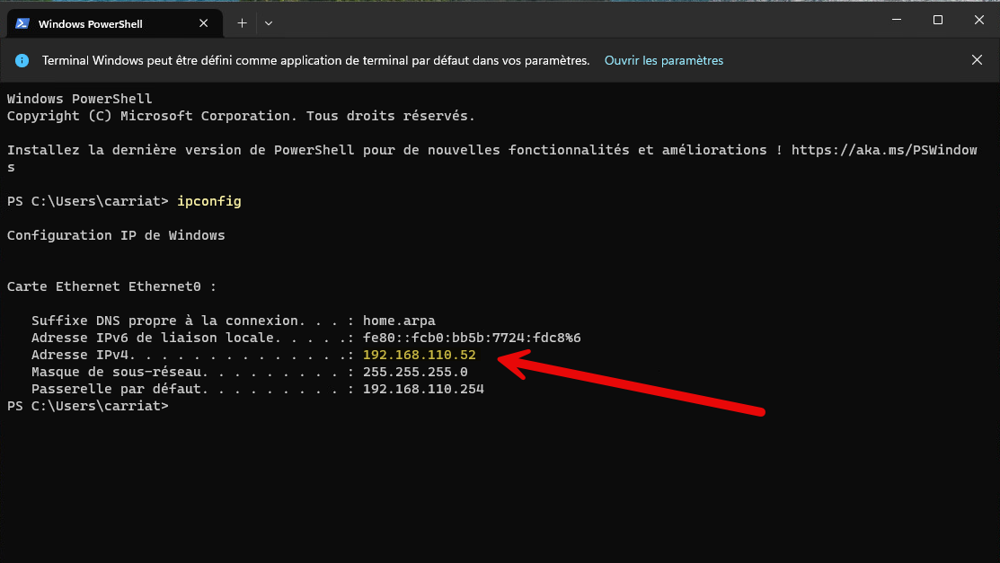
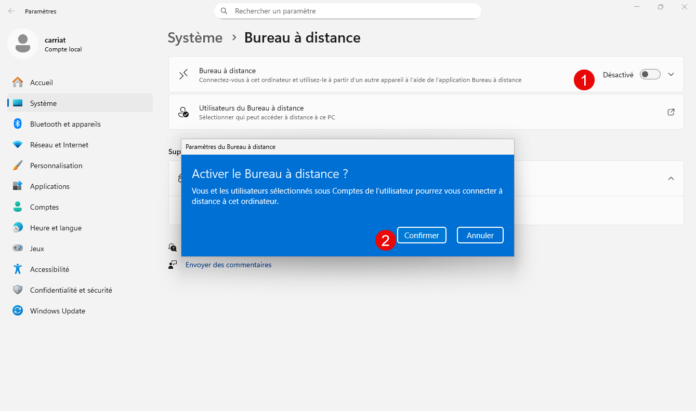
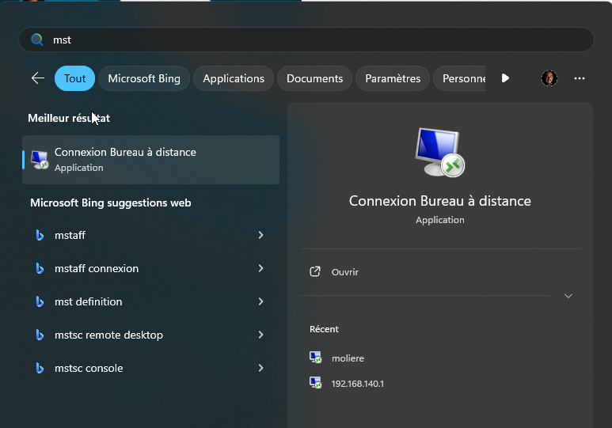
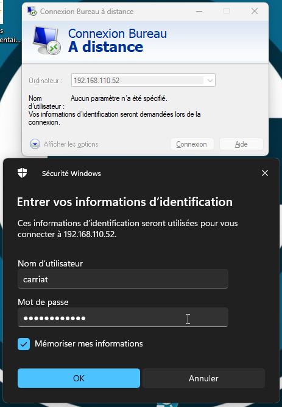
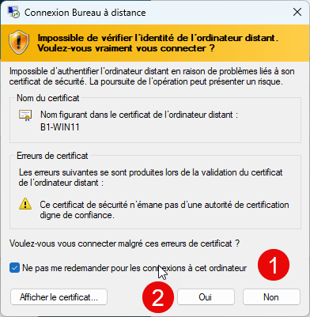

L’utilisation du Bureau à distance de Windows permet de prendre le contrôle d’un ordinateur ou d’un serveur sans avoir besoin d’être physiquement devant la machine.

On l’utilise pour gérer et administrer les serveurs du réseau depuis sa propre machine. Cette solution est pratique, sécurisée et fait gagner du temps, car elle évite les déplacements et centralise la gestion.

Elle illustre aussi une pratique courante en entreprise, où les administrateurs système utilisent le Bureau à distance pour maintenir et superviser les serveurs à distance.

### Connaitre son adresse IP

Lancer le terminal Windows et taper la commande :

```bash
ipconfig
```



On voit que l’ordinateur a pour IP : 192.168.110.52

### Activation du bureau à distance

Nous allons chercher le paramètre « Paramètres du bureau à distance« 

Paramètres > Système > Bureau à distance > Activer



Par défaut, votre utilisateur administrateur à un accès (à partir du moment où il a un mot de passe).

### Test de connexion

**Depuis le PC hôte**

Taper « mstsc » ou « Bureau à distance »



Dans la fenêtre qui s’ouvre, mettre l’IP du PC virtuel puis saisir les informations de connexion.



Valider la connexion et autoriser la connexion.



Le bureau de Windows est accessible depuis le PC hôte.

