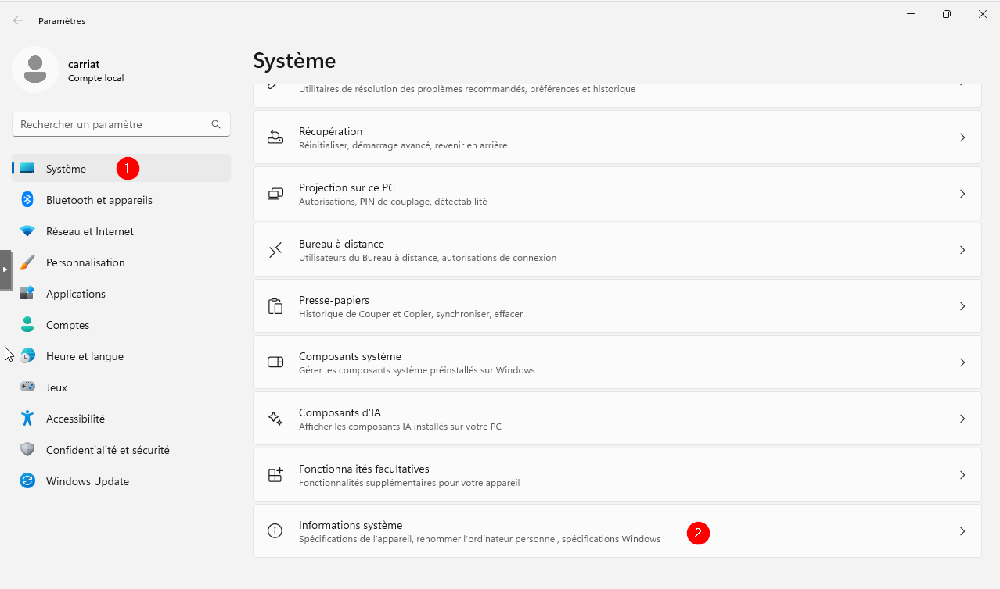
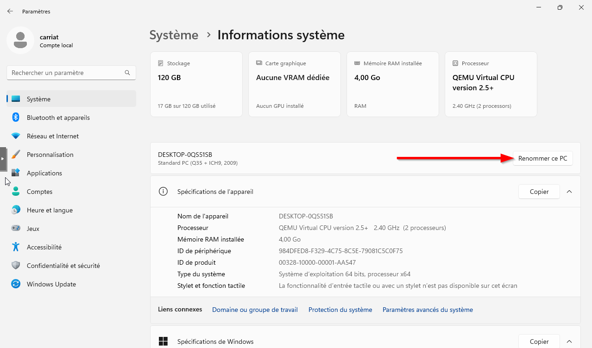
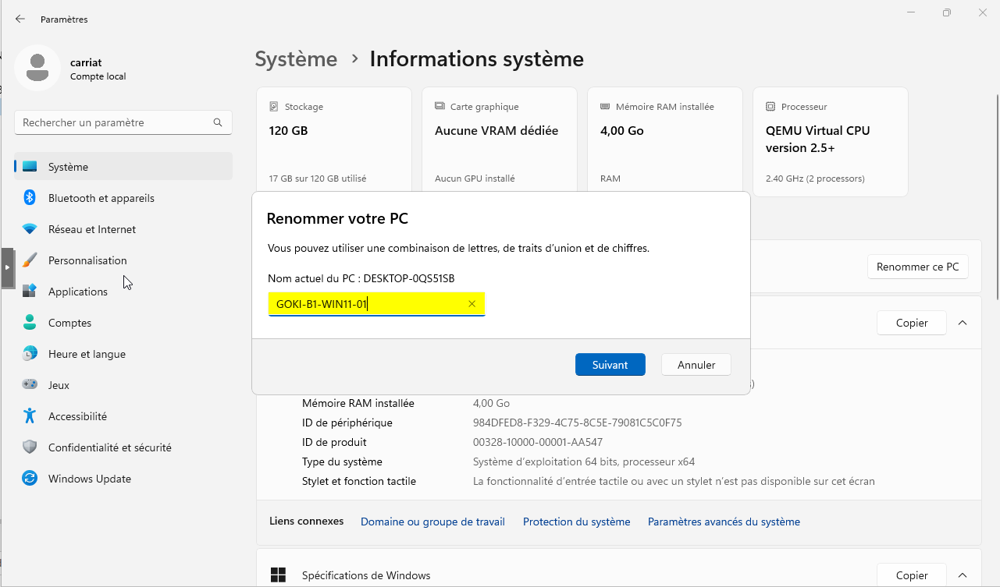
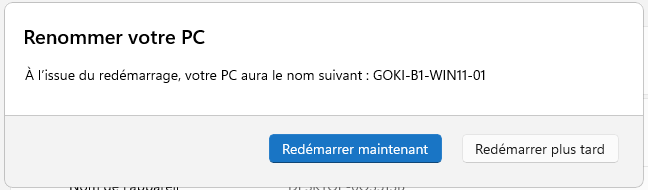
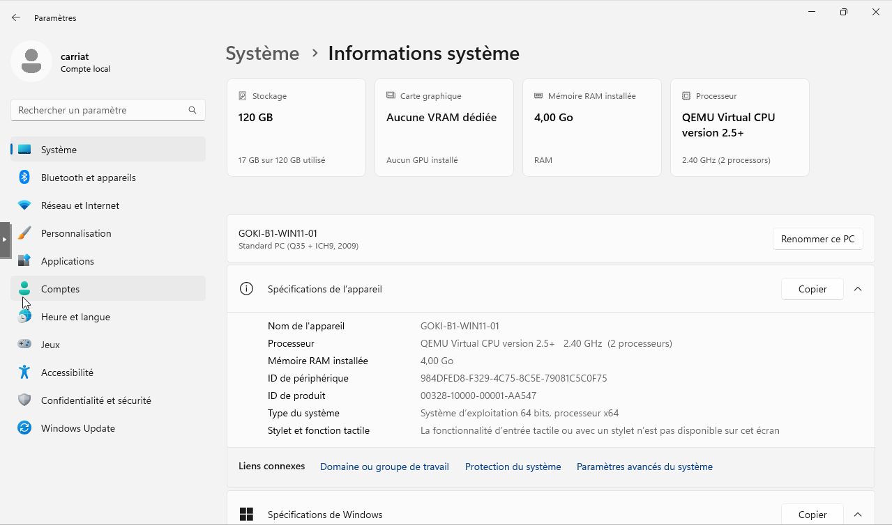

Le changement de nom est disponible directement avec le raccourci clavier **WINDOWS+PAUSE**.
Sinon, utilisez le chemin suivant :
**Paramètres > Système > Informations système.**

Il faut ensuite Renommer ce PC.

Saisir son nom dans la fenêtre qui s’ouvre puis valider avec Suivant. (nécessite un redémarrage)

L’ordinateur est bien renommé.
