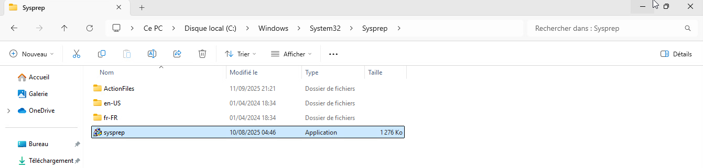
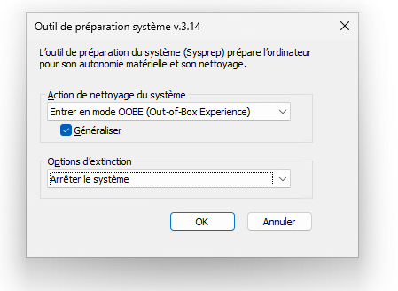

Avant de cloner une machine virtuelle, il est essentiel d’exécuter **Sysprep** (System Preparation Tool) afin de généraliser le système. Sysprep supprime les identifiants uniques de la machine (comme le SID, les journaux, le cache matériel, etc.) et remet Windows dans un état prêt pour un nouvel usage. Cela évite les conflits lorsque plusieurs machines issues du même clone coexistent dans un domaine Active Directory ou sur un réseau, notamment au niveau de l’authentification et de la gestion.

En résumé, Sysprep garantit que chaque clone obtenu sera vu comme un poste distinct et propre par le système et l’annuaire, ce qui est indispensable pour un déploiement fiable en entreprise.

L’outil est à l’adresse : `C:\Windows\System32\Sysprep\sysprep.exe`

### Mode de démarrage système

OOBE (Out-Of-Box Experience) :
Met Windows dans l’état d’un premier démarrage, comme si la machine venait d’être installée.
→ C’est ce qu’on choisit pour préparer une image destinée au déploiement.

Audit Mode :
Permet de démarrer Windows sans passer par la configuration initiale, utile pour installer des applications ou pilotes avant de créer l’image.

### Options de généralisation

Generalize (à cocher) :
Supprime les identifiants uniques de la machine (SID, drivers spécifiques, logs).
→ Indispensable avant de cloner une VM.

### Action après exécution

Shutdown : Éteint la machine une fois le Sysprep terminé.
→ Recommandé pour figer l’image avant clonage.

Restart : Redémarre la machine.
→ Moins utilisé dans le cadre d’un déploiement.

Quit : Ferme simplement l’assistant.

L’option la plus courante est : OOBE + Generalize + Shutdown

Au redémarrage, vous arrivez sur l’écran de configuration post installation de Windows.