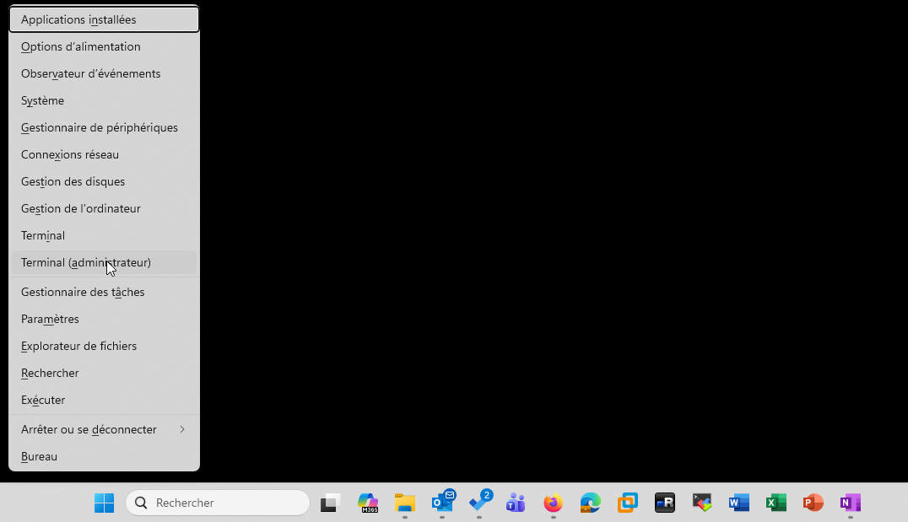
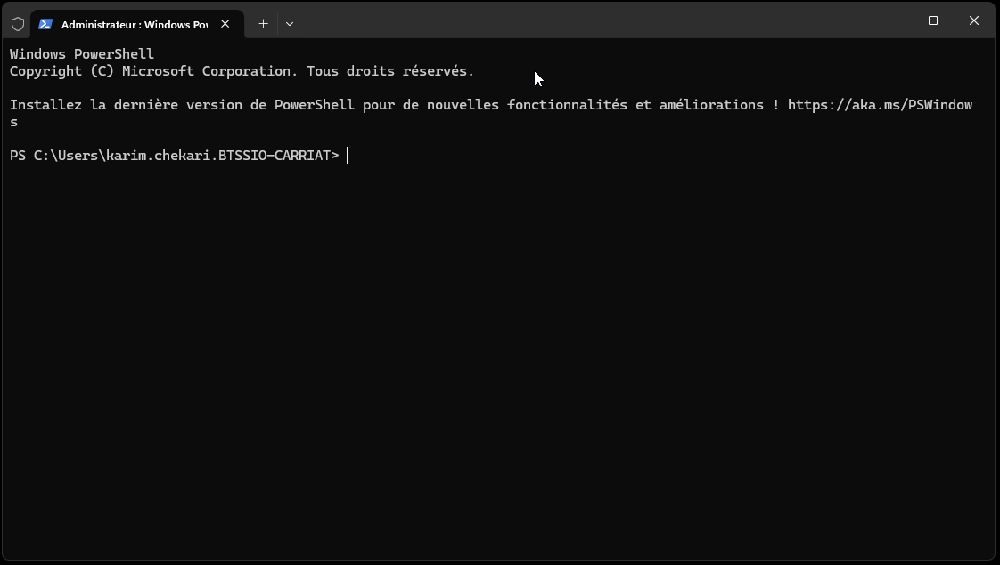

:::note
Le Terminal Windows est un outil moderne qui regroupe plusieurs consoles dans une seule application : Invite de commandes (CMD), PowerShell, et éventuellement WSL (Windows Subsystem for Linux).
Il offre un environnement puissant, personnalisable et ergonomique pour exécuter des commandes, automatiser des tâches et administrer un système Windows ou Linux.
:::
Le Terminal Windows permet d’ouvrir plusieurs onglets, chacun pouvant exécuter une console différente (CMD, PowerShell, WSL, etc.). Il offre une interface utilisateur moderne avec des fonctionnalités avancées telles que la personnalisation des thèmes, des polices, et des raccourcis clavier.
Il est particulièrement utile pour les développeurs et les administrateurs système qui ont besoin d’accéder à différents environnements de ligne de commande dans une seule application.
Contrairement à l’ancienne invite de commandes, le Terminal permet :
- D’ouvrir plusieurs onglets ou volets pour exécuter plusieurs sessions en parallèle,
- D’utiliser une interface graphique moderne (transparence, thèmes, police personnalisée),
- De copier-coller facilement du texte,
- De gérer plusieurs profils (PowerShell, CMD, Ubuntu, etc.),
- Et surtout, de disposer d’un terminal unifié pour tous les environnements de développement et d’administration.

C’est un outil incontournable pour les étudiants en BTS SIO, car il permet de pratiquer l’administration système, le scripting PowerShell, la configuration réseau, ou encore la manipulation de fichiers et services à la ligne de commande.

Pour le lancer, vous pouvez rechercher le programme ou faire la combinaison de touche [WINDOWS]+X puis Terminal.

Par défaut, le Terminal s’ouvre avec PowerShell. Vous pouvez ouvrir un nouvel onglet en cliquant sur le bouton "+" ou en utilisant le raccourci clavier [CTRL]+T.

Voici quelques raccourcis clavier :
- Ctrl + Maj + T > Ouvre un nouvel onglet.
- Ctrl + Maj + W > Ferme l’onglet actuel.
- Alt + Maj + D > Divise l’écran (split) pour afficher plusieurs sessions côte à côte.
- Ctrl + Molette de la souris > Change la taille du texte.
- Ctrl + , > Ouvre les paramètres du Terminal (thèmes, raccourcis, apparence).

Vous pouvez personnaliser le Terminal en modifiant les paramètres JSON ou via l’interface graphique intégrée. Vous pouvez changer les couleurs, la police, le comportement des onglets, etc.

Le Terminal Windows est un outil puissant et flexible qui facilite la gestion des systèmes Windows et Linux via la ligne de commande. Il est fortement recommandé aux étudiants en BTS SIO de se familiariser avec cet outil pour leurs travaux pratiques et projets.
