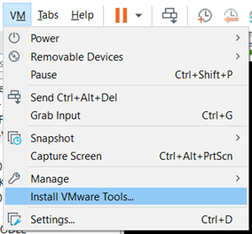
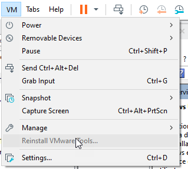
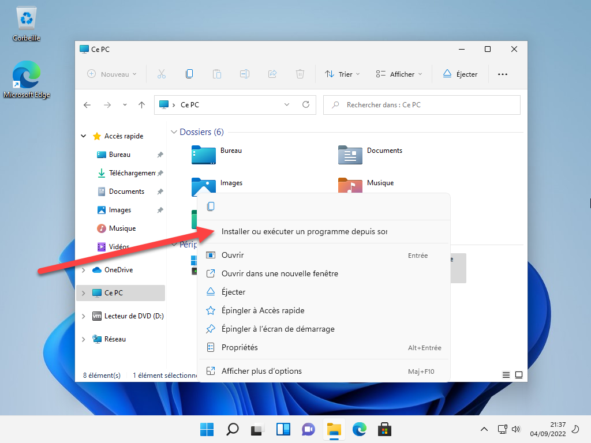

Si votre VM ne s’est pas installé automatiquement, il faut installer les VM Tools pour que l’OS utilise les drivers de votre machine.

VM > Install Vmware Tools …

Installer le programme depuis le lecteur virtuel.

Laisser les options par défaut et redémarrer.
