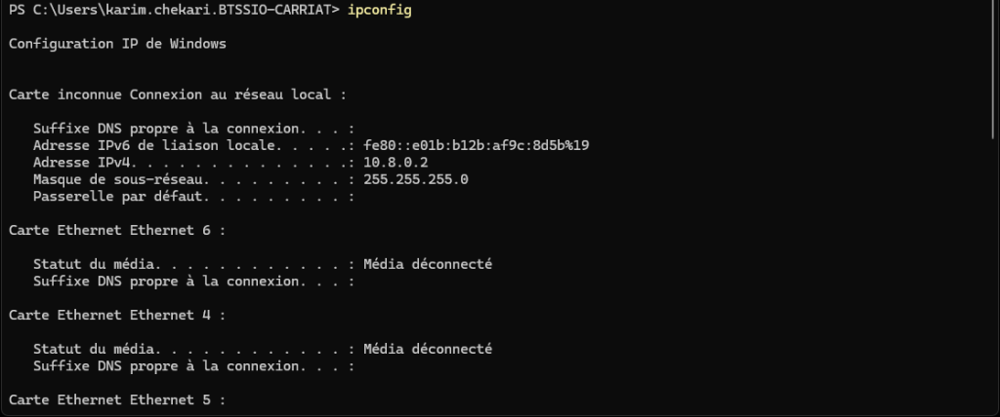

:::note
Testé sous Windows 10 et 11
:::
La commande `ipconfig` (Internet Protocol Configuration) est un outil en ligne de commande utilisé dans les systèmes d'exploitation Windows pour afficher et gérer la configuration réseau des interfaces réseau de l'ordinateur. Elle permet aux utilisateurs de visualiser des informations telles que les adresses IP, les masques de sous-réseau, les passerelles par défaut et les serveurs DNS associés à chaque interface réseau.
La commande `ipconfig` est souvent utilisée pour diagnostiquer des problèmes de connectivité réseau, renouveler les baux DHCP, et libérer les adresses IP attribuées par un serveur DHCP.
Syntaxe de base :
```cmd
ipconfig [options]
```


Exemples d'utilisation :
- Pour afficher la configuration IP de toutes les interfaces réseau :
```cmd
ipconfig
```
- Pour afficher des informations détaillées sur toutes les interfaces réseau :
```cmd
ipconfig /all
```
- Pour libérer l'adresse IP actuelle d'une interface réseau (utile pour les connexions DHCP) :
```cmd
ipconfig /release
```
- Pour renouveler l'adresse IP d'une interface réseau (utile pour les connexions DHCP) :
```cmd
ipconfig /renew
```
- Pour vider le cache DNS local :
```cmd
ipconfig /flushdns
```
Interprétation des résultats :
- `Adresse IPv4` : Affiche l'adresse IP attribuée à l'interface réseau.
- `Masque de sous-réseau` : Indique le masque de sous-réseau associé à l'adresse IP.
- `Passerelle par défaut` : Montre l'adresse IP de la passerelle par défaut utilisée pour accéder à d'autres réseaux.
- `Serveurs DNS` : Liste les adresses IP des serveurs DNS configurés pour la résolution de noms de domaine.

La commande `ipconfig` est un outil essentiel pour les administrateurs réseau et les utilisateurs avancés afin de gérer et diagnostiquer les configurations réseau sur les systèmes Windows.            