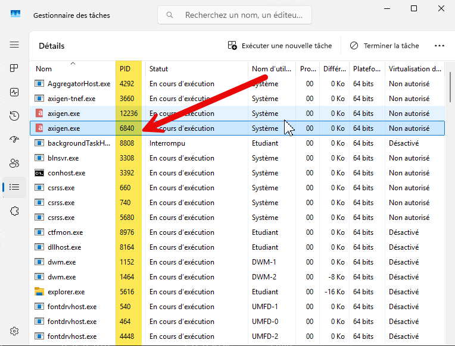
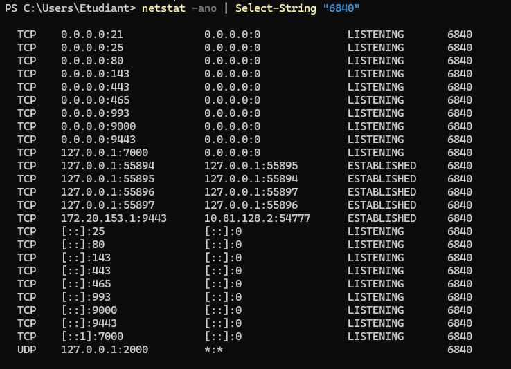

Il peut être pratique de connaitre les ports en écoute d’un processus.
Pour cela, ouvrir le gestionnaire des tâches pour trouver le PID du programme :



Puis ouvrir un Terminal Windows et saisir la commande :

```bash
{
# en cmd :
netstat -ano | find "6840"
 
# en PowerShell :
netstat -ano | Select-String "6840"
```

Le paramètre -a liste toutes les connexions et ports, -n force l’affichage numérique, et -o ajoute la colonne PID.

