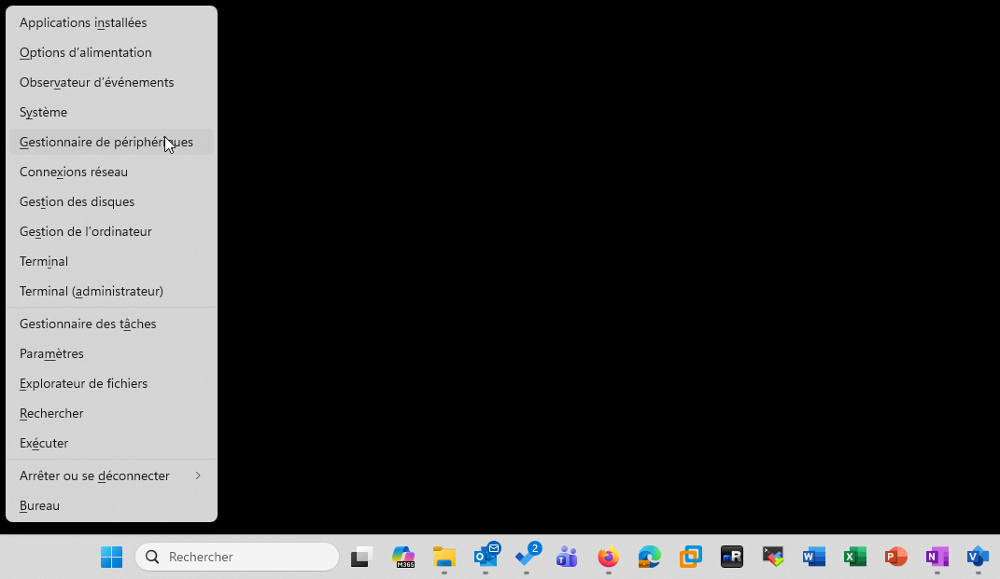
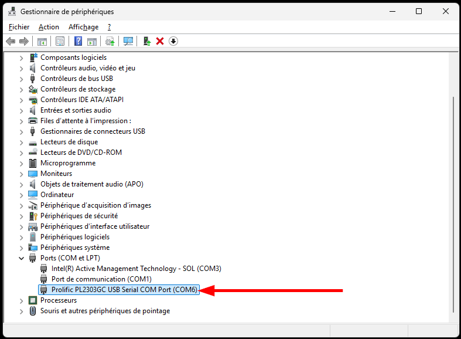
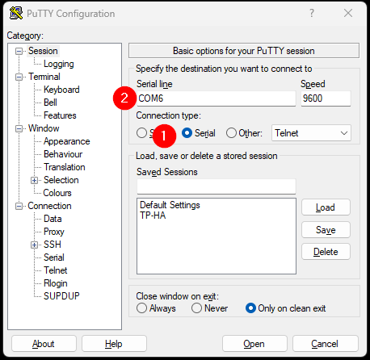
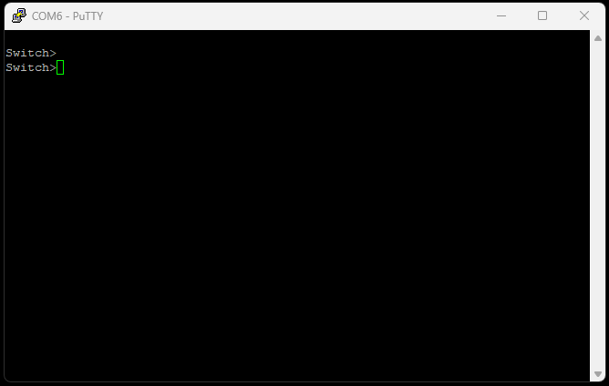

:::note
Testé sous Windows 10 et 11 avec PuTTY version 0.78
:::

PuTTY est un client SSH et Telnet open source très populaire, principalement utilisé pour se connecter à distance à des serveurs Linux/Unix depuis un ordinateur Windows. Il permet d’établir une connexion sécurisée via le protocole SSH (Secure Shell), offrant ainsi une interface en ligne de commande pour administrer des systèmes distants. PuTTY supporte également d’autres protocoles comme Telnet, Rlogin et Serial, mais son utilisation principale reste le SSH.
[PuTTY Download Page](https://www.chiark.greenend.org.uk/~sgtatham/putty/latest.html)
La connexion série (ou connexion console) est un accès direct et local à un équipement via un câble série (RS-232 / USB-série).
Elle permet d’accéder à la console de configuration d’un matériel sans passer par le réseau (utile si l’équipement n’a pas encore d’adresse IP configurée).

## Trouver la connexion serial sur Windows
Sous Windows, les connexions série sont identifiées par des ports COM (COM1, COM2, etc.). Pour trouver le port COM associé à votre câble série, suivez ces étapes :
1. Branchez votre câble série USB à votre ordinateur.
2. Ouvrez le "Gestionnaire de périphériques" (Device Manager) en faisant un clic droit sur le menu Démarrer et en sélectionnant "Gestionnaire de périphériques".
3. Dans la liste des périphériques, développez la section "Ports (COM et LPT)". Vous devriez voir un périphérique nommé "USB Serial Port (COMx)" où "x" est le numéro du port COM attribué à votre câble.
4. Notez ce numéro de port COM, car vous en aurez besoin pour configurer PuTTY.

Dans Port (COM et LPT), regardé la ligne Prolific PL2303GC. Dans mon cas, ce sera le port COM6.

Dans PuTTy, choisir Serial puis le bon port COM puis Open

La connexion au commutateur est réussite.

Appuyer sur [ENTRÉE] pour afficher l’invite de commande.

