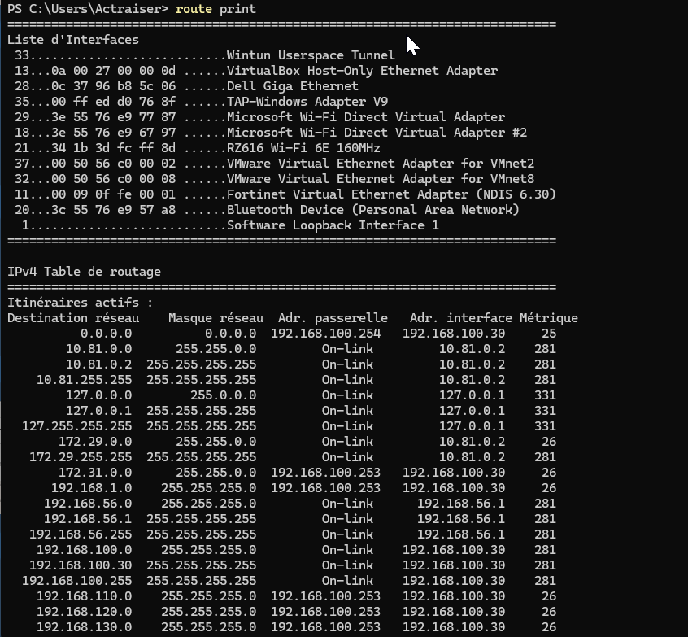

## Voir les routes
Pour afficher la table de routage sur un système Windows, ouvrez l'invite de commande et exécutez la commande suivante :
```cmd
route print
```


## Ajouter une route
Pour ajouter une route statique, utilisez la commande suivante :
```cmd
route add -p [RESEAU-DESTINATION] mask [MASQUE-DESTINATION] [PASSERELLE]
```
- `[RESEAU-DESTINATION]` : Le réseau de destination (par exemple, 192.168  .1.0).
- `[MASQUE-DESTINATION]` : Le masque de sous-réseau.
- `[PASSERELLE]` : L'adresse IP de la passerelle.
L'option `-p` rend la route persistante, ce qui signifie qu'elle restera en place après un redémarrage.


## Supprimer une route
Pour supprimer une route statique, utilisez la commande suivante :
```cmd
route delete [RESEAU-DESTINATION]
```
- `[RESEAU-DESTINATION]` : Le réseau de destination que vous souhaitez supprimer.