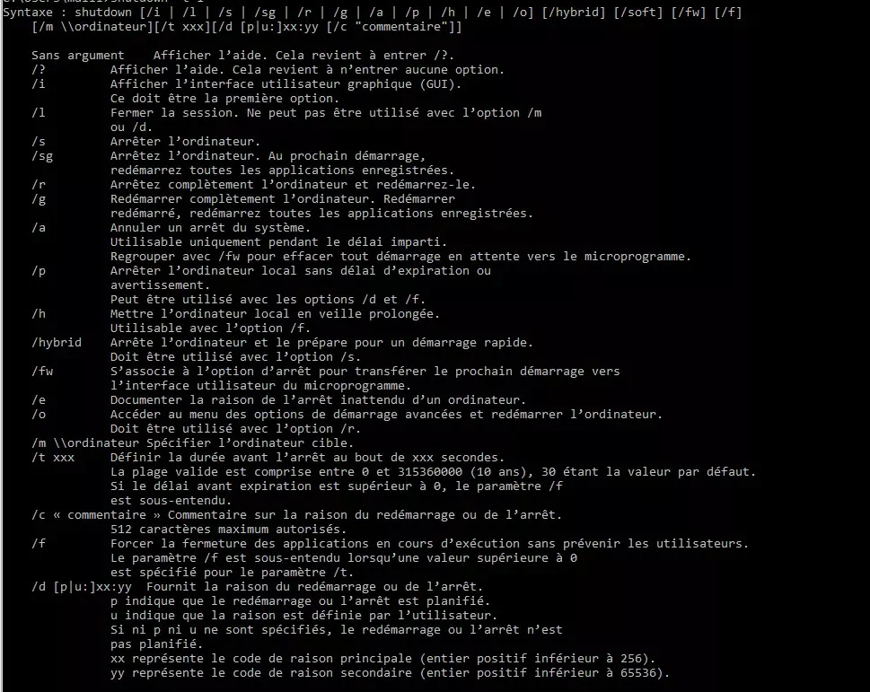

shutdown est une commande qui permet de redémarrer ou arrêter un PC à partir de l’invite de commandes de Windows.

Voici la syntaxe de la commande shutdown et notamment les multiples paramètres disponibles :



Voici quelques syntaxes autour de la commande shutdown.

Fermer la session Windows pour revenir à la page de demande de mot de passe :

```bash
shutdown /l
```

Pour redémarrer le PC et Windows, utilisez la commande de cette manière :

```bash
shutdown /r
```

Arrêter l’ordinateur :

```bash
shutdown /s
```

Lorsque vous lancez un arrêt de Windows, le délai par défaut est de 60 (modifiable avec le paramètre /t) donc si vous désirez arrêter Windows instantanément , vous pouvez utiliser la commande suivante :

```bash
shutdown /s /t 0
```

mais on peut aussi utiliser aussi le paramètre /p pour arrêter Windows sans délai :

```bash
shutdown /p
```

À noter que lorsque le paramètre est inférieur à 0, les applications ouvertes peuvent bloquer la fermeture ou l’arrêt de Windows et ainsi provoquer une demande de fermeture de l’utilisateur.

Pour forcer la fermeture des applications, vous pouvez utiliser le paramètre /f

Enfin, pendant lorsqu’un délai est présent, il est possible d’annuler la demande d’arrêt ou redémarrage avec le paramètre /a :

```bash
shutdown /a
```