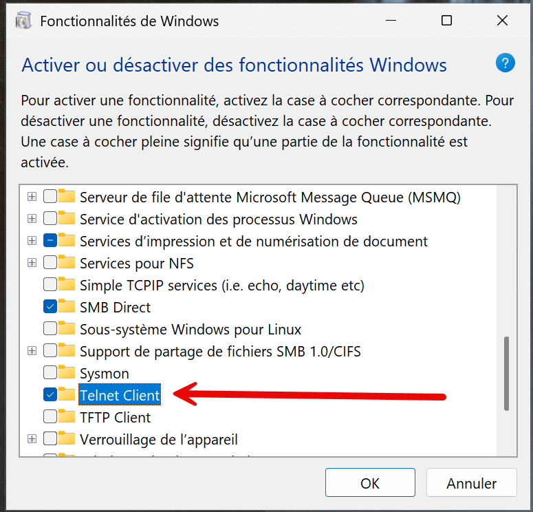
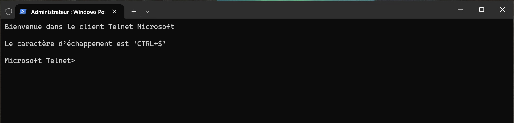

L'outil Telnet est un protocole réseau qui permet de se connecter à distance à un autre ordinateur ou appareil sur un réseau. Il est souvent utilisé pour administrer des serveurs, des routeurs et d'autres équipements réseau.
C'est un protocole simple qui fonctionne en mode texte, ce qui signifie que les utilisateurs peuvent envoyer des commandes et recevoir des réponses sous forme de texte brut. Cependant, il est important de noter que Telnet n'est pas sécurisé, car il transmet les données en clair, y compris les mots de passe. Pour des raisons de sécurité, il est recommandé d'utiliser des alternatives plus sécurisées comme SSH (Secure Shell) pour les connexions à distance.

Pour activer Telnet sur Windows, vous pouvez suivre les étapes suivantes :
Il faut aller dans les fonctionnalités Windows et lancer `Activer ou désactiver les fonctionnalités Windows`.

Activer la fonctionnalité `Client Telnet`



Une fois activé, vous pouvez utiliser la commande :

```cmd
telnet
```

