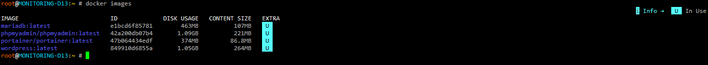

:::tip{icon="heart"}
Astro helps you build faster websites with [“Islands Architecture”](https://docs.astro.build/en/concepts/islands/).
:::

### Télécharger une image
```shell
root@MONITORING-D13:~ # docker pull <nom image>
```
### Voir les images disponible sur le serveur
```shell
root@MONITORING-D13:~ # root@MONITORING-D13:~ # docker images
```

### Créer un volume
```shell
root@MONITORING-D13:~ # docker pull <nom volume>
```

