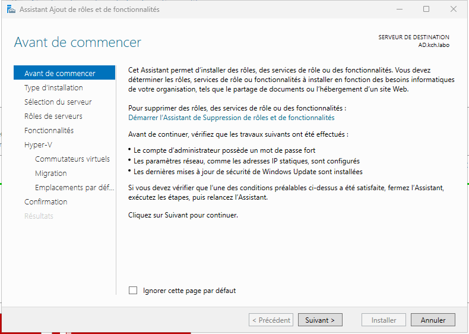
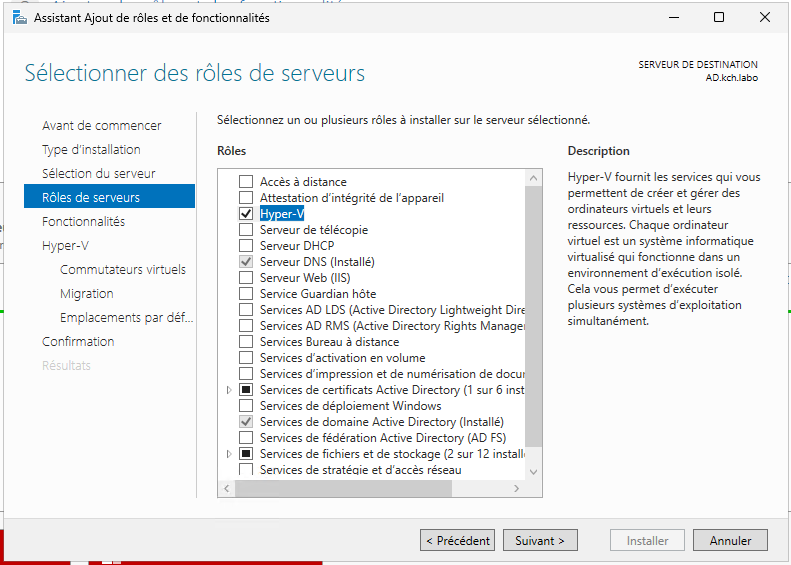
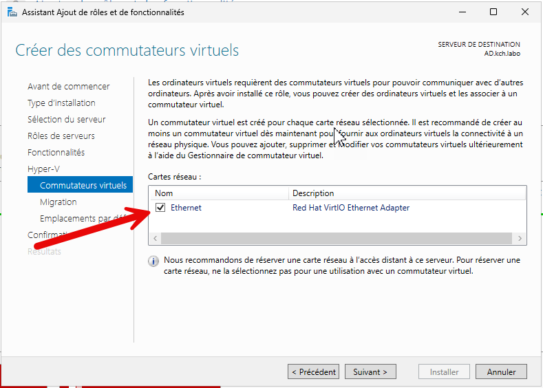
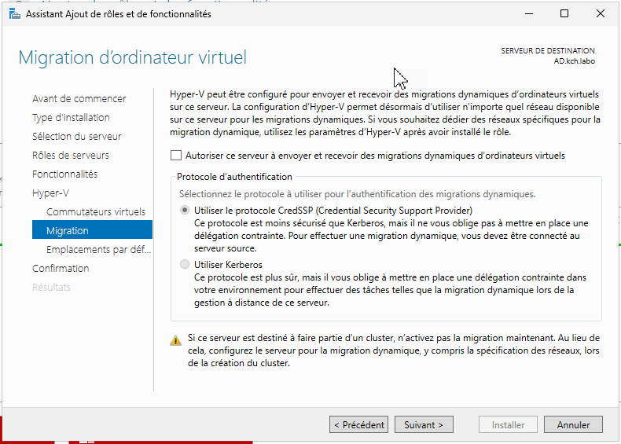
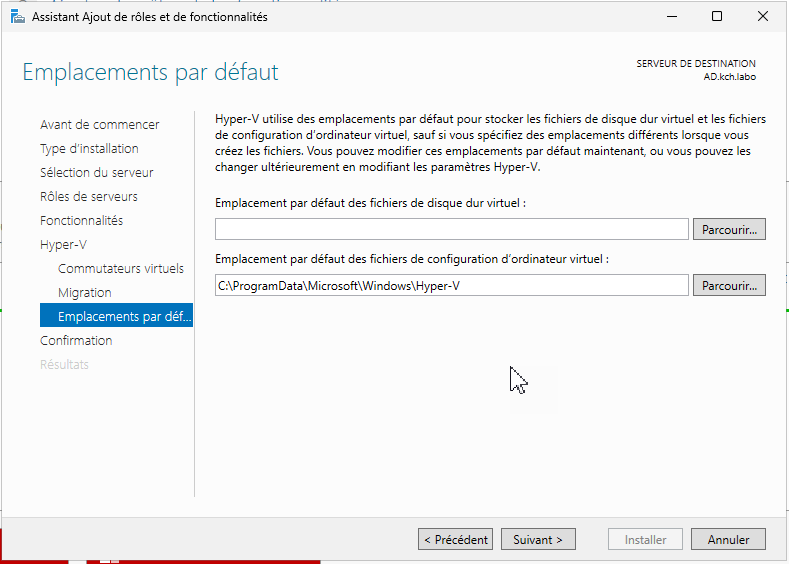

:::note
Fonctionnalité testé Windows Server 2025
:::

:::caution
Il est déconseillé d'installer le role Hyper-V sur un controleur de domaine.
:::

Dans le **gestionnaire de serveur**
Ajouter des rôles et fonctionnalités

Valider avec **Suivant** jusqu'à la selection des rôles :

Cocher **Hyper-V**

N'ajoutez pas de fonctionnalités supplémentaires.

Choisir de créer un commutateur virtuel

La migration d'ordinateur virtuel est utile uniquement si vous avez plusieurs Hyper-V

Choisir maintenant l'emplacement de stockage des VM et des disques virtuels

L'installation se lance

Une fois l'installation terminée, vous avez accès au gestionnaire Hyper-V.
