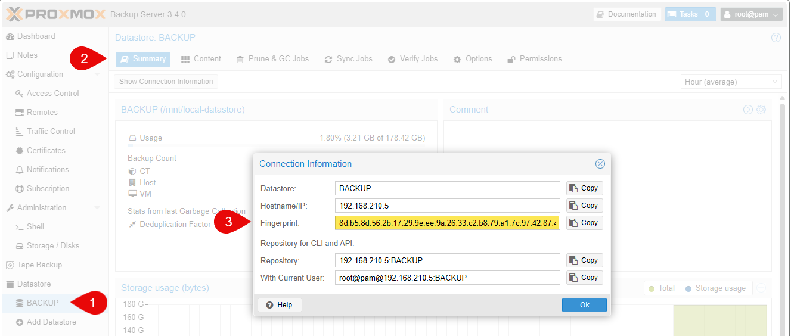
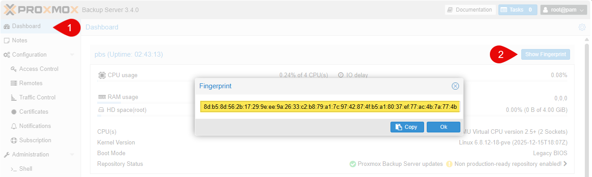
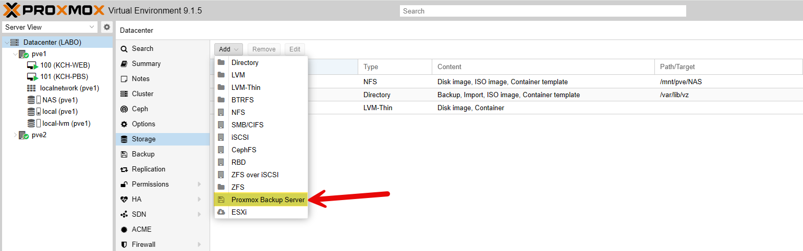
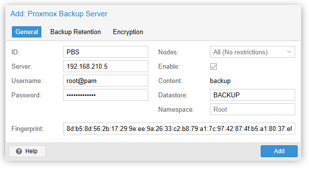

L'objectif de ce guide est d'expliquer comment ajouter un serveur Proxmox Backup Server (PBS) à un environnement Proxmox VE (PVE) afin de permettre la sauvegarde et la restauration des machines virtuelles et des conteneurs.

## 1. Récupération des informations du PBS

Avant d'ajouter le PBS à Proxmox VE, assurez-vous d'avoir les informations suivantes :
- Adresse IP ou nom d'hôte du serveur PBS.
- Nom d'utilisateur et mot de passe pour accéder au PBS.
- L'empreinte du certificat du PBS.

Dans le **DATASTORE** > **Summary** > **Show Connection Information** > **Fingerprint**.

Dans **Dashboard** > **Show Fingerprint**.

## 2. Ajout du PBS à Proxmox VE

Connectez-vous à l'interface web de Proxmox VE.
Selectionnez **Datacenter** > **Storage** > **Add** > **Proxmox Backup Server**.

Dans la fenêtre qui s'ouvre, remplissez les champs suivants :
- **ID** : Donnez un nom à votre stockage PBS.
- **Server** : Entrez l'adresse IP ou le nom d'hôte du serveur PBS
- **Username** : Entrez le nom d'utilisateur pour accéder au PBS.
- **Password** : Entrez le mot de passe associé à l'utilisateur.
- **Fingerprint** : Collez l'empreinte du certificat que vous avez récupérée précédemment.
- **Datastore** : Sélectionnez le datastore que vous souhaitez utiliser pour les sauvegardes.

