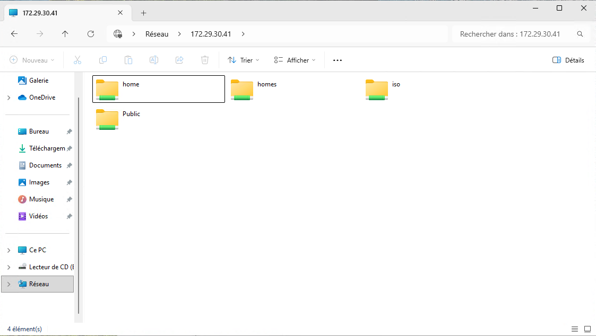
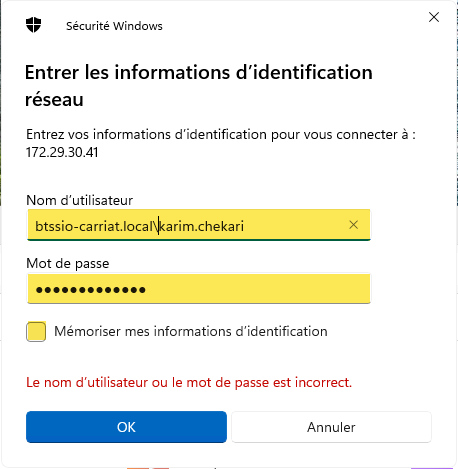

Bien que les réseaux Proxmox soient isolés, vous pouvez quand même accéder aux ressources réseaux du BTS.
Le serveur de stockage QNAP est disponible à l’adresse :
```
\\172.29.30.41
```

Le QNAP étant sur le réseau du BTS, vous devez utiliser vos identifiants BTS pour vous connecter.

Deux partages sont importants :
- Home : Représente votre dossier personnel (équivalent de votre H:).
- Iso : Contient les fichiers iso et les logiciels, notamment le dossier \\172.29.30.41\iso\logiciels